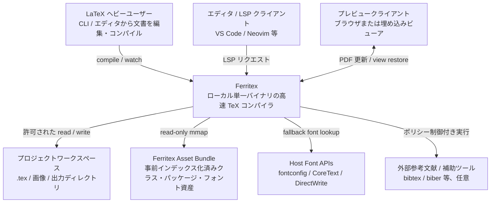
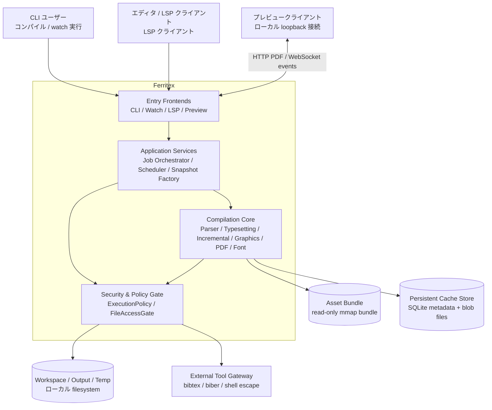

# Ferritex アーキテクチャ設計書

## メタ情報

| 項目 | 内容 |
| --- | --- |
| バージョン | 0.1.4 |
| 最終更新日 | 2026-03-16 |
| ステータス | 提案 |
| 入力 | [requirements.md](requirements.md) v0.1.19, [domain_model.md](domain_model.md) v0.1.20 |

## 1. 設計方針

Ferritex は `compile` / `watch` / `lsp` / preview を単一の Rust バイナリで提供する、ローカル実行前提の高性能 TeX コンパイラとして設計する。分散アーキテクチャは採らず、ドメイン境界で分割されたモジュラーモノリスを基本パターンとする。

この判断の主な根拠は以下。

- `REQ-NF-001`, `REQ-NF-002`, `REQ-NF-004`: フルコンパイル 1.0 秒未満、差分 100ms 未満、LSP 低遅延を満たすには IPC やネットワーク越し通信を避ける必要がある。
- `REQ-NF-008`, `REQ-NF-009`: Linux / macOS / Windows で同一動作し、単一バイナリ配布を維持する必要がある。
- `domain_model.md` の 8 コンテキスト: パーサー、タイプセッティング、差分コンパイル、アセット、グラフィック、PDF、フォント、開発者ツールの境界が既に明確であり、分散よりも境界付き単一プロセスの方が自然である。

## 2. 品質特性シナリオと優先順位

### 2.1 優先順位

| 優先 | 品質特性 | 判断方針 |
| --- | --- | --- |
| 1 | 性能・応答性 | 低遅延を最優先し、プロセス分割より単一プロセス・共有メモリ・事前インデックス化を優先する |
| 2 | 互換性・決定性 | 攻めた並列化よりも pdfLaTeX 互換と決定的 commit を優先する |
| 3 | セキュリティ | 利便性より `ExecutionPolicy` と `FileAccessGate` による既定拒否を優先する |
| 4 | 保守性・進化可能性 | 技術レイヤ分割ではなくドメイン境界分割を採用し、将来の抽出可能性を残す |
| 5 | 移植性・運用性 | 単一バイナリ配布、versioned Asset Bundle、CI による 3 OS 検証を前提にする |

### 2.2 主要シナリオ

| ID | 刺激 | 環境 | 応答 | 測定基準 |
| --- | --- | --- | --- | --- |
| QA-01 | `FTX-BENCH-001` をフルコンパイルする | `--no-cache`、同一入力・同一マシン | 単一ジョブが高速に完了する | 中央値 1.0 秒未満 (`REQ-NF-001`) |
| QA-02 | 本文 1 段落だけ変更する | キャッシュと依存グラフが存在する | 影響範囲だけを再処理して PDF を更新する | 中央値 100ms 未満 (`REQ-NF-002`) |
| QA-03 | 未保存編集後に診断・補完・定義ジャンプを要求する | `Open Document Buffer` を保持する LSP 実行中 | 保存前状態に基づいて解析結果を返す | 診断 < 500ms、補完 < 100ms、定義ジャンプ < 200ms (`REQ-NF-004`) |
| QA-04 | 外部コマンド実行や許可外ファイルアクセスを試みる | `compile` / `watch` / `lsp` の任意入口 | 既定で拒否し、明示許可時も job 単位の上限を適用する | 未許可外部実行経路 0、許可外 I/O 経路 0 (`REQ-NF-005`, `REQ-NF-006`) |
| QA-05 | 標準的な論文文書を 3 OS で処理する | Host Font Catalog overlay を無効化した再現ビルド | 同一 PDF を生成する | メタデータを除きバイト同一 (`REQ-NF-008`) |
| QA-06 | プレビュー接続中に再コンパイルが完了する | 閲覧位置を保持した preview session が存在する | PDF を更新し、閲覧位置を復元する | 更新 1 秒以内 (`REQ-FUNC-040`) |
| QA-07 | `FTX-BENCH-001` をフルコンパイルしつつ LSP snapshot を再構築する | `--no-cache`、同一入力・同一マシン | ピーク RSS を予算内に保つ | peak RSS < 1 GiB (`REQ-NF-003`) |
| QA-08 | 構文エラー、外部実行拒否、または preview session 失効が発生する | compile / watch / lsp / preview の任意入口 | ソース診断ではファイル名・行番号・文脈・修正候補を、session 応答ではエラー種別・sessionId・回復手順を返す | 必須フィールド充足率 100% (`REQ-NF-010`) |
| QA-09 | `FTX-CORPUS-COMPAT-001` を `FTX-ASSET-BUNDLE-001` 前提で処理する | pdfLaTeX baseline 出力が存在する同一入力・同一マシン | レイアウト・リンク・埋め込み資産を含めて互換な PDF を生成する | 95/100 文書以上がレイアウト基準を満たし、navigation-features / embedded-assets subset が 100% 一致 (`REQ-NF-007`) |

## 3. アーキテクチャ概要

### 3.1 採用パターン

- ベースパターン: モジュラーモノリス
- 境界設計: Ports and Adapters
- 実行モデル: 単一プロセス、workspace 単位 job scheduler、読み取り専用 snapshot + 決定的 commit barrier
- commit 順序: `CommitBarrier` は `(passNumber, stageOrder, partitionId)` の total order で結果を適用し、`stageOrder` は `macro/session delta -> document/reference/bibliography state -> layout/page-number merge -> artifact emission/cache metadata` に固定する。`partitionId` は `DocumentPartitionPlanner` が安定に発行する
- 並列化方針: ドメインで独立性判定、アプリケーション層でジョブ配分、インフラ層でスレッド実行

### 3.2 レイヤ責務

| レイヤ | 主な責務 | 含まれる主要コンテキスト |
| --- | --- | --- |
| Entry Adapters | CLI / watch / LSP / preview の入口、外部プロトコル変換 | CLI Adapter, LSP Adapter, Preview Adapter, Watch Adapter |
| Application | job orchestration、scheduler、snapshot 構築、use case 統合 | CompileJobService, WorkspaceJobScheduler, RecompileScheduler, LiveAnalysisSnapshotFactory, PreviewSessionService |
| Domain | TeX 処理の本体、決定的状態遷移、差分統合、PDF 射影 | Parser, Bibliography, Typesetting, Incremental Compilation, Asset Runtime, Graphics, PDF, Font, Kernel |
| Infrastructure | OS/FS/DB/network/process 依存の実装 | Cache Store, FileWatcher, Asset Bundle Loader, Preview Transport, Shell Command Gateway |

### 3.3 依存方向ルール

- `entry-adapters -> application -> domain`
- `infrastructure` は `application` または `domain` が定義した port を実装する
- `domain` は `application` / `infrastructure` の型を参照しない
- `DocumentState` は共有 read model ではなく、必要な sub-state / projection を介して参照する
- 1 workspace につき同時にアクティブな `CompilationJob` は 1 つまでとし、追加要求は coalesce する

## 4. C4 モデル

### 4.1 レベル1: システムコンテキスト図



### 4.2 レベル2: コンテナ図



### 4.3 レベル3: Ferritex Runtime の主要コンポーネント

この図の矢印は runtime 上の協調関係または port 利用方向を表し、静的な compile-time 依存を表さない。compile-time 依存規律は 3.3 の `entry-adapters -> application -> domain` と「infrastructure は port 実装側」に従う。

```mermaid
graph LR
    subgraph EntryAdapters[Entry Adapters]
        CLI[CLI Adapter]
        LSP[LSP Adapter]
        Watch[Watch Adapter]
        Preview[Preview Adapter]
    end

    subgraph Application[Application]
        CompileSvc[CompileJobService]
        AnalysisSvc[LiveAnalysisSnapshotFactory]
        OpenDocs[OpenDocumentStore / Buffer]
        Stable[Stable Compile State]
        Scheduler[WorkspaceJobScheduler]
        Recompile[RecompileScheduler]
        PreviewSvc[PreviewSessionService]
        Policy[ExecutionPolicyFactory / ExecutionPolicy]
    end

    subgraph Domain[Domain]
        Parser[Parser & Macro Engine]
        Bibliography[Bibliography Integration]
        Typeset[Typesetting Engine]
        Incremental[Incremental Compilation]
        Graphics[Graphics Rendering]
        Font[Font Management]
        Pdf[PDF Renderer / SyncTeX]
        Assets[Asset Runtime]
        Kernel[Kernel Runtime]
    end

    subgraph Infra[Infrastructure Adapters]
        Cache[Cache Repository]
        Files[FileAccessGate Adapter]
        Tools[ShellCommandGateway]
        Watcher[FileWatcher Adapter]
        Transport[Preview Transport]
    end

    CLI --> CompileSvc
    LSP --> OpenDocs
    OpenDocs --> AnalysisSvc
    Watch --> Recompile
    Recompile --> Scheduler
    Preview --> PreviewSvc

    CompileSvc --> Scheduler
    CompileSvc --> Policy
    Scheduler --> Stable
    Stable --> AnalysisSvc
    Scheduler --> Parser
    Scheduler --> Incremental
    Transport --> Pdf : serves active artifact
    PreviewSvc --> Policy : checks publish

    Assets --> Parser
    Assets --> Font
    Parser --> Bibliography
    Bibliography --> Typeset
    Parser --> Typeset
    Parser --> Graphics
    Parser --> Incremental
    Typeset --> Graphics
    Typeset --> Font
    Typeset --> Pdf
    Graphics --> Pdf
    Font --> Pdf
    Incremental --> Parser
    Incremental --> Typeset

    Incremental --> Cache
    Policy --> Files
    Policy --> Tools
    Parser --> Files
    Assets --> Files
    Recompile --> Watcher
    PreviewSvc --> Transport : publishes if allowed
    Scheduler --> Tools
```

## 5. コンポーネント分割

### 5.1 Compilation Core

| コンポーネント | 責務 | 主な公開契約 |
| --- | --- | --- |
| Parser & Macro Engine | 字句解析、マクロ展開、条件分岐、パッケージ読み込み、job/pass 状態管理、および `FTX-ASSET-BUNDLE-001` / `FTX-CORPUS-COMPAT-001` が要求する package-facing pdfTeX 拡張の互換層 | `CompilationSession`, `DocumentStateDelta`, `GraphicsCommandStream`, `DependencyEvents` |
| Bibliography Integration | `.bbl` 読み込み、`BblSnapshot` / `CitationTable` / `BibliographyEntry` 構築、citation provenance の供給 | `BibliographyState`, `CitationTable`, `BibliographyEntry` |
| Typesetting Engine | 行分割、ページ分割、display math、フロート、脚注、目次/索引、参考文献リストのレイアウト | `PageBox`, `FloatPlacement`, `LayoutFragment` |
| Incremental Compilation | 依存グラフ、影響範囲判定、`DocumentPartitionPlanner` による stable `partitionId` と `PartitionLocator` 発行、再利用/再構築統合、固定点反復、文書パーティション統合 | `RecompilationScope`, `CompilationMergePlan`, `PaginationMergeResult`, `CompilationSnapshot` |
| Graphics Rendering | `graphicx` / `tikz` を PDF 非依存プリミティブへ正規化 | `GraphicsScene`, `GraphicResourceSet` |
| Font Management | `FontSpec` 正規化、フォント解決、メトリクス・グリフ供給 | `ResolvedFont`, `FontMetrics`, `FontEmbeddingPlan` |
| PDF Renderer | `PageBox` とグラフィック・フォントを PDF / SyncTeX へ射影 | `PdfDocument`, `SyncTexTrace`, `OutputArtifactManifest` |
| Asset Runtime | bundle / overlay / host-local fallback の解決面を提供 | `AssetRef`, `AssetSnapshot`, `FontAssetRef` |
| Kernel Runtime | 数値/寸法演算、stable ID、source span、snapshot version などの基底型だけを提供し、package/class/bibliography semantics や I/O は持たない | `SourceSpan`, `StableId`, `DimensionValue` |

### 5.2 Application Services

| サービス | 責務 |
| --- | --- |
| `CompileJobService` | 各入口で正規化済みの `RuntimeOptions` を受け取り、`compile` / `watch` / `lsp` 共通の use case を起動する |
| `WorkspaceJobScheduler` | workspace ごとの active job 排他制御と compile / preview publish 順序保証を担う |
| `RecompileScheduler` | watch 専用に変更イベントを coalesce し、`PendingChangeQueue` と watch set refresh を管理する |
| `LiveAnalysisSnapshotFactory` | `OpenDocumentBuffer` と最新の成功した `CommitBarrier` 完了時点で確定した Stable Compile State から LSP 専用の immutable projection を構築する |
| `LspCapabilityService` | `initialize` 応答で advertise する `textDocumentSync` / `completionProvider` / `codeActionProvider` と `definitionProvider` / `hoverProvider` などの optional provider を構築し、push diagnostics を含む LSP 配線を担う |
| `PreviewSessionService` | preview session の発行・再発行・失効、`POST /preview/session` bootstrap 応答、`PreviewTarget` owner 管理、閲覧位置保存、PDF 更新通知、`ExecutionPolicy.previewPublication` に照らした publish 可否判定と再適用を行う |
| `CacheMaintenanceService` | dependency graph / cache metadata の writeback、invalidation、integrity check、LRU eviction を統括し、cache 破損検知を `Incremental Compilation` へ通知する |
| `ExecutionPolicyFactory` | 入口ごとの差を吸収し、共通 `ExecutionPolicy` と `previewPublication` の既定制約を生成する |

Stable Compile State は、最新の成功した `CommitBarrier` 完了時点で確定した `CompilationSession` / `DocumentState` の投影を指す。worker-local な未 commit 状態、失敗 pass の部分結果、進行中 barrier の中間結果は LSP から観測しない。

### 5.3 Infrastructure Adapters

| アダプタ | 責務 | 適用条件 / 制限 |
| --- | --- | --- |
| `AssetBundleLoader` | Asset Bundle の検証、version check、memory map | 実行前に整合性検証。破損時は起動失敗 |
| `DependencyGraphStore` | 依存グラフの独立永続化と復元 | cache 破損と障害分離するため cache metadata とは別ストア |
| `CacheMetadataStore` | cache key、version、integrity、LRU 情報の永続化 | integrity check と eviction 対象 |
| `BlobCacheStore` | page fragment や compiled artifact の content-addressed 保存 | GC が必要 |
| `ArtifactRegistryAuditWriter` | job ごとの artifact provenance を診断用に出力 | trusted 判定には使わず、監査専用 |
| `NativeFileWatcher` | OS ごとの監視 API を抽象化 | 監視粒度差は adapter 内で吸収 |
| `PreviewTransport` | session bootstrap、PDF document endpoint、revision events endpoint を提供 | loopback のみへ bind し、`POST /preview/session` / `GET /preview/{sessionId}/document` / `WS /preview/{sessionId}/events` の endpoint を公開する。`POST /preview/session` の応答内容は `PreviewSessionService` が決定し、bind / publish は同 service が `ExecutionPolicy.previewPublication` と `PreviewTarget` 一致を確認した場合にだけ実行する |
| `ShellCommandGateway` | `bibtex` / `biber` / shell escape の起動と上限制御 | `ExecutionPolicy` が明示許可した場合のみ |

## 6. 推奨クレート構成

```text
crates/
  ferritex-cli/            # CLI binary とエントリポイント組み立て
  ferritex-application/    # use case, scheduler, snapshot factory, ports
  ferritex-core/           # ドメインモデル本体
  ferritex-infra/          # cache, fs, watcher, preview, process adapters
  ferritex-bench/          # FTX-BENCH-001, compatibility/regression benchmarks
```

runtime path のトップレベル crate はレイヤ境界として使い、`ferritex-bench` は benchmark / compatibility harness としてその外側に置く。ドメイン境界はまず `ferritex-core` 内の垂直モジュールで表現する。`parser`, `bibliography`, `typesetting`, `incremental`, `graphics`, `font`, `pdf`, `assets`, `kernel` を一次単位とし、次の条件を満たした場合だけ独立 crate へ昇格する。

- 公開 API が安定し、他コンテキストから narrow interface だけで参照できる
- feature flag やベンチの都合で独立 compile が有利
- OS 依存や外部ライブラリ依存を局所化したい

`controllers/services/repositories` のような技術レイヤ名では分割しない。

`kernel` は catch-all shared module にはしない。置けるのは数値/寸法演算、stable ID、source span、snapshot version など TeX 依存だが特定サブドメインに属さない基底型だけであり、package/class/bibliography semantics、I/O、policy は各境界へ残す。

## 7. 主要ランタイムフロー

### 7.1 `compile`

1. `CLI Adapter` が CLI フラグを `RuntimeOptions` に正規化する。
2. `ExecutionPolicyFactory` が workspace と option から共通ポリシーを構築し、preview については `previewPublication` の既定制約（loopback 限定、active-job 限定、target 変更/再起動時の session 再発行）も埋め込む。
3. `CompileJobService` が正規化済み `RuntimeOptions` と `ExecutionPolicy` を受けて `CompilationJob` を生成し、`Incremental Compilation` がフル or 差分方針と stable `partitionId` / `PartitionLocator` 付きの `DocumentPartitionPlan` を決める。cache 破損が報告された場合、`Incremental Compilation` は dependency graph を invalidation / watch-set refresh の補助にだけ使い、出力生成はフルコンパイルへ fallback させる。
4. `Parser` は citation intent と label intent を分けて生成し、`Bibliography Integration` が `.bbl` 由来の `CitationTable` / `BibliographyEntry` を構築する。`Typesetting` は `CrossReferenceTable` を label 系に、`BibliographyState` を参考文献リスト組版に使い、その後 `Graphics` / `Font` / `PDF` が pipeline を実行する。
5. `OutputArtifactRegistry` は active job に対する in-memory registry として更新し、trusted readback の一致判定は主入力 + jobname で行う。current pass number は current job の順序・出力命名・診断に使う運用属性、`producedPass` は artifact provenance の監査属性として保持し、必要に応じて監査用 manifest を出力する。
6. `PDF Renderer` / `SyncTeX` が成果物を出力し、`CompileJobService` が diagnostics を集約する。`CacheMaintenanceService` は dependency graph / cache metadata の writeback と保守処理だけを担当する。

### 7.2 `watch` / preview

1. preview client は loopback 上の `POST /preview/session` に `PreviewTarget` を送り、`PreviewSessionService` から `sessionId` / `documentUrl` / `eventsUrl` を受け取る。target 変更または process restart 後の旧 session は `410 Gone` 相当で失効させ、再度 bootstrap させる。
2. `Watch Adapter` が起動時オプションを `RuntimeOptions` に正規化し、`NativeFileWatcher` が変更を集約する。
3. `ExecutionPolicyFactory` が workspace context と watch 由来の `RuntimeOptions` から共通 policy を構築し、`RecompileScheduler` が `PendingChangeQueue` へ coalesce した各再コンパイル要求をその policy と差分入力の組として `CompileJobService` へ渡す。
4. `RecompileScheduler` は active job 実行中の新イベントを保留し、`WorkspaceJobScheduler` は workspace 単位の排他と publish 順序を保証する。
5. compile 完了後、`PreviewSessionService` が session owner である `PreviewTarget` と active job の target を照合し、`ExecutionPolicy.previewPublication` に照らして publish 可否を判定する。許可された場合だけ閲覧位置を再適用したうえで `PreviewTransport` に loopback 上の session endpoint への target 付き最新 revision 配信を指示する。
6. 新しい依存グラフに基づき監視対象集合を差し替える。

### 7.3 `lsp`

1. `LSP Adapter` が workspace 既定値とクライアント設定を `RuntimeOptions` に正規化しつつ、未保存テキストを `OpenDocumentStore` に保持する。
2. `LiveAnalysisSnapshotFactory` が最新の成功した `CommitBarrier` 完了時点で確定した Stable Compile State を受け取り、`OpenDocumentBuffer` と合成した LSP 専用 `LiveAnalysisSnapshot` を構築する。
3. background compile / diagnostics refresh が必要な場合、`ExecutionPolicyFactory` が workspace context と LSP 由来の `RuntimeOptions` から共通 policy を構築し、`CompileJobService` はその policy で再コンパイルする。
4. diagnostics / codeAction / completion / definition / hover は全て `LiveAnalysisSnapshot` を唯一の入力として参照し、active compile/watch job の完了を待たない。
5. diagnostics は `textDocument/publishDiagnostics` を既定とし、pull diagnostics は adapter 拡張として別契約で扱う。
6. `LspCapabilityService` が `initialize` 応答で capability を advertise し、build 設定に応じて optional provider を制御する。

#### LSP capability matrix

| capability key | 対応方針 | advertise 条件 |
| --- | --- | --- |
| `textDocumentSync` | Must。`didOpen` / `didChange` / `didClose` を受け付け、push diagnostics の前提を提供する | 常に advertise |
| `codeActionProvider` | Must。代表的な構文エラー修正候補を返す | 常に advertise |
| `completionProvider` | Must。command / environment / label / citation を返す | 常に advertise |
| `definitionProvider` | Should。macro / label / citation に対応する | definition provider 有効時のみ advertise |
| `hoverProvider` | Could。`HoverDocCatalog` が有効な build のみ | provider 有効時のみ advertise |

## 8. 技術選定

| 領域 | 採用 | 理由 | 代替と非採用理由 |
| --- | --- | --- | --- |
| 言語 / ビルド | Rust + Cargo workspace | 実装言語制約に一致し、単一バイナリ配布と所有権による安全性が得られる | 代替なし |
| 非同期 I/O | Tokio | LSP、preview、watch、外部プロセス管理を 1 つの runtime で扱いやすい | 純 `std` は I/O 多重化が重い。async-std は周辺採用例が少ない |
| CPU 並列化 | Rayon + commit barrier | CPU bound な typesetting / font / graphics 処理に向く | Tokio だけで CPU 並列を担うとスケジューリング責務が混ざる |
| 永続キャッシュ | SQLite metadata + blob cache | クロスプラットフォーム、スキーマ管理しやすく、検査しやすい | JSON/flat file は整合性が弱い。専用 KV は可観測性が落ちる |
| Asset 読み込み | memory map (`memmap2`) | bundle の高速起動とランダムアクセスに合う | 毎回全文読み込みは遅い |
| 監視 / 観測 | `tracing` ベースの構造化ログ + metrics | compile path / deny event / cache hit を可視化しやすい | ad-hoc logging は LSP / watch の追跡が難しい |
| Preview transport | HTTP で PDF 配信 + WebSocket で revision / view-state events | PDF 配信の単純さと低遅延通知を両立する | loopback 限定の固定契約として実装し、session ごとに `GET /preview/{sessionId}/document` と `WS /preview/{sessionId}/events` を公開する |

## 9. ADR 一覧

- [ADR-0001: ドメイン境界を持つ単一プロセス・モジュラーモノリスを採用する](adr/0001-domain-modular-monolith.md)
- [ADR-0002: 読み取り専用 snapshot と commit barrier による決定的並列化を採用する](adr/0002-deterministic-snapshot-pipeline.md)
- [ADR-0003: 差分コンパイル状態は独立ストア群に分けて永続化する](adr/0003-local-cache-store.md)
- [ADR-0004: すべての入口で `ExecutionPolicy` と `FileAccessGate` を共通利用する](adr/0004-centralized-execution-policy.md)

## 10. 適合度関数

## 適合度関数: フルコンパイル性能

- **計測対象**: `FTX-BENCH-001` のフルコンパイル時間
- **閾値**: 中央値 1.0 秒未満
- **計測方法**: 専用 perf runner で 1 回ウォームアップ後 5 回計測し中央値を記録する
- **違反時のアクション**: main ブランチへのマージを止め、遅延の大きい commit を bisect する

## 適合度関数: 差分コンパイル性能

- **計測対象**: 本文 1 段落変更時の差分コンパイル時間
- **閾値**: 中央値 100ms 未満
- **計測方法**: 依存グラフと cache を事前生成した状態で 5 回計測する
- **違反時のアクション**: affected node 数、cache hit 率、passes used を記録し regression として追跡する

## 適合度関数: 相対速度

- **計測対象**: `FTX-BENCH-001` に対する pdfLaTeX 比の速度倍率
- **閾値**: フルコンパイルで pdfLaTeX 比 100x 以上
- **計測方法**: 同一マシン、同一入力、同一 benchmark profile で pdfLaTeX baseline と比較する
- **違反時のアクション**: 絶対速度だけでなく baseline 側の変動も記録し、成功基準との差を追跡する

## 適合度関数: メモリ使用量

- **計測対象**: `FTX-BENCH-001` のフルコンパイルと `LiveAnalysisSnapshot` 構築を含むピーク RSS
- **閾値**: peak RSS < 1 GiB
- **計測方法**: CI とローカル perf runner で `peak_rss_mb`, `compilation_snapshot_bytes`, `live_analysis_snapshot_bytes` を採取する
- **違反時のアクション**: main ブランチへのマージを止め、snapshot 粒度と cache retention を見直す

## 適合度関数: エラーメッセージ品質

- **計測対象**: compile / watch / lsp / preview の診断・拒否メッセージ・セッションエラー応答
- **閾値**: ソース診断ではファイル名・行番号・要約・文脈 snippet を 100% 付与し、修正候補を出せるケースでは suggestion を付与する。preview session 応答ではエラー種別・対象 sessionId・回復手順を 100% 付与する
- **計測方法**: golden diagnostics テストでソース診断の `file`, `line`, `message`, `context`, `suggestion?` を検証し、preview session テストで `error_type`, `session_id`, `recovery` を検証する
- **違反時のアクション**: build を失敗させ、ソース診断では `DefinitionProvenance` / `SourceSpan` の欠落箇所を、session 応答では `PreviewSessionService` のエラー応答を修正する

## 適合度関数: LSP 応答性

- **計測対象**: diagnostics / completion / definition の各処理時間
- **閾値**: diagnostics < 500ms、completion < 100ms、definition < 200ms
- **計測方法**: replayable LSP trace を CI と手元ベンチで実行する
- **違反時のアクション**: snapshot 構築コストと provider コストを分離計測し、どちらがボトルネックか判定する

## 適合度関数: プレビュー更新遅延

- **計測対象**: watch モードでの再コンパイル完了から preview client への document revision 通知到達までの遅延
- **閾値**: 中央値 1.0 秒以内
- **計測方法**: `FTX-BENCH-001` を watch モードで loopback preview session を確立した状態から本文 1 段落変更を適用し、再コンパイル完了時点から `WS /preview/{sessionId}/events` 上で revision 通知を受信するまでの時間を 5 回計測し中央値を記録する
- **違反時のアクション**: publish 判定時間と transport 配信時間を分離計測し、ボトルネックを特定する

## 適合度関数: 再現性

- **計測対象**: 3 OS での PDF 出力一致
- **閾値**: Host Font Catalog overlay 無効時、メタデータ差分を除きバイト同一
- **計測方法**: CI matrix で同一入力を処理し、正規化後の PDF ハッシュを比較する
- **違反時のアクション**: Asset Bundle / font resolution / metadata injection の差分を切り分ける

## 適合度関数: pdfLaTeX 互換性 (`REQ-NF-007`)

- **計測対象**: `FTX-ASSET-BUNDLE-001` 前提で `FTX-CORPUS-COMPAT-001` に対する pdfLaTeX とのレイアウト互換、および `FTX-CORPUS-COMPAT-001/navigation-features` / `FTX-CORPUS-COMPAT-001/embedded-assets` に対する PDF 機能互換
- **スコープ**: 互換対象の engine surface は `FTX-ASSET-BUNDLE-001` と `FTX-CORPUS-COMPAT-001` が要求する e-TeX および package-facing pdfTeX 拡張プリミティブに限定し、XeTeX 固有プリミティブは v1 の対象外とする
- **閾値**: 文書単位で 95/100 文書以上が「全ページの行分割位置差分率 <= 5% かつページ分割位置一致」を満たす。行分割位置差分率はページごとに `|Ferritex の改行位置集合 △ pdfLaTeX の改行位置集合| / max(1, |pdfLaTeX の改行位置集合|)` を計算し、その文書内ページ平均を取る。feature subset は annotation / destination / outline / metadata / resource inventory / 埋め込みフォント集合 / 外部 PDF 参照先ページ数まで 100% 一致する
- **計測方法**: `ferritex-bench` で `FTX-CORPUS-COMPAT-001` を `FTX-ASSET-BUNDLE-001` 前提で実行し、レイアウト差分は文書単位で集計する。feature subset は annotation / destination / outline / metadata / resource inventory / 埋め込みフォント集合 / 外部 PDF 参照先ページ数を正規化した manifest で比較する
- **違反時のアクション**: どの subset / 文書で差が生じたかを `parser` / `typesetting` / `font` / `pdf` 単位で切り分ける

## 適合度関数: アーキテクチャ境界

- **計測対象**: crate 依存方向
- **閾値**: `ferritex-core` から `ferritex-application` / `ferritex-infra` への依存 0、循環依存 0
- **計測方法**: `cargo metadata` ベースのカスタム検査を CI で実行する
- **違反時のアクション**: build を失敗させ、依存逆流を修正する

## 適合度関数: セキュリティ境界

- **計測対象**: 許可外ファイルアクセスと許可外外部コマンド実行
- **閾値**: 拒否テスト 100% パス、未許可経路 0、明示許可時でも 30 秒 / 1 process / 4 MiB を超える外部実行 0
- **計測方法**: deny-case 回帰テストで `../../outside.txt` や未登録 output artifact readback を検証する
- **違反時のアクション**: セキュリティ回帰として即時修正し、該当リリースを停止する

## 11. 運用設計

### 11.1 監視・オブザーバビリティ

- 構造化ログ: `job_id`, `workspace_id`, `pass_number`, `entrypoint`, `affected_nodes`, `cache_hit_ratio` を必須フィールドとする
- 主要メトリクス: `compile_full_ms`, `compile_incremental_ms`, `lsp_diagnostics_ms`, `preview_publish_ms`, `peak_rss_mb`, `compilation_snapshot_bytes`, `live_analysis_snapshot_bytes`, `cache_hit_ratio`, `passes_used`, `denied_file_access_total`, `denied_process_spawn_total`
- アラート閾値:
  - `FTX-BENCH-001` フルコンパイル p50 が 1.0 秒を超えたら警告
  - 差分 compile p50 が 100ms を超えたら性能回帰
  - deny イベントが release build で急増したら policy regression を疑う

### 11.2 セキュリティ設計

- `ExecutionPolicy` は compile / watch / lsp / preview publish path で共通化し、preview では内包する `previewPublication` が bind 先、公開可否、配信対象 artifact の選別、session 再発行規約を担う
- `FileAccessGate` は filesystem の read / write / readback だけを仲介し、socket accept/connect と `PreviewSession` の in-memory state は扱わない
- `PreviewSessionService` は `POST /preview/session` bootstrap と preview publish の両方で `ExecutionPolicy.previewPublication` と `PreviewTarget` 一致を確認し、許可された場合だけ `PreviewTransport` に loopback bind 済み endpoint への応答と配信を指示する
- `ShellCommandGateway` は既定拒否、許可時も 30 秒 / 1 process / 4 MiB の上限を守る
- `OutputArtifactRegistry` に記録された trusted artifact だけを readback 対象にする
- trusted artifact の same-job 判定は current Compilation Job の主入力と jobname で行う。current pass number は current job の順序・出力命名・診断に使う運用属性、`producedPass` は artifact provenance の監査属性であり、registry 自体は active job にのみ有効とし、job 完了または process restart で無効化する

### 11.3 配布・リリース戦略

Web サービスの Blue/Green は適用しない。Ferritex はローカルバイナリ製品なので、以下を採用する。

- 配布単位: `ferritex` 単一バイナリ + versioned Asset Bundle
- リリースチャネル: `nightly` / `beta` / `stable`
- 互換戦略: バイナリは対応 Asset Bundle の semver 範囲を明示し、起動時に検証する
- CI: Linux / macOS / Windows の matrix で互換性と再現性を検証する
- ロールバック: 旧バイナリと旧 Asset Bundle の組をそのまま復元できるよう、ペアで配布物を保持する

### 11.4 性能設計

- hot path は asset lookup と incremental merge を優先最適化する
- I/O bound な入口処理は Tokio、CPU bound な compile stage は Rayon に分離する
- mutable state は `CompilationJob` / `CompilationSession` に閉じ込め、並列処理は `CompilationSnapshot` のみを読む
- `CommitBarrier` の merge は worker 完了順に依存させず、`(passNumber, stageOrder, partitionId)` の total order に従って適用する
- `LiveAnalysisSnapshot` は compile 用 snapshot とは別の immutable projection とし、LSP/preview が mutable session を直接参照しない

### 11.5 スケーラビリティ設計

- 1 process / 1 workspace のローカル利用を最適化対象とする
- 同一 workspace では active compile job を 1 つに制限する
- LSP の read path は active compile job の完了を待たず、直近の Stable Compile State から応答する
- 複数 workspace を同時に扱う場合は process を分離し、OS のプロセス並列に任せる
- Host Font fallback は再現ビルドでは無効化できる strict mode を提供する

## 12. リスクと未確定事項

| 項目 | リスク | 対応 |
| --- | --- | --- |
| pdfLaTeX 比 100x | 成功基準は高く、PoC で律速確認が必要 | `FTX-BENCH-001` を固定し、`ferritex-bench` で律速ステージを継続計測する |
| `LiveAnalysisSnapshot` の不変性 | shallow copy 実装だと LSP が中途状態を観測する | `CompilationSnapshot` と分離し、immutable projection だけを保持する |
| Preview transport | ブラウザ cache や stale session が古い PDF を見せる可能性がある | session ごとに `PreviewTarget` 付き revision を付与し、`no-store` と target 変更 / process restart 時の session 再発行を徹底する |
| Host font fallback | ローカル preview と再現ビルドで出力差が出る | strict reproducible mode を用意し、CI は fallback 無効で固定する |
| 外部参考文献処理 | TeX ランタイム非依存の目的と `bibtex` / `biber` 連携が緊張する | gateway 経由の任意機能として分離し、コア要件とは切り離す |

## 13. セルフレビュー結果

| 観点 | 状態 | 補足 |
| --- | --- | --- |
| 品質特性シナリオ定義 | 充足 | QA-01 〜 QA-08 に整理済み |
| パターン選択根拠 | 充足 | 性能・配布・決定性を根拠にモジュラーモノリスを選択 |
| ドメイン境界ベース分割 | 充足 | `domain_model.md` の 8 コンテキストを採用 |
| ADR 整備 | 充足 | 4 件の ADR を追加 |
| SPOF / ボトルネック識別 | 充足 | `DocumentState`, cache, preview transport, asset bundle を識別 |
| LSP / bibliography 契約明示 | 充足 | capability matrix と bibliography ownership を追記済み |
| 未確定事項の隔離 | 充足 | preview protocol、memory fitness、bibliography 境界を固定し、残件は product risk に限定した |
