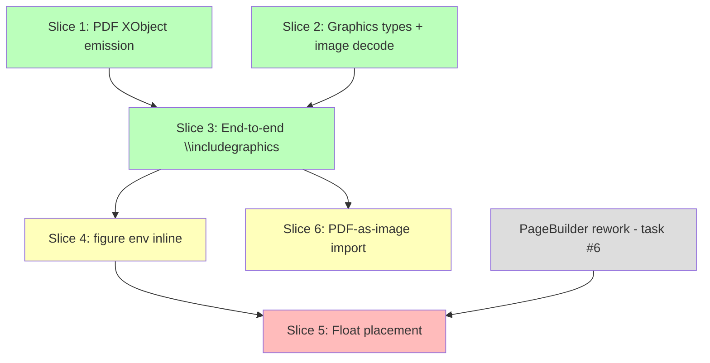

# Float/Image Pipeline Design Report

## Meta

| Item | Value |
|---|---|
| Version | 0.1.0 |
| Date | 2026-03-22 |
| Status | Draft |
| Scope | REQ-FUNC-010 (Float placement), REQ-FUNC-016 (Image embedding), REQ-FUNC-023 (tikz/pgf — boundary only) |
| Input | requirements.md v0.1.41, domain_model.md v0.1.39, architecture.md v0.1.28, current codebase |

## 1. Current State Assessment

### 1.1 Gap between domain model and implementation

The domain model (`domain_model.md` §3.2–§3.3) defines a rich type hierarchy for floats and graphics:

- **Typesetting**: `FloatQueue`, `FloatItem`, `PlacementSpec`, `FloatPlacement`, `PageBuilder`
- **Graphics**: `GraphicsScene`, `GraphicsBox`, `GraphicNode`, `ExternalGraphic`, `RasterImage`, `PdfGraphic`, `GraphicsCompiler`, `GraphicAssetResolver`
- **PDF**: `PageRenderPlan` bundles `PageBox` + `GraphicsScene`

**None of these are implemented beyond a bare stub.** The current state:

| Component | Code location | Current state |
|---|---|---|
| `GraphicsBox` | `graphics/api.rs` | Stub: `{ width, height }` only. No `GraphicsScene` field |
| `DocumentNode` | `parser/api.rs` | No `Float`, `Figure`, `IncludeGraphics` variants |
| `TypesetPage` | `typesetting/api.rs` | `{ lines: Vec<TextLine>, page_box }` — text only, no graphics scene |
| `VListItem` | `typesetting/api.rs` | `Box`/`Glue`/`Penalty` — no image/float item |
| `PdfRenderer` | `pdf/api.rs` | Text operators (`BT`/`ET`/`Tf`/`Tj`) + link annotations only. No `XObject`, no graphics state (`q`/`Q`/`cm`/`Do`) |
| `AssetHandle` | `assets/api.rs` | Stub with `LogicalAssetId` only. No file I/O wiring |
| `PageRenderPlan` | Not implemented | Domain model defines it; code uses `TypesetPage` directly |

### 1.2 Existing dependencies that must be honored

- **Asset Runtime** (`assets/`): provides `LogicalAssetId` / `AssetHandle`. Image loading must go through this + `FileAccessGate` for policy compliance (REQ-NF-005).
- **`ExecutionPolicy`**: image file reads are filesystem I/O, gated by `PathAccessPolicy`.
- **Pagination** (`paginate_vlist`): basic vlist-based page breaking. Floats need to interact with this.
- **PDF object allocation**: current renderer uses a linear object ID allocation scheme. Image XObjects need their own object IDs.

## 2. Design Decisions

### 2.1 First shippable capability: inline `\includegraphics` (no float wrapper)

**Decision**: Ship `\includegraphics[width=...,height=...]{file.png}` as an inline/block-level box *before* implementing float placement.

**Rationale**:
- Float placement (REQ-FUNC-010) depends on a functional `PageBuilder` with the full TeX page-breaking algorithm (planning report task #6), which is not yet implemented. The current paginator is a simplified vlist walker.
- Image embedding (REQ-FUNC-016) can be exercised end-to-end without floats: an image can appear as a block-level box in the vertical list, occupying its natural height.
- This exercises the entire pipeline: parser → asset resolution → image decoding → graphics scene → typesetting box → PDF XObject emission.
- A `\begin{figure}...\end{figure}` wrapper without float semantics can be added as thin sugar on top (just emit the content inline at the point of definition, which is the `[H]` behavior of the `float` package).

**Consequence**: The first slice does not satisfy full REQ-FUNC-010 (htbp placement). That requires Slice 3 (below). But it delivers a visible, testable capability.

### 2.2 GraphicsScene is the normalization surface between typesetting and PDF

**Decision**: All graphical content (images, vector paths, tikz output) flows through `GraphicsScene` as defined in domain_model.md §3.3. The typesetter produces a `GraphicsScene` per page (initially containing only `ExternalGraphic` nodes), and the PDF renderer consumes it alongside the text content.

**Rationale**: This matches the architecture's `PageRenderPlan = PageBox + GraphicsScene` design and keeps tikz/pgf (REQ-FUNC-023) on the same pipeline without special-casing images.

**Consequence**: Even for the first slice (images only), we implement `GraphicsScene`, `GraphicNode`, `ExternalGraphic`, `RasterImage`, `PdfGraphic` — not just a one-off image struct. This is a small upfront cost that avoids a rewrite when tikz support lands.

### 2.3 Image data flows through AssetHandle, not raw bytes in the node tree

**Decision**: The parser emits an `IncludeGraphics` node referencing a logical path. The `GraphicAssetResolver` service (in the graphics context) resolves this to an `ExternalGraphic` containing an `AssetHandle`. Actual byte data is loaded lazily at PDF emission time via the asset handle.

**Rationale**:
- Keeps the parse tree and typesetting tree free of large binary blobs.
- Respects `FileAccessGate` policy: the resolver checks access permission at resolution time.
- Supports future caching: the same `AssetHandle` can be shared across pages/passes.

### 2.4 Float placement deferred to after PageBuilder rework

**Decision**: Full `[htbp!]` float placement (REQ-FUNC-010) is a separate slice that depends on the PageBuilder rework (planning report task #6). The current `paginate_vlist` cannot host float queue logic.

**Rationale**: TeX float placement requires tracking available space at top/bottom of each page, maintaining a deferred float queue across pages, and handling `\clearpage` forced flush. This interleaves deeply with page breaking and cannot be bolted onto the current simplified paginator.

### 2.5 tikz/pgf: boundary only, no design work in this report

**Decision**: REQ-FUNC-023 is acknowledged as consuming the same `GraphicsScene` pipeline, but its parser (tikz command interpretation) and `GraphicsCompiler` are out of scope for this design. The `GraphicGroup` / `VectorPath` / `GraphicText` node types from the domain model will be implemented when tikz support begins.

**Consequence**: The `GraphicsScene` type includes `GraphicNode` as an enum with `ExternalGraphic` (images) initially. `GraphicGroup`, `VectorPath`, `GraphicText` variants are added later without breaking the scene structure.

## 3. Proposed Component Ownership

```
Parser ──(IncludeGraphics node)──> Graphics ──(GraphicsBox)──> Typesetting ──(VListItem)──> PDF
                                     │                              │
                                     ▼                              ▼
                                Asset Runtime                  PageRenderPlan
                                (resolve path,                 (PageBox + GraphicsScene)
                                 check policy)                        │
                                     │                              ▼
                                     └──────────────────────> PDF Renderer
                                                             (XObject emission)
```

| Responsibility | Owner | Key types |
|---|---|---|
| Parse `\includegraphics[opts]{path}` | Parser & Macro Engine | `DocumentNode::IncludeGraphics` |
| Parse `\begin{figure}...\end{figure}` | Parser & Macro Engine | `DocumentNode::Float` |
| Resolve image path to `ExternalGraphic` | Graphics Rendering (`GraphicAssetResolver`) | `ExternalGraphic`, `RasterImage`, `PdfGraphic` |
| Read image file bytes, check policy | Asset Runtime + `FileAccessGate` | `AssetHandle`, `LogicalAssetId` |
| Decode image dimensions (PNG/JPEG header) | Graphics Rendering | `ImageMetadata` (new) |
| Apply scaling/clipping to produce `GraphicsBox` | Graphics Rendering (`GraphicsCompiler`) | `GraphicsBox`, `GraphicsScene` |
| Place image box in vertical list | Typesetting Engine | `VListItem::ImageBox` (new) |
| Track per-page graphics scene | Typesetting Engine (paginator) | `TypesetPage.graphics: GraphicsScene` |
| Float queue management (htbp) | Typesetting Engine (`FloatQueue`) | `FloatItem`, `PlacementSpec`, `FloatPlacement` |
| Emit PDF Image XObject | PDF Renderer | `PdfImageXObject` (new) |
| Emit graphics state operators (q/Q/cm/Do) | PDF Renderer | within `render_page_stream` |

## 4. Implementation Slices

### Slice 1: Image XObject in PDF (foundation)

**Goal**: `PdfRenderer` can emit a raster image as a PDF Image XObject.

**Scope**: PDF module only. No parser/typesetter changes yet. Test via programmatic construction of a `TypesetPage` with an image item.

**Tasks**:
1. Add `PdfImageXObject` type: `{ object_id, width, height, color_space, bits_per_component, data: Vec<u8>, filter: ImageFilter }` where `ImageFilter` is `DCTDecode` (JPEG) or `FlateDecode` (PNG decoded pixels)
2. Extend `PdfRenderer::render` to allocate object IDs for image XObjects, emit them as stream objects, and reference them in page `/Resources << /XObject << /Im1 N 0 R >> >>`
3. Add `render_image_placement` helper that emits `q {w} 0 0 {h} {x} {y} cm /Im{n} Do Q` in the content stream
4. Test: construct a 1x1 red pixel image, render a single-page PDF, validate XObject presence and content stream operators

**Output**: `PdfRenderer` gains `images: Vec<PdfImageXObject>` and per-page image placement list.

**Risk**: None significant. Self-contained PDF plumbing.

### Slice 2: Image decoding + GraphicsScene types (graphics module)

**Goal**: Flesh out the graphics module to match domain_model.md §3.3 for the image subset.

**Scope**: `graphics/` module.

**Tasks**:
1. Implement core types from domain model: `GraphicsScene`, `GraphicNode` (enum), `ExternalGraphic`, `RasterImage`, `PdfGraphic`, `Transform`, `PlacementContext`
2. Implement `ImageMetadata` and PNG/JPEG header-only dimension reader (width, height, color depth, color space). Use minimal parsing — PNG IHDR chunk (first 8+13 bytes after signature), JPEG SOF marker scan. No full decode at this stage.
3. Implement `GraphicAssetResolver` service: given a logical path + `ResolutionContext`, resolve via Asset Runtime (`OverlaySet` lookup), read image header via `FileAccessGate`, return `ExternalGraphic` with `AssetHandle` and `ImageMetadata`
4. Implement `GraphicsCompiler::compile_includegraphics`: apply `width`, `height`, `scale`, `clip` options to produce a `GraphicsBox { size, scene }` where `scene` contains a single `ExternalGraphic` node with the appropriate `Transform`
5. Test: Given a PNG path and `[width=100pt]`, produce a `GraphicsBox` with correct dimensions and a `GraphicsScene` containing one `ExternalGraphic`

**Dependency**: Slice 1 (for eventual PDF testing, but types are independent).

**Risk**: PNG/JPEG parsing edge cases. Mitigation: use header-only parsing; defer full decode to PDF emission time. For v1, consider depending on a minimal image crate (`png` / `jpeg-decoder` headers) or implementing the ~50 lines of header parsing inline.

### Slice 3: Parser + Typesetter integration (`\includegraphics` end-to-end)

**Goal**: `\includegraphics[width=...]{file.png}` in LaTeX source produces a PDF with the embedded image.

**Scope**: Parser, Typesetting, cross-module wiring.

**Tasks**:
1. **Parser**: Add `DocumentNode::IncludeGraphics { path: String, options: IncludeGraphicsOptions }` where `options` holds `width`, `height`, `scale`, `clip` as `Option<DimensionValue>` / `Option<f64>` / `Option<Rect>`
2. **Parser**: Recognize `\includegraphics` command in the macro engine. Parse `[key=value]` optional argument and `{path}` required argument
3. **Typesetting**: Add `VListItem::ImageBox { graphics_box: GraphicsBox, x: DimensionValue, y: DimensionValue }` variant
4. **Typesetting**: In `document_nodes_to_vlist`, handle `DocumentNode::IncludeGraphics` by calling `GraphicsCompiler::compile_includegraphics` and emitting a `VListItem::ImageBox`
5. **Typesetting**: Extend `TypesetPage` with `graphics: Vec<PlacedImage>` where `PlacedImage = { graphics_box, x, y }`. The paginator populates this when processing `VListItem::ImageBox`
6. **PDF**: Wire `TypesetPage.graphics` into the PDF renderer to emit XObject references and placement operators (using Slice 1 infrastructure)
7. **E2E test**: `.tex` file with `\includegraphics[width=100pt]{test.png}` → PDF with embedded image XObject

**Dependency**: Slice 1 + Slice 2.

**Risk**: The `GraphicsCompiler` needs access to the `FileAccessGate` for image resolution, which currently flows through the policy layer. The typesetter must receive a `GraphicAssetResolver` (or a closure) from the application layer. This wiring adds cross-layer plumbing but is architecturally clean (the resolver is a port).

### Slice 4: `\begin{figure}...\end{figure}` as inline placement

**Goal**: `figure` environment works but places content inline (equivalent to `[H]` float specifier).

**Scope**: Parser, Typesetting (minor).

**Tasks**:
1. **Parser**: Add `DocumentNode::Float { specifier: String, content: Vec<DocumentNode>, caption: Option<String>, label: Option<String> }`. Recognize `\begin{figure}` / `\begin{table}` environments
2. **Parser**: Parse `\caption{...}` and `\label{...}` inside the float environment
3. **Typesetting**: Treat `DocumentNode::Float` as a block-level container — typeset `content` as a sub-vlist, append caption as a text line, emit the combined box into the main vlist at the current position
4. **Counter management**: Increment `figure` / `table` counter for numbering. Wire into cross-reference system if available (or use placeholder counter)
5. **Test**: `\begin{figure}\includegraphics{img.png}\caption{A figure}\end{figure}` → image + "Figure 1: A figure" below it

**Dependency**: Slice 3.

**Risk**: Low. This is syntactic sugar over inline placement.

### Slice 5: Float placement with `FloatQueue` (full REQ-FUNC-010)

**Goal**: Floats with `[htbp!]` specifiers are placed according to TeX's float placement algorithm.

**Scope**: Typesetting (major — requires PageBuilder rework).

**Precondition**: Planning report task #6 (TeX page-splitting algorithm) must be at least partially complete. The current `paginate_vlist` cannot host float logic.

**Tasks**:
1. Implement `FloatQueue` entity: `pending` list, `enqueue`, `tryPlace`, `forceFlush` as defined in domain_model.md §3.2
2. Implement `PlacementSpec` normalization: parse `[htbp!]` into `priorityOrder: Vec<FloatRegion>` + `force: bool`
3. Implement `PageBuilder` (replaces simple paginator): tracks current page height, float queue, top/bottom float areas, deferred float queue
4. Float placement algorithm: iterate priority order (`h` = here if fits, `t` = top of page, `b` = bottom of page, `p` = float-only page), apply TeX's maximum float fraction constraints
5. Handle `\clearpage`: force-flush all pending floats before the page break
6. Extend `PageBox` with `floats: Vec<FloatPlacement>` as defined in domain model
7. Wire float placements into `PageRenderPlan` → `GraphicsScene` → PDF emission
8. Test: Document with 10 figures using `[htbp]`, verify placement order matches TeX algorithm

**Dependency**: Slices 3–4 + planning report task #6 (PageBuilder rework).

**Risk**: High complexity. TeX float placement has subtle corner cases (float reordering, float page threshold, maximum floats per page). Mitigation: implement a simplified version first (h-only, then t/b, then p), add fidelity incrementally.

### Slice 6: PDF-as-image import (completes REQ-FUNC-016)

**Goal**: `\includegraphics{diagram.pdf}` imports a PDF page as a Form XObject, preserving vector content.

**Scope**: Graphics + PDF modules.

**Tasks**:
1. Implement minimal PDF parser: read page tree, extract first page's content stream and resources
2. Create `PdfGraphic` node in `GraphicsScene` with `pageIndex` and `mediaBox`
3. PDF renderer: emit imported page as a Form XObject (`/Type /XObject /Subtype /Form`), reference it via `Do` operator
4. Test: Import a single-page PDF, verify it appears as a Form XObject in the output

**Dependency**: Slice 3.

**Risk**: PDF parsing is non-trivial. Mitigation: support only single-page, unencrypted, no-compression PDFs initially. Consider using an existing crate (`lopdf`) if licensing permits.

## 5. Dependency Graph



Legend: Green = low risk, Yellow = medium risk, Red = high risk, Grey = external dependency.

## 6. Key Risks

| Risk | Severity | Mitigation |
|---|---|---|
| PageBuilder rework (task #6) not ready for Slice 5 | High | Slices 1-4 are fully independent of it. Slice 5 is explicitly deferred |
| PNG/JPEG parsing edge cases | Medium | Header-only parsing for dimensions; full decode delegated to known-good codepath (flate2 for PNG decompression, JPEG passthrough as DCTDecode) |
| PDF-as-image import complexity | Medium | Defer to Slice 6; start with single-page unencrypted PDFs |
| Cross-layer wiring for `GraphicAssetResolver` | Low | Follow existing `FileAccessGate` port pattern: define trait in domain, implement in infra, inject via application |
| GraphicsScene may over-engineer for images-only | Low | The type hierarchy is small (5 structs). Cost is ~100 LOC. Reuse for tikz is guaranteed by domain model |

## 7. Quality Characteristics

| Priority | Characteristic | How this design addresses it |
|---|---|---|
| 1 | Performance | Image bytes are not copied into the parse/typeset tree. AssetHandle defers loading. XObject emission streams bytes directly |
| 2 | Compatibility | `\includegraphics` key-value parsing follows `graphicx` package conventions. Float placement (Slice 5) follows TeX algorithm |
| 3 | Security | All image file access goes through `FileAccessGate` / `PathAccessPolicy`. No raw filesystem access in domain layer |
| 4 | Maintainability | GraphicsScene is the single normalization surface for all graphical content, avoiding image-specific special cases in PDF renderer |

## 8. Non-goals

- Full tikz/pgf command interpretation (REQ-FUNC-023 parser/compiler)
- `\graphicspath` search path configuration
- Image format conversion (e.g., EPS to PDF)
- `draft` mode (placeholder boxes without loading images)
- Color profile / ICC embedding
- Multi-page PDF import
