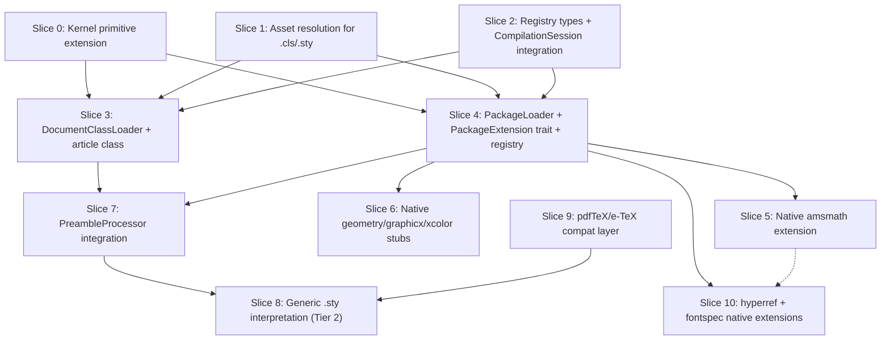

# Design: LaTeX Kernel & Package Loading Slice

## Meta

| Item | Value |
|---|---|
| Date | 2026-03-22 |
| Status | Draft — for orchestrator review |
| Scope | REQ-FUNC-020 (LaTeX kernel compat), REQ-FUNC-026 (generic package loading) |
| Related | REQ-FUNC-021 (amsmath), REQ-FUNC-025 (fontspec), REQ-FUNC-022 (hyperref) |

---

## 1. Current State Gap Analysis

### What exists

| Area | Status | Location |
|---|---|---|
| `\documentclass` parsing | Name extracted, options skipped | `parser/api.rs:843-857` |
| `\usepackage` parsing | Counter incremented, no loading | `parser/api.rs:859-861` |
| `MacroEngine` | Scoped define/expand/catcode, `\newcommand`/`\renewcommand`/`\def`/`\gdef`/`\let` | `parser/macro_engine.rs` |
| `EnvironmentDef` | Begin/end token lists, scoped storage | `parser/macro_engine.rs:13-18` |
| `AssetBundleLoaderPort` | `validate()` + `resolve_tex_input()` (path-based, `.tex` extension default) | `application/ports.rs:3-6` |
| `AssetBundleLoader` infra | Manifest load, version check, `texmf/` path resolution with traversal guard | `infra/asset_bundle/loader.rs` |
| `kernel` module | `SourceSpan`, `StableId`, `DimensionValue` only | `core/kernel/` |
| `assets` module | `LogicalAssetId(StableId)`, `AssetHandle { id }` — stub types | `core/assets/api.rs` |
| `CompilationSession` | Pass number + job context — no `CommandRegistry`/`EnvironmentRegistry`/`InputStack` | `core/compilation/session.rs` |

### What is missing (against domain model and requirements)

1. **Document class loading pipeline**: `DocumentClassLoader` service, `DocumentClassRegistry`, `ClassSnapshot`, class-specific command/environment registration (page layout, sectioning defaults, `\maketitle`)
2. **Package loading pipeline**: `PackageLoader` service, `PackageRegistry`, `PackageSnapshot`, `PackageExtension` trait, option processing (`\DeclareOption`, `\ProcessOptions`), `\RequirePackage` recursive loading, duplicate-load guard
3. **Asset resolution for `.cls`/`.sty`**: `AssetResolver` with `OverlaySet` (project-local → overlay roots → bundle), `LogicalAssetId` with `AssetNamespace::CLASS`/`PACKAGE`
4. **Registry integration into CompilationSession**: `CommandRegistry`, `EnvironmentRegistry` as domain entities on `CompilationSession`
5. **Kernel primitives**: subset of TeX primitives (`\catcode`, `\chardef`, `\countdef`, `\dimendef`, `\let`, `\ifx`, `\ifnum`, `\ifdim`, `\csname...\endcsname`, `\expandafter`, `\noexpand`, `\the`, `\relax`) needed to bootstrap `.cls`/`.sty` files
6. **pdfTeX compat layer**: package-facing primitives (`\pdfoutput`, `\pdfliteral`, `\pdfstrcmp`, `\pdffilesize`, etc.) — required by REQ-FUNC-026 acceptance criteria
7. **e-TeX compat layer**: `\numexpr`, `\dimexpr`, `\protected`, `\detokenize`, `\unexpanded` — also REQ-FUNC-026
8. **Concrete `PackageExtension` impls**: `AmsmathExtension`, `HyperrefExtension`, `FontspecExtension`, `TikzExtension` — at minimum stubs
9. **Package-to-parser integration**: preamble processing loop that drives `\documentclass` → class load → `\usepackage` sequence → `\begin{document}` transition

---

## 2. Design Decisions

### D1: Package loading lives in the Parser context, not Kernel

**Rationale**: The architecture doc (§5.1) explicitly places "パッケージ読み込み" as a Parser & Macro Engine responsibility and restricts Kernel Runtime to "数値/寸法演算、stable ID、source span、snapshot version などの基底型だけ". Package/class semantics, I/O, and registry mutation belong to the parser context.

**Consequence**: `PackageLoader`, `DocumentClassLoader`, `PackageRegistry`, `DocumentClassRegistry` are defined in `ferritex-core::parser`. The kernel module is not expanded with loading logic.

### D2: Two-tier extension model — native + generic `.sty` interpretation

**Tier 1 — Native extensions**: For high-impact packages (`amsmath`, `hyperref`, `fontspec`, `geometry`, `graphicx`, `xcolor`), implement `PackageExtension` as Rust code that registers commands/environments directly. These skip `.sty` parsing entirely.

**Tier 2 — Generic `.sty` interpretation**: For other packages, the `PackageLoader` reads the `.sty` file via `AssetResolver`, feeds it through the `MacroEngine` (with extended kernel primitives), and captures the resulting command/environment definitions as a `PackageSnapshot`.

**Rationale**: Full `.sty` interpretation requires a near-complete TeX engine. Starting with native extensions for the packages most documents use provides immediate value and defers the harder problem. The domain model already defines both `PackageExtension` (interface) and concrete extension types.

### D3: Asset resolution uses documented OverlaySet precedence

Resolution order per REQ-FUNC-026: project-local → configured read-only overlay roots → Asset Bundle.

This maps to `OverlaySet` with `OverlayLayer` entries. The `AssetBundleLoaderPort` needs a `.sty`/`.cls`-aware resolution method (current `resolve_tex_input` appends `.tex`; needs `.cls` and `.sty` variants or a generalized extension parameter).

### D4: CommandRegistry / EnvironmentRegistry as separate entities on CompilationSession

Per domain model §3.1, `CompilationSession` owns `CommandRegistry` and `EnvironmentRegistry`. Currently `CompilationSession` is a thin struct with only `pass_number` + `context`. These registries must be added to `CompilationSession` and seeded during class/package loading.

The existing `MacroEngine` already stores `scope_stack` (macros) and `environment_scope_stack` (environments). The design question is whether `CommandRegistry`/`EnvironmentRegistry` are the same as `MacroEngine`'s storage or separate.

**Decision**: `MacroEngine`'s scoped storage *is* the `CommandRegistry`/`EnvironmentRegistry` implementation for now. The domain model types are type aliases or thin wrappers over `MacroEngine`. This avoids duplicating state. If future requirements demand separate registries (e.g., for LSP introspection), extraction is straightforward.

### D5: Preamble processing as a distinct parser phase

The parser currently treats everything before `\begin{document}` and after it uniformly. Package loading requires a **preamble phase** where:
1. `\documentclass` → triggers `DocumentClassLoader`
2. `\usepackage` (repeated) → triggers `PackageLoader` for each
3. `\newcommand` / `\def` / etc. → processed as user-level preamble definitions
4. `\begin{document}` → finalizes preamble, transitions to body phase

This is a refactor of the main parse loop, not a separate component.

---

## 3. Component Ownership Map

```
Parser & Macro Engine (ferritex-core::parser)
├── PackageLoader          — service: drives .sty resolution + extension instantiation
├── DocumentClassLoader    — service: drives .cls resolution + class snapshot creation
├── PackageRegistry        — entity: tracks loaded packages, prevents double-load
├── DocumentClassRegistry  — entity: tracks active class
├── PackageExtension       — trait: register(session) → mutates registries
│   ├── AmsmathExtension   — native Rust impl
│   ├── HyperrefExtension  — native Rust impl (stub initially)
│   ├── FontspecExtension  — native Rust impl (stub initially)
│   └── GenericStyExtension — wraps MacroEngine-interpreted .sty result
├── CommandRegistry        — thin wrapper on MacroEngine::scope_stack
├── EnvironmentRegistry    — thin wrapper on MacroEngine::environment_scope_stack
└── PreambleProcessor      — orchestrates class→packages→begin{document} sequence

Asset Runtime (ferritex-core::assets)
├── AssetResolver          — service: resolves LogicalAssetId via OverlaySet
├── OverlaySet             — entity: project-local + overlays + bundle layers
├── LogicalAssetId         — value object: namespace + logical name
└── AssetNamespace         — enum: CLASS, PACKAGE, FONT

Application (ferritex-application)
├── AssetBundleLoaderPort  — extended with resolve_package / resolve_class
└── CompileJobService      — wires PreambleProcessor into compile pipeline

Infrastructure (ferritex-infra)
└── AssetBundleLoader      — implements extended port methods
```

---

## 4. Dependency Ordering



---

## 5. Implementation Slices (ordered)

### Slice 0: Kernel Primitive Extension
**Scope**: Extend `MacroEngine` with primitives required for `.cls`/`.sty` bootstrapping.
- `\csname...\endcsname` → construct control sequence from tokens
- `\expandafter` → single expansion before next token
- `\noexpand` → prevent expansion of next token
- `\the` → print register value as token list
- `\relax` → no-op (already partially handled)
- `\chardef`, `\countdef`, `\dimendef` → register aliases
- Extend existing conditional handling (`\ifx`, `\ifnum`, `\ifdim` additions)

**Owner**: `ferritex-core::parser`
**Risk**: Getting expansion order semantics right is non-trivial. Limit to the subset actually exercised by target `.cls`/`.sty` files.

### Slice 1: Asset Resolution for `.cls` / `.sty`
**Scope**: Make `AssetResolver` and `OverlaySet` operational for class/package assets.
- Extend `AssetBundleLoaderPort` with `resolve_asset(bundle_path, logical_name, namespace) -> Option<PathBuf>` or generalize `resolve_tex_input` to accept extension parameter
- Implement `OverlaySet` with layer precedence: project-local → bundle
- Implement `LogicalAssetId` with `AssetNamespace::{CLASS, PACKAGE, FONT}`
- Enforce path traversal guard (already exists in bundle loader, extend to project-local)

**Owner**: `ferritex-core::assets` (domain types) + `ferritex-application::ports` (port extension) + `ferritex-infra::asset_bundle` (implementation)
**Risk**: Low. Straightforward path resolution.

### Slice 2: Registry Types + CompilationSession Integration
**Scope**: Add `CommandRegistry` and `EnvironmentRegistry` to `CompilationSession`.
- Define `CommandRegistry` / `EnvironmentRegistry` as wrappers or type aliases on `MacroEngine`
- Add `MacroEngine` (or its successor) to `CompilationSession`
- Add `PackageRegistry` (tracks loaded package names + options, prevents double-load)
- Add `DocumentClassRegistry` (tracks active class name + class options)

**Owner**: `ferritex-core::parser` (registry types) + `ferritex-core::compilation` (session integration)
**Risk**: Moderate. `CompilationSession` is referenced throughout the compile pipeline; adding fields may require adjusting call sites.

### Slice 3: DocumentClassLoader + `article` Class
**Scope**: Implement class loading for `article` (the most common class).
- `DocumentClassLoader::load("article", session)` → returns `ClassSnapshot`
- `ClassSnapshot` registers: page layout defaults (margins, text dimensions), sectioning command semantics (`\section`, `\subsection`, etc.), `\maketitle` behavior, page styles
- Class registration seeds `CommandRegistry`/`EnvironmentRegistry` via `MacroEngine`
- Other classes (`report`, `book`, `letter`) as follow-up — `article` covers the vast majority of test documents

**Owner**: `ferritex-core::parser`
**Risk**: Defining what "article class defaults" means without parsing `article.cls` requires enumerating behaviors. Start minimal: page geometry + existing sectioning.

### Slice 4: PackageLoader + PackageExtension Trait + PackageRegistry
**Scope**: The package loading framework.
- `PackageExtension` trait: `fn register(&self, session: &mut CompilationSession)`
- `PackageLoader::load(name, options, session)` → checks `PackageRegistry` for double-load → resolves via `AssetResolver` → instantiates native or generic extension → calls `register`
- `PackageRegistry` tracks loaded packages with their options
- `\RequirePackage` support → delegates to same `PackageLoader::load`

**Owner**: `ferritex-core::parser`
**Risk**: Option processing (`\DeclareOption`/`\ProcessOptions`) is complex. Defer full option semantics to Slice 8; native extensions handle their own option interpretation.

### Slice 5: Native `amsmath` Extension
**Scope**: Promote existing math environment handling to a proper `AmsmathExtension`.
- Current `align`/`gather`/`multline`/`equation` parsing already exists in the parser
- Wrap as `PackageExtension` impl that registers these environments when `\usepackage{amsmath}` is loaded
- Without amsmath loaded, these environments should not be available (or fall back to base LaTeX behavior)

**Owner**: `ferritex-core::parser`
**Risk**: Low. Mostly restructuring existing code.

### Slice 6: Native `geometry` / `graphicx` / `xcolor` Stubs
**Scope**: Stub extensions that accept commands without error.
- `geometry`: Parse options, update page layout dimensions in `DocumentState`
- `graphicx`: Register `\includegraphics` command (delegates to existing Graphics pipeline)
- `xcolor`: Register `\color`, `\textcolor`, `\definecolor` (initially no-op for rendering)

**Owner**: `ferritex-core::parser`
**Risk**: Low for stubs. Full semantics (especially graphicx image embedding) depends on Graphics Rendering context.

### Slice 7: PreambleProcessor Integration
**Scope**: Refactor the parse loop to support the preamble phase.
- `\documentclass` → call `DocumentClassLoader`
- `\usepackage` → call `PackageLoader` (instead of incrementing counter)
- Wire `PreambleProcessor` into `CompileJobService.compile()`
- `ParsedDocument` gains metadata: loaded packages list, active class, preamble diagnostics
- `ParseOutput` gains preamble-phase errors/warnings

**Owner**: `ferritex-core::parser` + `ferritex-application::compile_job_service`
**Risk**: Moderate. This is the main integration point; if registry state isn't properly threaded through, body parsing will not see class/package definitions.

### Slice 8: Generic `.sty` Interpretation (Tier 2)
**Scope**: Feed `.sty` file content through `MacroEngine` to capture definitions.
- Parse `.sty` as a token stream
- Execute through `MacroEngine` (with Slice 0 primitives + Slice 9 compat)
- Capture resulting macro/environment definitions as `PackageSnapshot`
- Support `\DeclareOption` / `\ProcessOptions` / `\ExecuteOptions`
- Support `\newif` / `\@ifpackageloaded` / common LaTeX internal commands

**Owner**: `ferritex-core::parser`
**Risk**: **High**. This is where "implement a TeX engine" starts. Limit to the subset needed for packages in `FTX-ASSET-BUNDLE-001`. Test against specific `.sty` files, not arbitrary ones.

### Slice 9: pdfTeX / e-TeX Compatibility Layer
**Scope**: Implement package-facing engine primitives.
- e-TeX: `\numexpr`, `\dimexpr`, `\protected`, `\detokenize`, `\unexpanded`
- pdfTeX: `\pdfoutput`, `\pdfliteral`, `\pdfstrcmp`, `\pdffilesize`, `\pdftexversion`
- Strategy: register these as built-in commands that return expected values or no-ops
- `\pdfstrcmp` is heavily used by packages (e.g., `xkeyval`, `etoolbox`) — needs a real implementation

**Owner**: `ferritex-core::parser`
**Risk**: Moderate. The set is bounded by what `FTX-ASSET-BUNDLE-001` packages actually use. Profile real `.sty` files to determine minimum viable set.

### Slice 10: `hyperref` + `fontspec` Native Extensions
**Scope**: Implement native extensions for cross-cutting packages.
- `HyperrefExtension`: registers `\href`, `\url`, `\hyperref`, `\hypersetup`; emits `DocumentStateDelta` for navigation (bookmarks, link annotations)
- `FontspecExtension`: registers `\setmainfont`, `\setsansfont`, `\setmonofont`; bridges to `Font Management` context via `FontSpec` resolution

**Owner**: `ferritex-core::parser`
**Risk**: Moderate. These packages have deep integration with other systems (PDF for hyperref, font subsystem for fontspec). Limit to command registration + delegation to existing subsystems.

---

## 6. Minimal First Compatibility Surface

**Goal**: A LaTeX document with `\documentclass{article}` and `\usepackage{amsmath}` compiles through the full pipeline with class-aware defaults and amsmath environments registered.

This requires **Slices 0–5 + 7** — seven implementation units that can be parallelized as:

| Phase | Slices | Parallelizable? |
|---|---|---|
| Foundation | S0, S1, S2 | Yes (independent) |
| Loaders | S3, S4 | Yes (independent, both depend on S0+S1+S2) |
| Extension | S5 | Depends on S4 |
| Integration | S7 | Depends on S3+S4 |

**Estimated scope**: ~15-20 files touched, ~1500-2500 lines added.

---

## 7. Key Risks and Mitigations

| Risk | Severity | Mitigation |
|---|---|---|
| Scope creep into full TeX engine | High | Native extensions for top packages; defer generic `.sty` interpretation (Slice 8) to a later wave |
| `MacroEngine` expansion semantics insufficient for `.cls`/`.sty` | High | Limit Slices 0–7 to native extensions that bypass `.sty` parsing entirely; only Slice 8+ requires full interpretation |
| `CompilationSession` refactor cascading through codebase | Medium | Introduce registries as `Option<MacroEngine>` on session, initialize lazily, thread through parse calls incrementally |
| Class defaults (article) diverge from pdfLaTeX | Medium | Validate against `FTX-CORPUS-COMPAT-001/layout-core/article` baseline documents |
| `AssetBundleLoaderPort` extension breaks existing tests | Low | Additive method with default impl; existing tests unaffected |

---

## 8. Architecture Conformance Notes

- **No domain → application dependency**: `PackageLoader`/`DocumentClassLoader` are domain services. They depend on `AssetResolver` (domain port). The infra adapter implements it. ✓
- **Kernel stays thin**: No loading logic in `kernel` module. ✓
- **Peer context isolation**: Parser context accesses Assets context only via `AssetResolver` port, not internal modules. ✓
- **CompilationSession ownership**: Registries are owned by `CompilationSession` per domain model §3.1. ✓
- **No shared mutable state**: Package loading happens in the preamble phase of a single pass; no concurrent mutation concern. ✓
