# Ferritex ドメインモデル

## メタ情報

| 項目    | 内容              |
| ----- | --------------- |
| バージョン | 0.1.4           |
| 最終更新日 | 2026-03-12      |
| ステータス | ドラフト            |
| 作成者   | Claude Opus 4.6 |
| レビュー者 | —               |
| 準拠要件  | [requirements.md](requirements.md) v0.1.4 |

## 1. サブドメイン分類

| サブドメイン | 分類 | 理由 |
|---|---|---|
| パーサー/マクロエンジン | **コア** | TeX の本質。カテゴリコード・マクロ展開の正確さが互換性を決定 |
| タイプセッティング | **コア** | Knuth-Plass 行分割・ページ分割・数式組版が出力品質を決定 |
| 差分コンパイル | **コア** | 100倍高速化の差別化要因。依存グラフ・キャッシュが独自価値 |
| アセットランタイム | 支援 | クラス・パッケージ・フォント資産を事前インデックス化し、実行時の探索コストを最小化 |
| グラフィック描画 | 支援 | `tikz` と `graphicx` の描画結果を PDF 非依存のプリミティブへ正規化し、出力責務を集約 |
| PDF 生成 | 支援 | 確立された仕様（PDF規格）に従う変換処理 |
| フォント管理 | 支援 | OpenType/TFM の読み込み・探索は確立された仕様に基づく |
| 開発者ツール | 支援 | LSP / プレビュー / CLI はコアエンジンの公開インターフェース |

**パッケージ互換レイヤーの位置づけ**: 独立サブドメインとはせず、パーサー/マクロエンジン内の `DocumentClassRegistry` / `PackageRegistry` / `CommandRegistry` / `EnvironmentRegistry` を拡張点として実現する。資産の実体はアセットランタイムが供給し、汎用パッケージ読み込み機構（`.sty` ファイルのパース・スナップショット読み込み・マクロ登録）はパーサー/マクロエンジンの責務とする。個別パッケージの振る舞い（amsmath → 数式組版、hyperref → PDF リンク、graphicx / tikz → グラフィック描画、fontspec → フォント管理）は対応するサブドメイン内で処理する。

## 2. コンテキストマップ

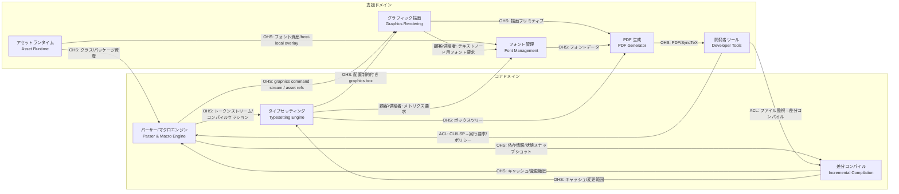

**統合パターンの選択根拠:**

- アセットランタイム → コア/支援は **OHS（公開ホストサービス）** — 事前インデックス化された不変資産を供給
- コアドメイン間は **OHS（公開ホストサービス）** — 明確に定義されたストリーム/データ構造で接続
- 開発者ツール → コアは **ACL（腐敗防止層）** — LSP プロトコル等の外部仕様をコアドメインの言語に変換
- グラフィック描画 → PDF 生成は **OHS（公開ホストサービス）** — PDF 非依存の描画プリミティブを供給
- タイプセッティング → フォント管理は **顧客/供給者** — タイプセッティングが必要なメトリクスを要求し、フォント管理が供給

## 3. ドメインモデル図

### 3.1 パーサー/マクロエンジン コンテキスト

```mermaid
classDiagram
    class CompilationSession {
        <<Entity>>
        +CatcodeTable catcodes
        +DocumentState documentState
        +ScopeStack scopes
        +RegisterBank registers
        +CommandRegistry commands
        +EnvironmentRegistry environments
        +OutputArtifactRegistry outputArtifacts
        +ExecutionPolicy policy
    }
    class Lexer {
        <<Entity>>
        +InputSource source
        +nextToken(CompilationSession) Token
    }
    class CatcodeTable {
        <<ValueObject>>
        +Map~char, Catcode~ entries
        +get(char) Catcode
        +set(char, Catcode) CatcodeTable
    }
    class Token {
        <<ValueObject>>
        +TokenKind kind
        +SourceLocation location
    }
    class ControlSequenceToken {
        <<ValueObject>>
        +String name
    }
    class CharacterToken {
        <<ValueObject>>
        +char value
        +Catcode catcode
    }
    class MacroEngine {
        <<Entity>>
        +expand(TokenStream, CompilationSession) TokenStream
        +defineLocal(String, MacroDefinition, CompilationSession) void
        +defineGlobal(String, MacroDefinition, CompilationSession) void
    }
    class MacroDefinition {
        <<ValueObject>>
        +String name
        +ParameterPattern pattern
        +TokenList replacementText
        +ExpansionKind kind
    }
    class ScopeStack {
        <<Entity>>
        +push() void
        +pop() void
        +lookup(String) MacroDefinition
    }
    class RegisterBank {
        <<Entity>>
        +RegisterValue get(RegisterKind, int) RegisterValue
        +set(RegisterKind, int, RegisterValue) void
    }
    class DocumentState {
        <<Entity>>
        +CounterStore counters
        +CrossReferenceTable references
        +BibliographyState bibliography
        +AuxState aux
        +int passCount
        +registerLabel(String, LabelInfo) void
        +resolveLabel(String) ResolvedRef
    }
    class CounterStore {
        <<Entity>>
        +step(String) int
        +set(String, int) void
        +get(String) int
    }
    class AuxState {
        <<Entity>>
        +List~AuxWrite~ pendingWrites
        +mergePreviousPass(AuxSnapshot) void
    }
    class CrossReferenceTable {
        <<Entity>>
        +Map~String, LabelInfo~ labels
        +List~UnresolvedRef~ unresolved
        +isStable() bool
    }
    class LabelInfo {
        <<ValueObject>>
        +String key
        +String value
        +int pageNumber
    }
    class BibliographyState {
        <<Entity>>
        +CitationTable citations
        +BblSnapshot bbl
        +resolveCitation(String) CitationInfo
    }
    class CitationTable {
        <<Entity>>
        +Map~String, CitationInfo~ entries
    }
    class CitationInfo {
        <<ValueObject>>
        +String key
        +String label
        +String formattedText
    }
    class BblSnapshot {
        <<ValueObject>>
        +List~BibliographyEntry~ entries
    }
    class BibliographyEntry {
        <<ValueObject>>
        +String key
        +String renderedBlock
    }
    class CommandRegistry {
        <<Entity>>
        +register(String, ExecutableCommand) void
        +lookup(String) ExecutableCommand
    }
    class EnvironmentRegistry {
        <<Entity>>
        +register(String, ExecutableEnvironment) void
        +lookup(String) ExecutableEnvironment
    }
    class DocumentClassRegistry {
        <<Entity>>
        +resolve(String, ClassOptions) ClassSnapshot
    }
    class PackageRegistry {
        <<Entity>>
        +resolve(String, PackageOptions) PackageSnapshot
    }
    class PackageLoader {
        <<Service>>
        +load(String, CompilationSession) PackageExtension
    }
    class DocumentClassLoader {
        <<Service>>
        +load(String, CompilationSession) ClassSnapshot
    }
    class PackageExtension {
        <<Interface>>
        +register(CompilationSession) void
    }
    class AmsmathExtension {
        <<Extension>>
    }
    class HyperrefExtension {
        <<Extension>>
    }
    class TikzExtension {
        <<Extension>>
    }
    class FontspecExtension {
        <<Extension>>
    }
    class AssetResolver {
        <<Service>>
        +resolve(LogicalPath, ResolutionContext) AssetHandle
    }
    class ShellCommandGateway {
        <<Service>>
        +execute(CommandRequest, ExecutionPolicy) CommandResult
    }
    class ExecutionPolicy {
        <<ValueObject>>
        +bool shellEscapeEnabled
        +PathAccessPolicy pathPolicy
        +Duration commandTimeout
    }
    class PathAccessPolicy {
        <<ValueObject>>
        +FilePath projectRoot
        +List~FilePath~ overlayRoots
        +List~FilePath~ bundleRoots
        +FilePath cacheDir
        +List~FilePath~ outputRoots
        +Set~String~ outputReadbackExtensions
        +FilePath privateTempRoot
    }
    class OutputArtifactRegistry {
        <<Entity>>
        +Map~FilePath, OutputArtifactRecord~ records
        +record(OutputArtifactRecord) void
        +allowReadback(FilePath, String, ArtifactKind) bool
    }
    class OutputArtifactRecord {
        <<ValueObject>>
        +FilePath path
        +ArtifactKind kind
        +String jobname
        +ArtifactProducerKind producer
        +ContentHash contentHash
        +int producedPass
    }
    class InputSource {
        <<Entity>>
        +FilePath path
        +int line
        +int column
        +read() char
    }
    class ConditionalEvaluator {
        <<Service>>
        +evaluate(ConditionKind, TokenStream) Branch
    }
    class ErrorRecovery {
        <<Service>>
        +recover(ParseError, TokenStream) TokenStream
    }
    class SourceLocation {
        <<ValueObject>>
        +FilePath file
        +int line
        +int column
    }

    Token <|-- ControlSequenceToken
    Token <|-- CharacterToken
    CompilationSession --> CatcodeTable
    CompilationSession --> DocumentState
    CompilationSession --> ScopeStack
    CompilationSession --> RegisterBank
    CompilationSession --> CommandRegistry
    CompilationSession --> EnvironmentRegistry
    CompilationSession --> OutputArtifactRegistry
    CompilationSession --> ExecutionPolicy
    DocumentState --> CounterStore
    DocumentState --> CrossReferenceTable
    DocumentState --> BibliographyState
    DocumentState --> AuxState
    CrossReferenceTable o-- LabelInfo
    BibliographyState --> CitationTable
    BibliographyState --> BblSnapshot
    CitationTable o-- CitationInfo
    BblSnapshot o-- BibliographyEntry
    Lexer --> CompilationSession : reads
    Lexer --> InputSource
    Lexer ..> Token : produces
    MacroEngine --> CompilationSession
    MacroEngine ..> MacroDefinition : uses
    MacroEngine ..> ConditionalEvaluator : uses
    ScopeStack o-- MacroDefinition
    PackageLoader --> PackageRegistry
    PackageLoader --> AssetResolver
    PackageLoader ..> PackageExtension : instantiates
    DocumentClassLoader --> DocumentClassRegistry
    DocumentClassLoader --> AssetResolver
    PackageExtension <|.. AmsmathExtension
    PackageExtension <|.. HyperrefExtension
    PackageExtension <|.. TikzExtension
    PackageExtension <|.. FontspecExtension
    ShellCommandGateway --> ExecutionPolicy
    ExecutionPolicy --> PathAccessPolicy
    OutputArtifactRegistry o-- OutputArtifactRecord
    Token --> SourceLocation
```

### 3.2 タイプセッティング コンテキスト

ここで参照する `DocumentState` は、3.1 の `CompilationSession.documentState` と同一の共有エンティティである。

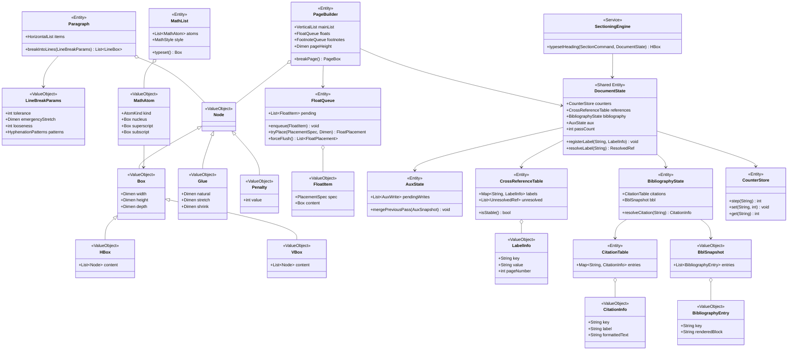

### 3.3 グラフィック描画 コンテキスト

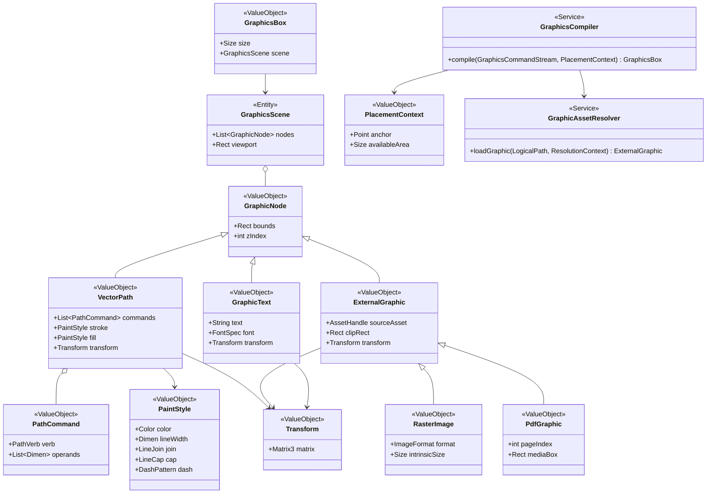

### 3.4 差分コンパイル コンテキスト

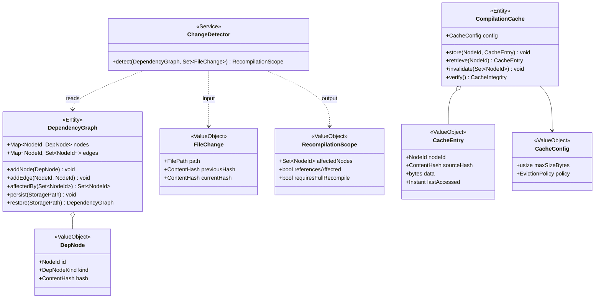

### 3.5 アセットランタイム コンテキスト

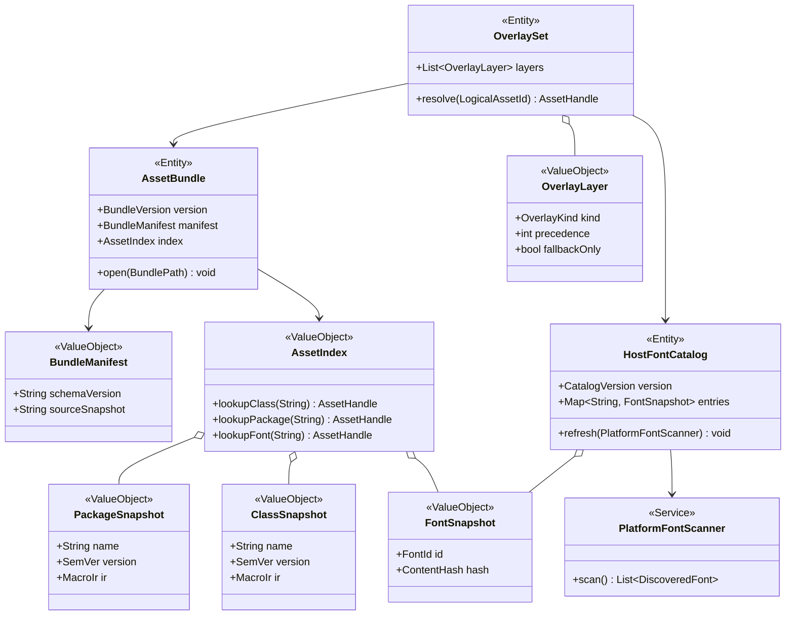

### 3.6 PDF 生成 コンテキスト

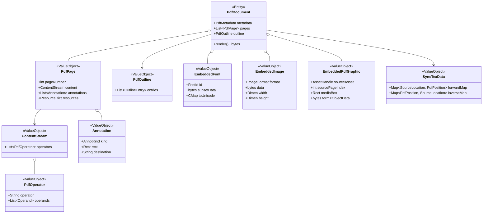

### 3.7 フォント管理 コンテキスト

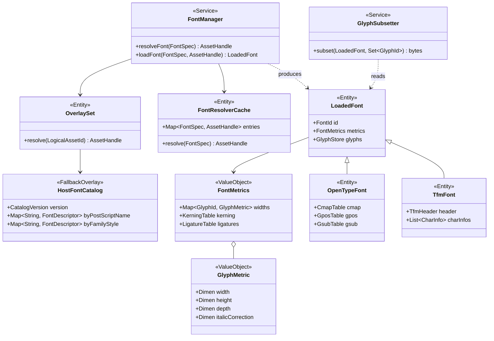

### 3.8 開発者ツール コンテキスト

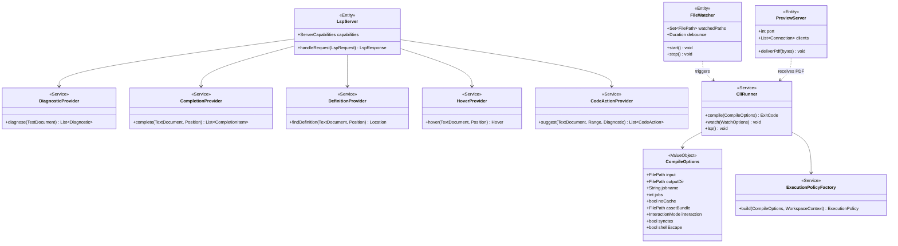

## 4. 状態遷移図

### 4.1 コンパイルジョブ

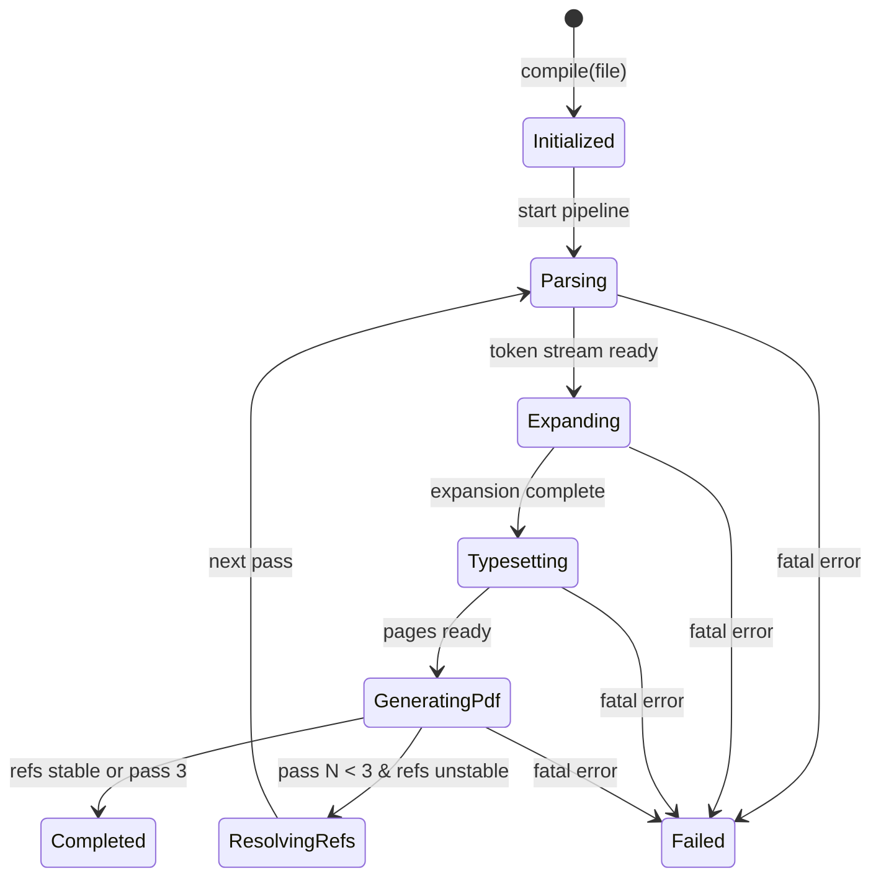

### 4.2 フロート配置

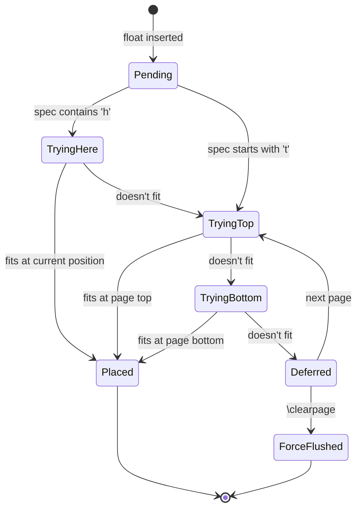

### 4.3 差分コンパイルキャッシュ

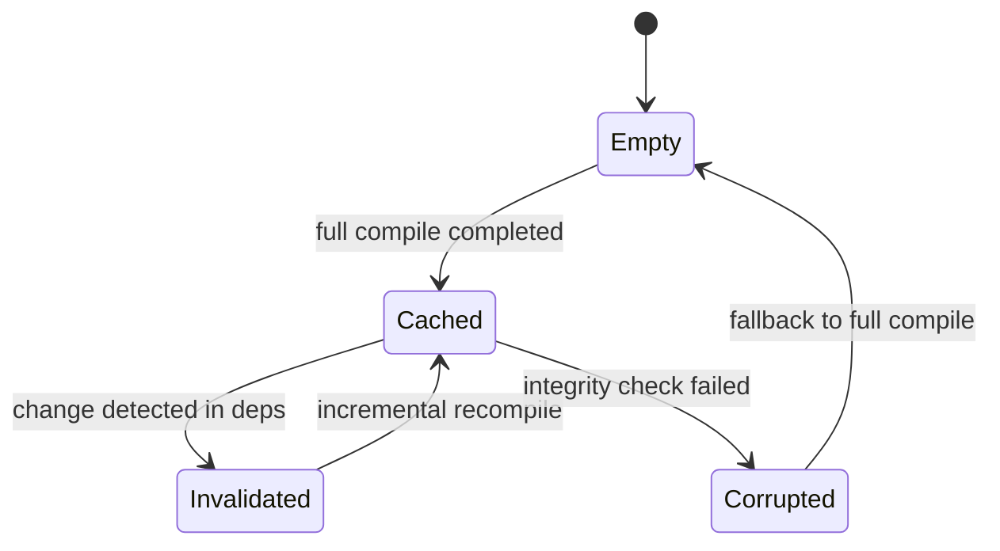

## 5. 用語集

### 5.1 パーサー/マクロエンジン コンテキスト

| 用語 | 定義 | 関連概念 |
|---|---|---|
| トークン (Token) | 字句解析が生成する処理の最小単位。コントロールシーケンストークンと文字トークンの 2 種 | カテゴリコード, Lexer |
| カテゴリコード (Catcode) | 各文字に割り当てる種別コード（0〜15）。字句解析の挙動を制御 | トークン, CatcodeTable |
| マクロ定義 (MacroDefinition) | `\def` 等で定義されたパターンと置換テキストの組 | マクロ展開, スコープ |
| スコープ (Scope) | `{}` や `\begingroup`/`\endgroup` で区切られたマクロ・レジスタの有効範囲 | ScopeStack |
| レジスタ (Register) | count, dimen, skip, toks, box 等の型付き記憶領域。e-TeX 拡張で 32768 個 | RegisterBank |
| コンパイルセッション (CompilationSession) | 1 回のコンパイルパスで共有される可変 TeX 状態の集約。カテゴリコード、レジスタ、ラベル、参考文献状態、出力アーティファクト provenance、実行ポリシーを保持する | DocumentState, OutputArtifactRegistry, ExecutionPolicy |
| パスアクセスポリシー (PathAccessPolicy) | 読み書き可能な project root / overlay roots / bundle roots / cache dir / output roots / private temp root と、output root から再読込可能な補助ファイル拡張子 allowlist を保持する静的ポリシー。実際の readback 可否は OutputArtifactRegistry と組み合わせて判定する | ExecutionPolicy, OutputArtifactRegistry |
| 出力アーティファクトレジストリ (OutputArtifactRegistry) | Ferritex または Ferritex が制御した外部ツール実行で生成した readback 対象補助ファイルの provenance を保持し、trusted artifact のみを再読込可能にする台帳 | OutputArtifactRecord, ExecutionPolicy |
| ソース位置 (SourceLocation) | ファイル名・行番号・列番号の組。エラー報告と SyncTeX で使用 | エラー回復 |

### 5.2 タイプセッティング コンテキスト

| 用語 | 定義 | 関連概念 |
|---|---|---|
| ボックス (Box) | 幅・高さ・深さを持つ組版の基本レイアウト単位 | HBox, VBox |
| グルー (Glue) | 自然長・伸び量・縮み量を持つ伸縮可能なスペース | 行分割 |
| ペナルティ (Penalty) | 行/ページ分割の位置を制御する整数値。高いほど分割されにくい | 行分割, ページ分割 |
| 行分割 (Line Breaking) | Knuth-Plass アルゴリズムにより段落の最適な改行位置を決定する処理 | Paragraph, LineBreakParams |
| フロート (Float) | テキストの流れから独立して配置されるオブジェクト。配置指定子で制御 | FloatQueue, PageBuilder |
| ドキュメント状態 (DocumentState) | カウンタ、ラベル、参考文献状態、参照安定性など、組版中に更新される文書単位の状態 | CounterStore, CrossReferenceTable, BibliographyState |
| 相互参照 (Cross Reference) | `\label`/`\ref`/`\pageref` による文書内の参照。最大 3 パスで解決 | CrossReferenceTable |
| 参考文献状態 (BibliographyState) | `.bbl` 由来の Citation Table と参考文献エントリを保持し、`\cite` を解決する状態 | CitationTable, BblSnapshot |
| 数式リスト (MathList) | 数式アトム（Ord, Op, Bin, Rel 等）の列。スタイルに応じて組版 | MathAtom |

### 5.3 グラフィック描画 コンテキスト

| 用語 | 定義 | 関連概念 |
|---|---|---|
| グラフィックシーン (GraphicsScene) | `tikz` / `graphicx` の結果を PDF 非依存のベクター・PDF グラフィック・ラスタ・テキスト要素へ正規化した描画単位 | GraphicsBox, GraphicNode |
| GraphicsBox | 組版結果に埋め込める寸法付きの描画ボックス | GraphicsScene, PlacementContext |
| VectorPath | 線・矩形・曲線などのベクター描画要素 | PathCommand, PaintStyle |
| ExternalGraphic | 外部ファイル由来のグラフィック要素。共通のクリッピング・変換情報を持つ | RasterImage, PdfGraphic |
| RasterImage | PNG/JPEG 画像などのラスタ要素 | GraphicAssetResolver, Transform |
| PdfGraphic | 埋め込み元 PDF のページをベクター性を保持したまま扱う外部グラフィック要素 | GraphicAssetResolver, Transform |

### 5.4 差分コンパイル コンテキスト

| 用語 | 定義 | 関連概念 |
|---|---|---|
| 依存グラフ (DependencyGraph) | ファイル・マクロ・ラベル間の依存関係を表す有向グラフ | DepNode, 変更検知 |
| 依存ノード (DepNode) | 依存グラフの頂点。ファイル/マクロ/ラベルのいずれか | DependencyGraph |
| コンテンツハッシュ (ContentHash) | ファイル/ノード内容のハッシュ値。変更検知に使用 | ChangeDetector |
| 再コンパイル範囲 (RecompilationScope) | 変更の影響伝播により再処理が必要なノードの集合。参照影響の有無を含む | ChangeDetector |
| キャッシュエントリ (CacheEntry) | コンパイル中間結果のシリアライズデータ。ソースハッシュで整合性を検証 | CompilationCache |

### 5.5 アセットランタイム コンテキスト

| 用語 | 定義 | 関連概念 |
|---|---|---|
| Ferritex Asset Bundle | 実行時に参照するクラス・パッケージ・フォント資産の不変スナップショット | AssetIndex, OverlaySet |
| Asset Index | 論理名から資産ハンドルを高速解決する索引構造 | AssetBundle |
| オーバーレイ (Overlay) | project-local 資産、設定済み read-only overlay roots、Ferritex Asset Bundle、host-local font catalog fallback を優先順位付きで束ねる解決レイヤー | OverlaySet, OverlayLayer |
| Host Font Catalog | platform font discovery API から収集したホストフォント索引。overlay の一種として解決面に参加する | PlatformFontScanner, FontSnapshot |

### 5.6 PDF 生成 コンテキスト

| 用語 | 定義 | 関連概念 |
|---|---|---|
| コンテンツストリーム (ContentStream) | PDF ページの描画命令列 | PdfOperator |
| アノテーション (Annotation) | PDF 上のリンク・しおり等のインタラクティブ要素 | hyperref |
| 埋め込みフォント (EmbeddedFont) | 使用グリフのみをサブセット化して PDF に埋め込んだフォントデータ | GlyphSubsetter |
| 埋め込み PDF グラフィック (EmbeddedPdfGraphic) | 外部 PDF ページを Form XObject 化して PDF 内へ再利用可能にした描画資産 | PdfGraphic |
| SyncTeX データ | ソース位置と PDF 位置の双方向マッピング | SourceLocation |

### 5.7 フォント管理 コンテキスト

| 用語 | 定義 | 関連概念 |
|---|---|---|
| フォントメトリクス (FontMetrics) | 文字幅・高さ・深さ・カーニング・リガチャ情報の集合 | GlyphMetric |
| Host Font Catalog | platform font discovery API に基づき永続化されたホストフォント索引。`fontspec` 解決時に hot path で再走査しない fallback overlay であり、project/configured overlay と Asset Bundle に一致候補がない場合にのみ参照する。host-local font を直接解決した出力は REQ-NF-008 のバイト同一保証対象外 | HostFontCatalog, FontResolverCache |
| OpenType フォント | OTF/TTF 形式のモダンフォント。GPOS/GSUB テーブルで高度な組版を制御 | fontspec |
| TFM フォント | TeX 固有のフォントメトリクスバイナリ形式 | Computer Modern |
| グリフサブセット化 | 使用グリフのみを抽出してフォントデータを縮小する処理 | PDF 埋め込み |

## 6. 判断記録

### 6.1 パイプライン並列化をインフラストラクチャ層に配置

- **日付**: 2026-03-11
- **関連コンテキスト**: 全コンテキスト横断
- **判断内容**: パイプライン並列化（ステージ間バッファリング・スレッドプール管理）はドメインモデルに含めず、インフラストラクチャ層の関心事とする
- **根拠**:
  - 観測事実: BR-6「並列処理の出力はシングルスレッド実行と同一」— ドメインロジックは実行モデルに依存しない
  - 代替案: `PipelineOrchestrator` をドメインモデルに含める
  - 分離証人: 逐次実行でも並列実行でも全ビジネスルール（行分割・ページ分割・参照解決等）の帰結は同一。パイプラインの存在でのみ表現可能なビジネスルールが存在しない
- **等価性への影響**: 理論等価（ドメインの振る舞いは変化しない）
- **語彙への影響**: なし

### 6.2 依存グラフとコンパイルキャッシュの独立永続化

- **日付**: 2026-03-11
- **関連コンテキスト**: 差分コンパイル
- **判断内容**: `DependencyGraph` は `CompilationCache` とは独立したストレージに永続化する
- **根拠**:
  - 観測事実: BR-9「キャッシュ破損時はフルコンパイルにフォールバック」。依存グラフが失われると変更検知自体が不可能になり、フォールバックのコストが不必要に増大する
  - 代替案: `DependencyGraph` を `CompilationCache` の一部として同一ストレージに保存する
  - 分離証人: キャッシュ破損＋依存グラフ健全のケース。独立永続化モデルでは依存グラフから変更範囲を特定し「変更範囲のみフルリビルド」が可能。同一ストレージモデルではグラフも失われるため全ファイルの再パースから開始する必要がある
- **等価性への影響**: 観測的等価（正常時の出力は同一。異常時の復旧効率が異なる）
- **語彙への影響**: なし

### 6.3 RecompilationScope への参照影響フラグ追加

- **日付**: 2026-03-11
- **関連コンテキスト**: 差分コンパイル / タイプセッティング
- **判断内容**: `RecompilationScope` に `referencesAffected: bool` を追加し、差分コンパイル時の参照再計算要否を明示する
- **根拠**:
  - 観測事実: BR-5「差分コンパイルの出力はフルコンパイルと同一」。ページ番号がずれると目次・相互参照の再計算が必要
  - 代替案: 差分コンパイル時は常に参照を再計算する
  - 分離証人: 本文中のタイポ修正（ページ番号に影響しない変更）のケース。フラグありモデルでは `referencesAffected == false` で参照再計算をスキップし高速化。常時再計算モデルでは不要なパスが実行される
- **等価性への影響**: 理論等価（出力は同一。処理効率が異なる）
- **語彙への影響**: 「再コンパイル範囲」の定義に「参照影響の有無」を追加

### 6.4 パッケージ互換レイヤーを独立サブドメインとしない

- **日付**: 2026-03-11
- **関連コンテキスト**: 全コンテキスト横断
- **判断内容**: パッケージ互換を独立サブドメインとせず、各サブドメインの拡張ポイントとして実現する。`graphicx` / `tikz` はグラフィック描画コンテキストへ束ねる
- **根拠**:
  - 観測事実: 個別パッケージの振る舞いは異なるサブドメインに属する（amsmath → 数式組版、hyperref → PDF リンク、graphicx / tikz → グラフィック描画）
  - 代替案: 「パッケージ互換」を独立した境界づけられたコンテキストとする
  - 分離証人: 独立コンテキストモデルでは、amsmath の数式環境を処理するために「パッケージ互換コンテキスト」がタイプセッティングの内部（MathList, MathAtom）を知る必要があり、密結合が生じる。拡張ポイントモデルではこの問題が発生しない
- **等価性への影響**: 理論等価（機能は同一。モジュール構造が異なる）
- **語彙への影響**: なし

### 6.5 Ferritex Asset Bundle を実行時の唯一の共有資産源とする

- **日付**: 2026-03-11
- **関連コンテキスト**: アセットランタイム / パーサー/マクロエンジン / フォント管理
- **判断内容**: クラス・パッケージ・フォント資産は、project-local 資産、設定済み read-only overlay roots、Ferritex Asset Bundle、Host Font Catalog fallback の順で解決し、TeX Live / kpathsea は実行時依存にしない。Host Font Catalog は第三の資産源ではなく fallback overlay として扱い、前段に一致候補がない場合または明示的 host-local 解決時にのみ参照する。ただし host-local font を直接解決した出力は REQ-NF-008 のバイト同一保証対象外とする
- **根拠**:
  - 観測事実: 要件は pdfLaTeX 比 100 倍の高速化を求め、単一バイナリ + バンドルでの起動を要求する
  - 代替案: 実行時に `TEXMF` ツリーを走査し、kpathsea 互換の探索を行う
  - 分離証人: クリーンマシンでのコールドスタートコンパイル。Asset Bundle モデルでは memory-mapped index 1回 + ハッシュ探索でクラス/パッケージ/フォントを解決できるが、実行時探索モデルではディレクトリ走査・`ls-R` 解析・OS フォント探索が必要になる
- **等価性への影響**: 観測的非等価（展開・配備方式は変わるが、文書処理機能の目標は同一）
- **語彙への影響**: 「Ferritex Asset Bundle」「Asset Index」「Host Font Catalog」を導入

### 6.6 CompilationSession を可変 TeX 状態の集約境界とする

- **日付**: 2026-03-11
- **関連コンテキスト**: パーサー/マクロエンジン / タイプセッティング
- **判断内容**: カテゴリコード、スコープ、レジスタ、カウンタ、ラベル、参考文献状態、`.aux` 書き込み、参照安定性、コマンド/環境レジストリ、実行ポリシーを `CompilationSession` に集約する。タイプセッティングは同じ `DocumentState` を共有参照する
- **根拠**:
  - 観測事実: `\section` によるカウンタ更新、`\label` の登録、`\ref` の解決、パッケージ読み込みは同一パスの逐次状態に依存する
  - 代替案: それぞれを独立サービスとして保持し、暗黙の共有状態またはグローバル状態で同期する
  - 分離証人: `\section{A}\label{sec:a}` のケース。集約モデルでは同一セッション内で最新カウンタ値とラベル登録を原子的に扱えるが、分散サービスモデルでは「カウンタ更新後にどの値をラベルへ固定するか」が隠れた結合になる
- **等価性への影響**: 理論等価（外部仕様は同一だが、整合性の表現力が向上する）
- **語彙への影響**: 「CompilationSession」「DocumentState」「BibliographyState」を導入

### 6.7 実行制御を CLI フラグではなく ExecutionPolicy として表現する

- **日付**: 2026-03-11
- **関連コンテキスト**: パーサー/マクロエンジン / 開発者ツール
- **判断内容**: `--shell-escape` やパス制御は CLI の一時的な分岐ではなく、全エントリポイントで共通に使う `ExecutionPolicy` / `PathAccessPolicy` として表現する。設定済み read-only overlay roots は `overlayRoots` として allowlist 化し、`--output-dir` は明示的 `outputRoots` へ変換する。private temp root は Ferritex が管理する専用ディレクトリに限定し、output root の readback は `OutputArtifactRegistry` が same job の trusted artifact と確認した補助ファイルに限って許可する
- **根拠**:
  - 観測事実: 同じコンパイル機能が CLI、watch、LSP、プレビュー再コンパイルから呼ばれる
  - 代替案: 各入口で個別に shell escape とファイルアクセス判定を実装する
  - 分離証人: watch モードと CLI の双方で `\write18` を含む文書を処理するケース。Policy モデルでは両者に同一判定を適用できるが、入口ごとの分岐モデルでは実装漏れで片方だけ許可される不整合が起こり得る
- **等価性への影響**: 理論等価（外部仕様は同一で、実装の一貫性が向上する）
- **語彙への影響**: 「ExecutionPolicy」「PathAccessPolicy」「OutputArtifactRegistry」を導入

### 6.8 引用解決を label 系相互参照から分離する

- **日付**: 2026-03-12
- **関連コンテキスト**: パーサー/マクロエンジン / タイプセッティング
- **判断内容**: `\label`/`\ref`/`\pageref` は `CrossReferenceTable` で扱い、`.bbl` 由来の `\cite` 解決と参考文献リスト組版は `BibliographyState` / `CitationTable` で扱う。両者は同じ `DocumentState` に属するが責務は分離する
- **根拠**:
  - 観測事実: ラベル参照は `.aux` ベースの文書内参照であり、引用解決は `.bbl` ベースの外部ツール連携を伴う
  - 代替案: すべての参照を単一の `CrossReferenceTable` に集約する
  - 分離証人: `\ref{sec:intro}` と `\cite{knuth1984}` が同居する文書。分離モデルでは `.aux` と `.bbl` の更新条件を独立に扱えるが、単一テーブルモデルでは未解決原因と更新契機が混線する
- **等価性への影響**: 理論等価（外部仕様は同一で、責務境界の明瞭さが向上する）
- **語彙への影響**: 「CitationTable」「BblSnapshot」を導入

## 7. ビジネスルール一覧

要件定義書から抽出した主要なビジネスルール・不変条件の一覧。

| # | ルール | 出典 | 関連コンテキスト |
|---|---|---|---|
| BR-1 | カテゴリコードは `\catcode` により動的に変更可能。字句解析は現在のカテゴリコードテーブルを常に参照する | REQ-FUNC-001 | パーサー/マクロエンジン |
| BR-2 | マクロ展開の再帰深度は上限あり（デフォルト 1000）。超過時はエラー | REQ-FUNC-002 | パーサー/マクロエンジン |
| BR-3 | ラベル/ページ相互参照は最大 3 パスで解決する。未解決は `??` を出力し警告 | REQ-FUNC-011 | タイプセッティング |
| BR-4 | フロート配置は指定子（`[htbp!]`）の優先順位に従い、配置不可時はキューに繰り延べ | REQ-FUNC-010 | タイプセッティング |
| BR-5 | 差分コンパイルの出力はフルコンパイルと同一でなければならない | REQ-FUNC-030 | 差分コンパイル |
| BR-6 | 並列処理の出力はシングルスレッド実行と同一でなければならない | REQ-FUNC-031 | インフラストラクチャ層 |
| BR-7 | `--shell-escape` なしでは外部コマンド実行経路がゼロ。すべての実行要求は `ExecutionPolicy` を経由する | REQ-FUNC-047 / REQ-NF-005 | パーサー/マクロエンジン |
| BR-8 | ファイル読み書きは、読み取りではプロジェクトディレクトリ、設定済み read-only overlay roots、Asset Bundle、キャッシュディレクトリに制限される。明示的 output root は OutputArtifactRegistry が same job の trusted artifact と確認した `.aux` / `.toc` / `.lof` / `.lot` / `.bbl` / `.synctex` などの補助ファイル readback に限って読み取り可能であり、書き込みはキャッシュディレクトリ、明示的 output root に制限される。private temp root は engine-temp 用にのみ使用する | REQ-FUNC-048 / REQ-NF-006 | パーサー/マクロエンジン |
| BR-9 | キャッシュ破損時はフルコンパイルにフォールバック | REQ-FUNC-029 | 差分コンパイル |
| BR-10 | 行分割は Knuth-Plass アルゴリズムにより総デメリット最小化 | REQ-FUNC-007 | タイプセッティング |
| BR-11 | クラス・パッケージ・フォント資産はプロジェクトオーバーレイ、設定済み read-only overlay roots、Ferritex Asset Bundle、host-local Font Catalog fallback の順で解決し、実行時の `TEXMF` 全走査や OS フォント全走査を行わない。host-local font を直接解決した出力は REQ-NF-008 のバイト同一保証対象外とする | REQ-FUNC-005 / REQ-FUNC-019 / REQ-FUNC-026 / REQ-FUNC-046 / REQ-NF-008 | アセットランタイム / パーサー/マクロエンジン / フォント管理 |
| BR-12 | カウンタ更新、ラベル登録、`.aux` 書き出しは同一 `CompilationSession` の `DocumentState` に対して行われる | REQ-FUNC-011 / REQ-FUNC-020 / REQ-FUNC-026 | パーサー/マクロエンジン / タイプセッティング |
| BR-13 | `\cite` の解決と参考文献リスト組版は `BibliographyState` / `CitationTable` が担い、label 系の `CrossReferenceTable` とは責務を分離する | REQ-FUNC-024 | パーサー/マクロエンジン / タイプセッティング |

## 変更履歴

| バージョン | 日付         | 変更内容 | 変更者             |
| ----- | ---------- | ---- | --------------- |
| 0.1.4 | 2026-03-12 | readback provenance、font fallback 優先順位、BibliographyState/CitationTable を反映 | Codex |
| 0.1.3 | 2026-03-12 | output root の補助ファイル readback、host-local font の再現性境界、EmbeddedPdfGraphic、LSP codeAction/hover を反映 | Codex |
| 0.1.2 | 2026-03-12 | overlayRoots、PdfGraphic、FontManager→OverlaySet を追加し、資産解決とアクセス境界の整合性を修正 | Codex |
| 0.1.1 | 2026-03-12 | グラフィック描画コンテキスト、host-local overlay、共有 DocumentState、output roots/private temp root を反映 | Codex |
| 0.1.0 | 2026-03-11 | 初版作成 | Claude Opus 4.6 |
