# Ferritex ドメインモデル

## メタ情報

| 項目    | 内容              |
| ----- | --------------- |
| バージョン | 0.1.23          |
| 最終更新日 | 2026-03-17      |
| ステータス | ドラフト            |
| 作成者   | Claude Opus 4.6 |
| レビュー者 | —               |
| 準拠要件  | [requirements.md](requirements.md) v0.1.21 |

## 1. サブドメイン分類

| サブドメイン | 分類 | 理由 |
|---|---|---|
| パーサー/マクロエンジン | **コア** | TeX の本質。カテゴリコード・マクロ展開の正確さが互換性を決定 |
| タイプセッティング | **コア** | Knuth-Plass 行分割・ページ分割・数式組版が出力品質を決定 |
| 差分コンパイル | **コア** | 100倍高速化の差別化要因。依存グラフ・キャッシュが独自価値 |
| アセットランタイム | 支援 | クラス・パッケージ・フォント資産を事前インデックス化し、実行時の探索コストを最小化 |
| グラフィック描画 | 支援 | `tikz` と `graphicx` の描画結果を PDF 非依存のプリミティブへ正規化し、出力責務を集約 |
| PDF 生成 | 支援 | 確立された仕様（PDF規格）に従う変換処理 |
| フォント管理 | 支援 | OpenType/TFM の読み込み・探索は確立された仕様に基づく |
| 開発者ツール | 支援 | LSP / プレビュー / CLI はコアエンジンの公開インターフェース |

**パッケージ互換レイヤーの位置づけ**: 独立サブドメインとはせず、パーサー/マクロエンジン内の `DocumentClassRegistry` / `PackageRegistry` / `CommandRegistry` / `EnvironmentRegistry` を拡張点として実現する。資産の実体はアセットランタイムが供給し、汎用パッケージ読み込み機構（`.sty` ファイルのパース・スナップショット読み込み・マクロ登録）はパーサー/マクロエンジンの責務とする。個別パッケージの振る舞い（amsmath → 数式組版、hyperref → PDF リンク、graphicx / tikz → グラフィック描画、fontspec → フォント管理）は対応するサブドメイン内で処理する。

## 2. コンテキストマップ

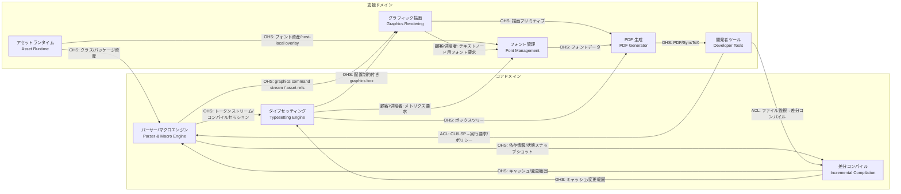

**統合パターンの選択根拠:**

- アセットランタイム → コア/支援は **OHS（公開ホストサービス）** — 事前インデックス化された不変資産を供給
- コアドメイン間は **OHS（公開ホストサービス）** — 明確に定義されたストリーム/データ構造で接続
- 開発者ツール → コアは **ACL（腐敗防止層）** — LSP プロトコル等の外部仕様をコアドメインの言語に変換
- グラフィック描画 → PDF 生成は **OHS（公開ホストサービス）** — PDF 非依存の描画プリミティブを供給
- タイプセッティング → フォント管理は **顧客/供給者** — タイプセッティングが必要なメトリクスを要求し、フォント管理が供給

## 3. ドメインモデル図

### 3.1 パーサー/マクロエンジン コンテキスト

`CompilationJob` は最大 3 パスまでのコンパイル全体を表す集約であり、pass 間で共有される `DocumentState` / active-job 限定の `OutputArtifactRegistry` / `ExecutionPolicy` を所有する。`CompilationSession` はその内部の 1 パスを表し、カテゴリコード・レジスタ・スコープに加えて current-file 基準の解決、`\include` ガード、ネスト深度管理を担う `InputStack` / `IncludeState` などの pass-local 状態を保持する。パイプライン並列化を行う場合でも、各ステージが参照できるのは `CompilationSession` / `DocumentState` から導出した読み取り専用 snapshot のみであり、可変状態への commit は `CompilationJob` が所有する決定的 barrier で逐次に行う。`OutputArtifactRegistry` は job 完了時に invalidate され、process restart をまたいで再利用しない。

```mermaid
classDiagram
    class CompilationJob {
        <<Entity>>
        +String jobname
        +FilePath primaryInput
        +DocumentState documentState
        +OutputArtifactRegistry outputArtifacts
        +ExecutionPolicy policy
        +beginPass(int) CompilationSession
    }
    class CompilationSession {
        <<Entity>>
        +JobContext context
        +InputStack inputs
        +IncludeState includes
        +CatcodeTable catcodes
        +ScopeStack scopes
        +RegisterBank registers
        +CommandRegistry commands
        +EnvironmentRegistry environments
    }
    class Lexer {
        <<Entity>>
        +InputStack sources
        +nextToken(CompilationSession) Token
    }
    class CatcodeTable {
        <<ValueObject>>
        +Map~char, Catcode~ entries
        +get(char) Catcode
        +set(char, Catcode) CatcodeTable
    }
    class Token {
        <<ValueObject>>
        +TokenKind kind
        +SourceLocation location
    }
    class ControlSequenceToken {
        <<ValueObject>>
        +String name
    }
    class CharacterToken {
        <<ValueObject>>
        +char value
        +Catcode catcode
    }
    class MacroEngine {
        <<Entity>>
        +expand(TokenStream, CompilationSession) TokenStream
        +defineLocal(String, MacroDefinition, CompilationSession) void
        +defineGlobal(String, MacroDefinition, CompilationSession) void
    }
    class MacroDefinition {
        <<ValueObject>>
        +String name
        +ParameterPattern pattern
        +TokenList replacementText
        +ExpansionKind kind
        +DefinitionProvenance provenance
    }
    class ScopeStack {
        <<Entity>>
        +push() void
        +pop() void
        +defineLocal(MacroDefinition) void
        +recordRegisterWrite(RegisterKind, int, RegisterValue) void
        +recordCatcodeWrite(char, Catcode) void
        +rollbackFrame(CompilationSession) void
        +lookup(String) MacroDefinition
    }
    class RegisterBank {
        <<Entity>>
        +RegisterValue get(RegisterKind, int) RegisterValue
        +set(RegisterKind, int, RegisterValue) void
    }
    class DocumentState {
        <<Entity>>
        +CounterStore counters
        +CrossReferenceTable references
        +BibliographyState bibliography
        +AuxState aux
        +TableOfContentsState toc
        +IndexState index
        +NavigationState navigation
        +int passCount
        +registerLabel(String, LabelInfo) void
        +resolveLabel(String) ResolvedRef
    }
    class JobContext {
        <<ValueObject>>
        +String jobname
        +FilePath primaryInput
        +int passNumber
    }
    class CounterStore {
        <<Entity>>
        +step(String) int
        +set(String, int) void
        +get(String) int
    }
    class AuxState {
        <<Entity>>
        +List~AuxWrite~ pendingWrites
        +mergePreviousPass(AuxSnapshot) void
    }
    class TableOfContentsState {
        <<Entity>>
        +Map~TocKind, List~TocEntry~~ entries
        +record(TocEntry) void
        +mergePreviousPass(Map~TocKind, List~TocEntry~~) void
    }
    class TocEntry {
        <<ValueObject>>
        +TocKind kind
        +String title
        +String number
        +int pageNumber
        +int level
        +DefinitionProvenance provenance
    }
    class IndexState {
        <<Entity>>
        +List~IndexEntry~ entries
        +record(IndexEntry) void
        +sortMakeindexCompatible() List~IndexEntry~
    }
    class IndexEntry {
        <<ValueObject>>
        +String term
        +String sortKey
        +List~int~ pageNumbers
        +DefinitionProvenance provenance
    }
    class CrossReferenceTable {
        <<Entity>>
        +Map~String, LabelInfo~ labels
        +List~UnresolvedRef~ unresolved
        +isStable() bool
    }
    class LabelInfo {
        <<ValueObject>>
        +String key
        +String value
        +int pageNumber
        +DefinitionProvenance provenance
    }
    class BibliographyState {
        <<Entity>>
        +CitationTable citations
        +BblSnapshot bbl
        +resolveCitation(String) CitationInfo
    }
    class CitationTable {
        <<Entity>>
        +Map~String, CitationInfo~ entries
    }
    class CitationInfo {
        <<ValueObject>>
        +String key
        +String label
        +String formattedText
        +DefinitionProvenance traceProvenance
    }
    class BblSnapshot {
        <<ValueObject>>
        +List~BibliographyEntry~ entries
    }
    class BibliographyEntry {
        <<ValueObject>>
        +String key
        +String renderedBlock
        +DefinitionProvenance provenance
    }
    class NavigationState {
        <<Entity>>
        +PdfMetadataDraft metadata
        +List~OutlineDraftEntry~ outlineEntries
        +Map~String, DestinationAnchor~ namedDestinations
        +LinkStyle defaultLinkStyle
        +recordOutline(OutlineDraftEntry) void
    }
    class PdfMetadataDraft {
        <<ValueObject>>
        +String title
        +String author
        +String subject
        +List~String~ keywords
    }
    class OutlineDraftEntry {
        <<ValueObject>>
        +String title
        +String destination
        +int level
    }
    class DestinationAnchor {
        <<ValueObject>>
        +String name
        +DefinitionProvenance provenance
    }
    class LinkStyle {
        <<ValueObject>>
        +bool colorLinks
        +Color textColor
        +BorderStyle border
    }
    class BorderStyle {
        <<ValueObject>>
        +Color color
        +Dimen width
        +DashPattern dash
    }
    class CommandRegistry {
        <<Entity>>
        +register(String, ExecutableCommand) void
        +lookup(String) ExecutableCommand
    }
    class EnvironmentRegistry {
        <<Entity>>
        +register(String, ExecutableEnvironment) void
        +lookup(String) ExecutableEnvironment
    }
    class DocumentClassRegistry {
        <<Entity>>
        +resolve(String, ClassOptions) ClassSnapshot
    }
    class PackageRegistry {
        <<Entity>>
        +resolve(String, PackageOptions) PackageSnapshot
    }
    class PackageLoader {
        <<Service>>
        +load(String, CompilationSession) PackageExtension
    }
    class DocumentClassLoader {
        <<Service>>
        +load(String, CompilationSession) ClassSnapshot
    }
    class PackageExtension {
        <<Interface>>
        +register(CompilationSession) void
    }
    class AmsmathExtension {
        <<Extension>>
    }
    class HyperrefExtension {
        <<Extension>>
    }
    class TikzExtension {
        <<Extension>>
    }
    class FontspecExtension {
        <<Extension>>
    }
    class AssetResolver {
        <<Service>>
        +resolve(LogicalPath, ResolutionContext) AssetHandle
    }
    class ResolutionContext {
        <<ValueObject>>
        +FilePath currentDirectory
        +int nestingDepth
        +bool allowMissing
    }
    class FileAccessRequest {
        <<ValueObject>>
        +FilePath requestedPath
        +AccessMode mode
        +AccessPurpose purpose
    }
    class SandboxedFileHandle {
        <<ValueObject>>
        +FilePath normalizedPath
        +AccessPurpose purpose
    }
    class FileAccessGate {
        <<Port>>
        +authorize(FileAccessRequest, ExecutionPolicy, JobContext, OutputArtifactRegistry) SandboxedFileHandle
    }
    class ShellCommandGateway {
        <<Service>>
        +execute(CommandRequest, ExecutionPolicy, JobContext, OutputArtifactRegistry) CommandResult
    }
    class CommandResult {
        <<ValueObject>>
        +int exitCode
        +bytes stdout
        +bytes stderr
        +List~ProducedArtifact~ producedArtifacts
    }
    class ProducedArtifact {
        <<ValueObject>>
        +FilePath path
        +ArtifactKind kind
        +ContentHash contentHash
    }
    class ExecutionPolicy {
        <<ValueObject>>
        +bool shellEscapeEnabled
        +PathAccessPolicy pathPolicy
        +Duration commandTimeout
        +usize maxConcurrentProcesses
        +usize maxCapturedOutputBytes
        +PreviewPublicationPolicy previewPublication
    }
    class PathAccessPolicy {
        <<ValueObject>>
        +FilePath projectRoot
        +List~FilePath~ overlayRoots
        +List~FilePath~ bundleRoots
        +FilePath cacheDir
        +List~FilePath~ outputRoots
        +Set~String~ outputReadbackExtensions
        +FilePath privateTempRoot
    }
    class OutputArtifactRegistry {
        <<Entity>>
        +Map~FilePath, OutputArtifactRecord~ records
        +record(OutputArtifactRecord) void
        +allowReadback(FilePath, JobContext, ArtifactKind) bool
        +invalidate() void
    }
    class OutputArtifactRecord {
        <<ValueObject>>
        +FilePath normalizedPath
        +FilePath producedPath
        +FilePath primaryInput
        +ArtifactKind kind
        +String jobname
        +ArtifactProducerKind producer
        +ContentHash contentHash
        +int producedPass
    }
    class InputSource {
        <<Entity>>
        +SandboxedFileHandle handle
        +LogicalPath logicalPath
        +FilePath baseDirectory
        +int line
        +int column
        +read() char
    }
    class InputStack {
        <<Entity>>
        +List~InputSource~ frames
        +push(InputSource) void
        +pop() InputSource
        +depth() int
        +currentResolutionContext() ResolutionContext
    }
    class IncludeState {
        <<Entity>>
        +Set~LogicalPath~ activeIncludes
        +Map~LogicalPath, FilePath~ auxPaths
        +shouldEnter(LogicalPath) bool
        +resolveAuxPath(LogicalPath, JobContext) FilePath
    }
    class ConditionalEvaluator {
        <<Service>>
        +evaluate(ConditionKind, TokenStream) Branch
    }
    class ErrorRecovery {
        <<Service>>
        +recover(ParseError, TokenStream) TokenStream
    }
    class SourceLocation {
        <<ValueObject>>
        +FilePath file
        +int line
        +int column
    }
    class DefinitionProvenance {
        <<ValueObject>>
        +SourceLocation location
        +DefinitionOriginKind originKind
    }
    class DocumentStateDelta {
        <<ValueObject>>
        +Map~String, int~ counterDeltas
        +List~LabelInfo~ labelUpdates
        +List~CitationInfo~ citationUpdates
        +List~TocEntry~ tocUpdates
        +List~IndexEntry~ indexUpdates
        +List~OutlineDraftEntry~ navigationUpdates
        +List~AuxWrite~ auxWrites
    }
    class GraphicsCommandStream {
        <<ValueObject>>
        +List~GraphicsDirective~ directives
        +List~AssetRef~ referencedAssets
    }
    class DependencyEvents {
        <<ValueObject>>
        +List~DependencyEvent~ events
    }

    Token <|-- ControlSequenceToken
    Token <|-- CharacterToken
    CompilationJob o-- CompilationSession
    CompilationJob --> DocumentState
    CompilationJob --> OutputArtifactRegistry
    CompilationJob --> ExecutionPolicy
    CompilationSession --> CatcodeTable
    CompilationSession --> CompilationJob
    CompilationSession --> JobContext
    CompilationSession --> InputStack
    CompilationSession --> IncludeState
    CompilationSession --> ScopeStack
    CompilationSession --> RegisterBank
    CompilationSession --> CommandRegistry
    CompilationSession --> EnvironmentRegistry
    DocumentState --> CounterStore
    DocumentState --> TableOfContentsState
    DocumentState --> IndexState
    DocumentState --> NavigationState
    DocumentState --> CrossReferenceTable
    DocumentState --> BibliographyState
    DocumentState --> AuxState
    TableOfContentsState o-- TocEntry
    IndexState o-- IndexEntry
    CrossReferenceTable o-- LabelInfo
    BibliographyState --> CitationTable
    BibliographyState --> BblSnapshot
    CitationTable o-- CitationInfo
    BblSnapshot o-- BibliographyEntry
    NavigationState --> PdfMetadataDraft
    NavigationState o-- OutlineDraftEntry
    NavigationState o-- DestinationAnchor
    NavigationState --> LinkStyle
    LinkStyle --> BorderStyle
    TocEntry --> DefinitionProvenance
    IndexEntry --> DefinitionProvenance
    MacroDefinition --> DefinitionProvenance
    LabelInfo --> DefinitionProvenance
    CitationInfo --> DefinitionProvenance : trace
    BibliographyEntry --> DefinitionProvenance : authority
    DestinationAnchor --> DefinitionProvenance
    Lexer --> CompilationSession : reads
    Lexer --> InputStack : reads current frame
    Lexer ..> Token : produces
    MacroEngine --> CompilationSession
    MacroEngine ..> MacroDefinition : uses
    MacroEngine ..> ConditionalEvaluator : uses
    ScopeStack o-- MacroDefinition
    PackageLoader --> PackageRegistry
    PackageLoader --> AssetResolver
    PackageLoader ..> PackageExtension : instantiates
    DocumentClassLoader --> DocumentClassRegistry
    DocumentClassLoader --> AssetResolver
    PackageExtension <|.. AmsmathExtension
    PackageExtension <|.. HyperrefExtension
    PackageExtension <|.. TikzExtension
    PackageExtension <|.. FontspecExtension
    HyperrefExtension ..> NavigationState : populates
    AssetResolver --> FileAccessGate : opens assets
    AssetResolver ..> ResolutionContext : resolves current-file relative
    FileAccessGate --> ExecutionPolicy
    FileAccessGate --> OutputArtifactRegistry : validates readback
    FileAccessGate --> SandboxedFileHandle
    FileAccessGate ..> JobContext : scopes access
    Lexer ..> FileAccessGate : requests tex-input
    ShellCommandGateway --> ExecutionPolicy
    ShellCommandGateway --> FileAccessGate : uses output/temp handles
    ShellCommandGateway --> OutputArtifactRegistry : records trusted external artifacts
    ShellCommandGateway --> CommandResult
    CommandResult o-- ProducedArtifact
    InputStack o-- InputSource
    InputStack --> ResolutionContext
    InputSource --> SandboxedFileHandle
    ExecutionPolicy --> PathAccessPolicy
    OutputArtifactRegistry o-- OutputArtifactRecord
    OutputArtifactRegistry ..> JobContext : validates
    Token --> SourceLocation
    DefinitionProvenance --> SourceLocation
    CompilationSession ..> DocumentStateDelta : produces per partition
    CompilationSession ..> GraphicsCommandStream : emits to graphics
    CompilationSession ..> DependencyEvents : emits to incremental
```

### 3.2 タイプセッティング コンテキスト

ここで参照する `DocumentState` は、3.1 の `CompilationJob.documentState` と同一の共有エンティティであり、各 pass の `CompilationSession` から参照される。タイプセッティングコンテキストでは読み取り専用の共有エンティティとして参照するため `<<Shared Entity>>` と表記する。`PageBuilder` は `FloatQueue` と `FootnoteQueue` を所有し、脚注本文の収集、ページ下部への予約、あふれた脚注の次ページ繰り延べを同じページ分割境界で決定する。複数行 display math は `DisplayMathBlock` / `AmsmathLayoutEngine` が表し、`align` 系の行揃え、`\intertext`、式番号付けを `MathAlignmentRow` / `EquationTag` として保持する。フロート配置は `[htbp!]` を `PlacementSpec` へ正規化し、確定した配置結果を `FloatPlacement` として `PageBox` に残す。

```mermaid
classDiagram
    class Paragraph {
        <<Entity>>
        +HorizontalList items
        +breakIntoLines(LineBreakParams) List~LineBox~
    }
    class LineBreakParams {
        <<ValueObject>>
        +int tolerance
        +Dimen emergencyStretch
        +int looseness
        +HyphenationPatterns patterns
    }
    class Box {
        <<ValueObject>>
        +Dimen width
        +Dimen height
        +Dimen depth
    }
    class HBox {
        <<ValueObject>>
        +List~Node~ content
    }
    class VBox {
        <<ValueObject>>
        +List~Node~ content
    }
    class PageBox {
        <<ValueObject>>
        +List~PlacedNode~ content
        +List~FloatPlacement~ floats
        +Size size
        +List~LinkAnnotationPlan~ linkAnnotations
        +List~PlacedDestination~ destinations
    }
    class Glue {
        <<ValueObject>>
        +Dimen natural
        +Dimen stretch
        +Dimen shrink
    }
    class Penalty {
        <<ValueObject>>
        +int value
    }
    class Node {
        <<ValueObject>>
    }
    class TextRun {
        <<ValueObject>>
        +GlyphSequence glyphs
        +TextStyle style
    }
    class TextStyle {
        <<ValueObject>>
        +FontSpec font
        +Color fillColor
    }
    class PlacedNode {
        <<ValueObject>>
        +Node node
        +Rect rect
        +SourceSpan sourceSpan
    }
    class SourceSpan {
        <<ValueObject>>
        +SourceLocation start
        +SourceLocation end
    }
    class MathList {
        <<Entity>>
        +List~MathAtom~ atoms
        +MathStyle style
        +typeset() Box
    }
    class MathAtom {
        <<ValueObject>>
        +AtomKind kind
        +Box nucleus
        +Box superscript
        +Box subscript
    }
    class DisplayMathBlock {
        <<Entity>>
        +DisplayMathKind kind
        +List~DisplayMathElement~ elements
        +typeset(DocumentState) VBox
    }
    class DisplayMathElement {
        <<ValueObject>>
    }
    class MathAlignmentRow {
        <<ValueObject>>
        +List~MathCell~ cells
        +EquationTag tag
    }
    class MathCell {
        <<ValueObject>>
        +MathList content
        +int alignmentColumn
    }
    class IntertextBlock {
        <<ValueObject>>
        +VBox content
    }
    class EquationTag {
        <<ValueObject>>
        +String renderedText
        +bool suppressNumber
    }
    class AmsmathLayoutEngine {
        <<Service>>
        +layout(DisplayMathBlock, DocumentState) VBox
    }
    class LinkAnnotationPlan {
        <<ValueObject>>
        +Rect rect
        +LinkTarget target
        +LinkStyle style
    }
    class LinkTarget {
        <<ValueObject>>
        +LinkTargetKind kind
        +String value
    }
    class PlacedDestination {
        <<ValueObject>>
        +String name
        +Rect rect
        +DefinitionProvenance provenance
    }
    class LinkStyle {
        <<ValueObject>>
        +bool colorLinks
        +Color textColor
        +BorderStyle border
    }
    class BorderStyle {
        <<ValueObject>>
        +Color color
        +Dimen width
        +DashPattern dash
    }
    class SectioningEngine {
        <<Service>>
        +typesetHeading(SectionCommand, DocumentState) HBox
    }
    class TocTypesetter {
        <<Service>>
        +typeset(TocKind, TableOfContentsState, DocumentState) VBox
    }
    class IndexTypesetter {
        <<Service>>
        +typeset(IndexState, DocumentState) VBox
    }
    class PageBuilder {
        <<Entity>>
        +VerticalList mainList
        +FloatQueue floats
        +FootnoteQueue footnotes
        +Dimen pageHeight
        +breakPage() PageBox
    }
    class FootnoteQueue {
        <<Entity>>
        +List~FootnoteItem~ pending
        +enqueue(FootnoteItem) void
        +reserveForPage(Dimen) List~FootnotePlacement~
        +spillRemaining() List~FootnoteItem~
    }
    class FootnoteItem {
        <<ValueObject>>
        +HBox marker
        +VBox content
        +SourceSpan sourceSpan
    }
    class FootnotePlacement {
        <<ValueObject>>
        +FootnoteItem item
        +Rect rect
    }
    class FloatQueue {
        <<Entity>>
        +List~FloatItem~ pending
        +enqueue(FloatItem) void
        +tryPlace(PlacementSpec, Dimen) FloatPlacement
        +forceFlush() List~FloatPlacement~
    }
    class FloatItem {
        <<ValueObject>>
        +PlacementSpec spec
        +Box content
    }
    class PlacementSpec {
        <<ValueObject>>
        +List~FloatRegion~ priorityOrder
        +bool force
    }
    class FloatPlacement {
        <<ValueObject>>
        +FloatItem item
        +FloatRegion region
        +Rect rect
    }
    class DocumentState {
        <<Shared Entity>>
        +CounterStore counters
        +CrossReferenceTable references
        +BibliographyState bibliography
        +AuxState aux
        +TableOfContentsState toc
        +IndexState index
        +NavigationState navigation
        +int passCount
        +registerLabel(String, LabelInfo) void
        +resolveLabel(String) ResolvedRef
    }
    class AuxState {
        <<Entity>>
        +List~AuxWrite~ pendingWrites
        +mergePreviousPass(AuxSnapshot) void
    }
    class TableOfContentsState {
        <<Entity>>
        +Map~TocKind, List~TocEntry~~ entries
        +record(TocEntry) void
        +mergePreviousPass(Map~TocKind, List~TocEntry~~) void
    }
    class TocEntry {
        <<ValueObject>>
        +TocKind kind
        +String title
        +String number
        +int pageNumber
        +int level
        +DefinitionProvenance provenance
    }
    class IndexState {
        <<Entity>>
        +List~IndexEntry~ entries
        +record(IndexEntry) void
        +sortMakeindexCompatible() List~IndexEntry~
    }
    class IndexEntry {
        <<ValueObject>>
        +String term
        +String sortKey
        +List~int~ pageNumbers
        +DefinitionProvenance provenance
    }
    class CrossReferenceTable {
        <<Entity>>
        +Map~String, LabelInfo~ labels
        +List~UnresolvedRef~ unresolved
        +isStable() bool
    }
    class LabelInfo {
        <<ValueObject>>
        +String key
        +String value
        +int pageNumber
        +DefinitionProvenance provenance
    }
    class BibliographyState {
        <<Entity>>
        +CitationTable citations
        +BblSnapshot bbl
        +resolveCitation(String) CitationInfo
    }
    class CitationTable {
        <<Entity>>
        +Map~String, CitationInfo~ entries
    }
    class CitationInfo {
        <<ValueObject>>
        +String key
        +String label
        +String formattedText
        +DefinitionProvenance traceProvenance
    }
    class BblSnapshot {
        <<ValueObject>>
        +List~BibliographyEntry~ entries
    }
    class BibliographyEntry {
        <<ValueObject>>
        +String key
        +String renderedBlock
        +DefinitionProvenance provenance
    }
    class NavigationState {
        <<Entity>>
        +PdfMetadataDraft metadata
        +List~OutlineDraftEntry~ outlineEntries
        +Map~String, DestinationAnchor~ namedDestinations
        +LinkStyle defaultLinkStyle
        +recordOutline(OutlineDraftEntry) void
    }
    class PdfMetadataDraft {
        <<ValueObject>>
        +String title
        +String author
        +String subject
        +List~String~ keywords
    }
    class OutlineDraftEntry {
        <<ValueObject>>
        +String title
        +String destination
        +int level
    }
    class DestinationAnchor {
        <<ValueObject>>
        +String name
        +DefinitionProvenance provenance
    }
    class DefinitionProvenance {
        <<ValueObject>>
        +SourceLocation location
        +DefinitionOriginKind originKind
    }
    class SourceLocation {
        <<ValueObject>>
        +FilePath file
        +int line
        +int column
    }
    class CounterStore {
        <<Entity>>
        +step(String) int
        +set(String, int) void
        +get(String) int
    }

    Box <|-- HBox
    Box <|-- VBox
    Node <|-- Box
    Node <|-- TextRun
    Node <|-- Glue
    Node <|-- Penalty
    PageBox o-- PlacedNode
    PageBox o-- FloatPlacement
    PageBox o-- PlacedDestination
    PageBox o-- LinkAnnotationPlan
    PlacedNode --> Node
    PlacedNode --> SourceSpan
    TextRun --> TextStyle
    LinkAnnotationPlan --> LinkTarget
    LinkAnnotationPlan --> LinkStyle
    LinkStyle --> BorderStyle
    LinkStyle ..> TextStyle : colors linked text
    Paragraph --> LineBreakParams
    Paragraph o-- Node
    PageBuilder o-- Node
    PageBuilder --> FloatQueue
    PageBuilder --> FootnoteQueue
    PageBuilder --> DocumentState
    PageBuilder --> PageBox
    FootnoteQueue o-- FootnoteItem
    FootnoteQueue --> FootnotePlacement
    FloatQueue o-- FloatItem
    FloatItem --> PlacementSpec
    FloatPlacement --> FloatItem
    MathList o-- MathAtom
    MathAtom --> Box
    DisplayMathElement <|-- MathAlignmentRow
    DisplayMathElement <|-- IntertextBlock
    DisplayMathBlock o-- DisplayMathElement
    MathAlignmentRow o-- MathCell
    MathAlignmentRow --> EquationTag
    MathCell --> MathList
    IntertextBlock --> VBox
    AmsmathLayoutEngine --> DisplayMathBlock
    AmsmathLayoutEngine --> DocumentState
    AmsmathLayoutEngine --> CounterStore
    SectioningEngine --> DocumentState
    SectioningEngine --> TableOfContentsState
    SectioningEngine --> NavigationState
    TocTypesetter --> TableOfContentsState
    TocTypesetter --> DocumentState
    IndexTypesetter --> IndexState
    IndexTypesetter --> DocumentState
    DocumentState --> CounterStore
    DocumentState --> AuxState
    DocumentState --> TableOfContentsState
    DocumentState --> IndexState
    DocumentState --> NavigationState
    DocumentState --> CrossReferenceTable
    DocumentState --> BibliographyState
    TableOfContentsState o-- TocEntry
    IndexState o-- IndexEntry
    CrossReferenceTable o-- LabelInfo
    BibliographyState --> CitationTable
    BibliographyState --> BblSnapshot
    CitationTable o-- CitationInfo
    BblSnapshot o-- BibliographyEntry
    NavigationState --> PdfMetadataDraft
    NavigationState o-- OutlineDraftEntry
    NavigationState o-- DestinationAnchor
    NavigationState --> LinkStyle
    TocEntry --> DefinitionProvenance
    IndexEntry --> DefinitionProvenance
    LabelInfo --> DefinitionProvenance
    CitationInfo --> DefinitionProvenance : trace
    BibliographyEntry --> DefinitionProvenance : authority
    DestinationAnchor --> DefinitionProvenance
    PlacedDestination --> DefinitionProvenance
    SourceSpan --> SourceLocation
    DefinitionProvenance --> SourceLocation
```

### 3.3 グラフィック描画 コンテキスト

`GraphicsScene` はフラットな描画命令列ではなく、tikz/pgf の style 継承・クリッピング・矢印指定を保持する階層スコープを持つ。`GraphicGroup` が group/scope 単位の継承スタイルと clip path を表し、`VectorPath` は path ごとの矢印指定を保持したまま PDF 射影へ渡される。

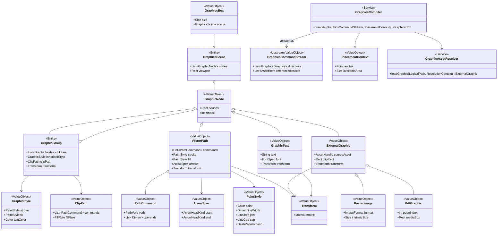

### 3.4 差分コンパイル コンテキスト

差分コンパイルの「再処理範囲の決定」だけでなく、「再構築結果と再利用結果の統合」「参照安定化までの反復」も Ferritex のコアドメイン責務としてこのモデルに含める。`IncrementalCompilationCoordinator` は job-scope の固定点反復の所有者であり、`CompilationJob.beginPass(passNumber)` を介して各反復の `CompilationSession` を生成する。文書パーティション単位並列化では `DocumentPartitionPlanner` が `DependencyGraph` / `DocumentState` から独立した章/セクション単位を `DocumentPartitionPlan` として切り出す。セクション境界の認識は `DocumentState.toc` が保持する `TocEntry` の `DefinitionProvenance`（`SourceLocation`）から導出し、ファイル間依存は `DependencyGraph` から取得する。`PaginationMergeCoordinator` が各 `DocumentLayoutFragment` をページオフセットと参照整合性を保ったまま統合する。実際のスレッド実行はインフラストラクチャ層へ委譲する。

```mermaid
classDiagram
    class DependencyGraph {
        <<Entity>>
        +Map~NodeId, DepNode~ nodes
        +Map~NodeId, Set~NodeId~~ edges
        +addNode(DepNode) void
        +addEdge(NodeId, NodeId) void
        +affectedBy(Set~NodeId~) Set~NodeId~
    }
    class DependencyGraphStore {
        <<Port>>
        +load() DependencyGraph
        +save(DependencyGraph) void
    }
    class DepNode {
        <<ValueObject>>
        +NodeId id
        +DepNodeKind kind
        +ContentHash hash
    }
    class ChangeDetector {
        <<Service>>
        +detect(DependencyGraph, Set~FileChange~) RecompilationScope
    }
    class FileChange {
        <<ValueObject>>
        +FilePath path
        +ContentHash previousHash
        +ContentHash currentHash
    }
    class RecompilationScope {
        <<ValueObject>>
        +Set~NodeId~ affectedNodes
        +bool referencesAffected
        +bool requiresFullRecompile
    }
    class IncrementalCompilationCoordinator {
        <<Service>>
        +plan(CompilationJob, RecompilationScope, DependencyGraph, CompilationCache) CompilationMergePlan
        +runToFixedPoint(CompilationJob, CompilationMergePlan) IncrementalCompilationResult
    }
    class CompilationMergePlan {
        <<ValueObject>>
        +Set~NodeId~ rebuildNodes
        +Set~NodeId~ reuseNodes
        +bool requiresReferenceStabilization
    }
    class IncrementalCompilationResult {
        <<ValueObject>>
        +Set~NodeId~ rebuiltNodes
        +Set~NodeId~ reusedNodes
        +bool referencesStable
        +int passesUsed
    }
    class DocumentPartitionPlanner {
        <<Service>>
        +plan(DependencyGraph, DocumentState) DocumentPartitionPlan
    }
    class DocumentPartitionPlan {
        <<ValueObject>>
        +List~DocumentWorkUnit~ units
        +bool preservesSequentialPageNumbers
    }
    class DocumentWorkUnit {
        <<ValueObject>>
        +LogicalPath entryFile
        +PartitionKind kind
        +String partitionId
        +PartitionLocator locator
        +Set~String~ importedRefs
        +Set~String~ exportedRefs
        +bool canTypesetInIsolation
    }
    class DocumentLayoutFragment {
        <<ValueObject>>
        +LogicalPath entryFile
        +PartitionKind kind
        +String partitionId
        +PartitionLocator locator
        +List~PageBox~ pages
        +Map~String, int~ localLabelPages
    }
    class PartitionLocator {
        <<ValueObject>>
        +LogicalPath entryFile
        +SourceSpan headingSpan
        +int ordinalWithinFile
    }
    class PaginationMergeCoordinator {
        <<Service>>
        +merge(DocumentPartitionPlan, List~DocumentLayoutFragment~, DocumentState) PaginationMergeResult
    }
    class PaginationMergeResult {
        <<ValueObject>>
        +List~PageBox~ mergedPages
        +Map~LogicalPath, int~ pageOffsets
    }
    class CompilationCache {
        <<Entity>>
        +CacheConfig config
        +store(NodeId, CacheEntry) void
        +retrieve(NodeId) CacheEntry
        +invalidate(Set~NodeId~) void
        +verify() CacheIntegrity
    }
    class CacheEntry {
        <<ValueObject>>
        +NodeId nodeId
        +ContentHash sourceHash
        +bytes data
        +Instant lastAccessed
    }
    class CacheConfig {
        <<ValueObject>>
        +usize maxSizeBytes
        +EvictionPolicy policy
    }
    class DependencyEvents {
        <<Upstream ValueObject>>
        +List~DependencyEvent~ events
    }

    DependencyGraph o-- DepNode
    DependencyGraph ..> DependencyEvents : consumes to build graph
    DependencyGraphStore ..> DependencyGraph : loads / saves
    ChangeDetector ..> DependencyGraph : reads
    ChangeDetector ..> FileChange : input
    ChangeDetector ..> RecompilationScope : output
    IncrementalCompilationCoordinator ..> RecompilationScope : consumes
    IncrementalCompilationCoordinator ..> CompilationJob : drives passes
    IncrementalCompilationCoordinator ..> DependencyGraph : reads
    DocumentPartitionPlanner ..> DependencyGraph : analyzes partition deps
    DocumentPartitionPlanner ..> DocumentState : reads ref stability
    DocumentPartitionPlanner --> DocumentPartitionPlan
    DocumentPartitionPlan o-- DocumentWorkUnit
    DocumentWorkUnit --> PartitionLocator
    PaginationMergeCoordinator ..> DocumentPartitionPlan : consumes
    PaginationMergeCoordinator ..> DocumentLayoutFragment : merges
    DocumentLayoutFragment --> PartitionLocator
    PaginationMergeCoordinator ..> DocumentState : reconciles refs/pages
    PaginationMergeCoordinator --> PaginationMergeResult
    IncrementalCompilationCoordinator --> CompilationMergePlan
    IncrementalCompilationCoordinator --> IncrementalCompilationResult
    IncrementalCompilationCoordinator --> CompilationCache
    CompilationCache o-- CacheEntry
    CompilationCache --> CacheConfig
```

### 3.5 アセットランタイム コンテキスト

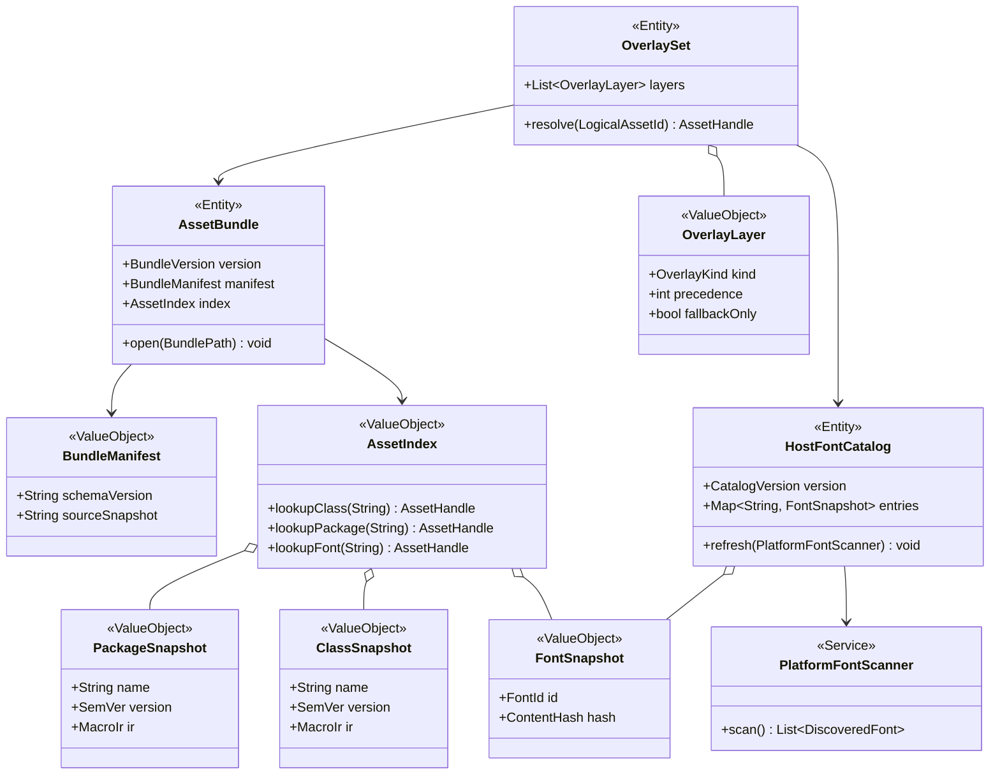

### 3.6 PDF 生成 コンテキスト

`PdfRenderer` が `PageRenderPlan` と `NavigationState` を `PdfDocument` へ射影し、配置済み `LinkAnnotationPlan` と `PlacedDestination` を `Annotation` / named destination へ変換する。`FontEmbeddingPlanner` は `TextRun` 群からページ横断の使用グリフ集合を `FontSubsetPlan` として集約し、`FontManager` / `GlyphSubsetter` と協調して `EmbeddedFont` と `ToUnicode CMap` を構築する。`SyncTexBuilder` は `PlacedNode` の source trace を fragment 単位で `SyncTexData` に索引化する。`GraphicResourceEncoder` はラスタ画像と外部 PDF を XObject / Form XObject へ正規化する。

```mermaid
classDiagram
    class PdfDocument {
        <<Entity>>
        +PdfMetadata metadata
        +List~PdfPage~ pages
        +PdfOutline outline
        +render() bytes
    }
    class PdfRenderer {
        <<Service>>
        +buildDocument(List~PageRenderPlan~, NavigationState) PdfDocument
        +projectPage(PageRenderPlan) PdfPage
    }
    class PageRenderPlan {
        <<ValueObject>>
        +PageBox pageBox
        +GraphicsScene graphics
    }
    class PageBox {
        <<Upstream ValueObject>>
        +List~PlacedNode~ content
        +List~FloatPlacement~ floats
        +Size size
        +List~LinkAnnotationPlan~ linkAnnotations
        +List~PlacedDestination~ destinations
    }
    class FloatPlacement {
        <<Upstream ValueObject>>
        +FloatItem item
        +FloatRegion region
        +Rect rect
    }
    class PlacedNode {
        <<Upstream ValueObject>>
        +Node node
        +Rect rect
        +SourceSpan sourceSpan
    }
    class Node {
        <<Upstream ValueObject>>
    }
    class TextRun {
        <<Upstream ValueObject>>
        +GlyphSequence glyphs
        +TextStyle style
    }
    class TextStyle {
        <<Upstream ValueObject>>
        +FontSpec font
        +Color fillColor
    }
    class SourceSpan {
        <<Upstream ValueObject>>
        +SourceLocation start
        +SourceLocation end
    }
    class LinkAnnotationPlan {
        <<Upstream ValueObject>>
        +Rect rect
        +LinkTarget target
        +LinkStyle style
    }
    class LinkTarget {
        <<Upstream ValueObject>>
        +LinkTargetKind kind
        +String value
    }
    class LinkStyle {
        <<Upstream ValueObject>>
        +bool colorLinks
        +Color textColor
        +BorderStyle border
    }
    class BorderStyle {
        <<Upstream ValueObject>>
        +Color color
        +Dimen width
        +DashPattern dash
    }
    class NavigationState {
        <<Upstream Entity>>
        +PdfMetadataDraft metadata
        +List~OutlineDraftEntry~ outlineEntries
        +Map~String, DestinationAnchor~ namedDestinations
        +LinkStyle defaultLinkStyle
    }
    class PdfMetadataDraft {
        <<Upstream ValueObject>>
        +String title
        +String author
        +String subject
        +List~String~ keywords
    }
    class OutlineDraftEntry {
        <<Upstream ValueObject>>
        +String title
        +String destination
        +int level
    }
    class DestinationAnchor {
        <<Upstream ValueObject>>
        +String name
        +DefinitionProvenance provenance
    }
    class PlacedDestination {
        <<Upstream ValueObject>>
        +String name
        +Rect rect
        +DefinitionProvenance provenance
    }
    class PdfMetadata {
        <<ValueObject>>
        +String title
        +String author
        +String subject
        +List~String~ keywords
    }
    class PdfPage {
        <<ValueObject>>
        +int pageNumber
        +ContentStream content
        +List~Annotation~ annotations
        +ResourceDict resources
    }
    class ContentStream {
        <<ValueObject>>
        +List~PdfOperator~ operators
    }
    class PdfOperator {
        <<ValueObject>>
        +String operator
        +List~Operand~ operands
    }
    class Annotation {
        <<ValueObject>>
        +AnnotKind kind
        +Rect rect
        +LinkTarget target
        +BorderStyle border
    }
    class PdfOutline {
        <<ValueObject>>
        +List~OutlineEntry~ entries
    }
    class OutlineEntry {
        <<ValueObject>>
        +String title
        +String destination
        +int level
    }
    class EmbeddedFont {
        <<ValueObject>>
        +FontId id
        +bytes subsetData
        +CMap toUnicode
    }
    class EmbeddedImage {
        <<ValueObject>>
        +ImageFormat format
        +bytes data
        +Dimen width
        +Dimen height
    }
    class EmbeddedPdfGraphic {
        <<ValueObject>>
        +AssetHandle sourceAsset
        +int sourcePageIndex
        +Rect mediaBox
        +bytes formXObjectData
    }
    class FontSubsetPlan {
        <<ValueObject>>
        +FontId fontId
        +Set~GlyphId~ usedGlyphs
        +bool emitToUnicode
    }
    class FontEmbeddingPlanner {
        <<Service>>
        +plan(List~PageRenderPlan~) List~FontSubsetPlan~
        +embed(List~FontSubsetPlan~) List~EmbeddedFont~
    }
    class FontManager {
        <<Upstream Service>>
    }
    class GlyphSubsetter {
        <<Upstream Service>>
    }
    class GraphicResourceEncoder {
        <<Service>>
        +embedRaster(RasterImage) EmbeddedImage
        +embedPdfGraphic(PdfGraphic) EmbeddedPdfGraphic
    }
    class SyncTexBuilder {
        <<Service>>
        +build(List~PageRenderPlan~) SyncTexData
    }
    class PdfPosition {
        <<ValueObject>>
        +int pageNumber
        +PdfPoint point
    }
    class PdfPoint {
        <<ValueObject>>
        +float x
        +float y
    }
    class SyncTraceFragment {
        <<ValueObject>>
        +SourceSpan sourceSpan
        +int pageNumber
        +Rect rect
    }
    class SyncTexData {
        <<ValueObject>>
        +List~SyncTraceFragment~ fragments
        +forwardSearch(SourceLocation) List~SyncTraceFragment~
        +inverseSearch(PdfPosition) SourceSpan
    }

    PdfRenderer --> PdfDocument
    PdfRenderer --> FontEmbeddingPlanner
    PdfRenderer --> GraphicResourceEncoder
    PdfRenderer --> SyncTexBuilder
    PdfRenderer --> NavigationState : consumes
    PdfRenderer ..> PageRenderPlan : projects
    PdfRenderer ..> LinkAnnotationPlan : materializes
    PdfRenderer ..> PdfMetadataDraft : derives
    PdfRenderer ..> OutlineDraftEntry : derives
    PdfRenderer ..> DestinationAnchor : resolves
    PdfRenderer ..> PlacedDestination : resolves named destinations
    PdfRenderer ..> TextRun : emits text operators/colors
    PageRenderPlan --> PageBox
    PageRenderPlan --> GraphicsScene
    PageBox o-- PlacedNode
    PageBox o-- FloatPlacement
    PageBox o-- LinkAnnotationPlan
    PageBox o-- PlacedDestination
    PlacedNode --> Node
    PlacedNode --> SourceSpan
    Node <|-- TextRun
    TextRun --> TextStyle
    LinkAnnotationPlan --> LinkTarget
    LinkAnnotationPlan --> LinkStyle
    LinkStyle --> BorderStyle
    PdfDocument o-- PdfPage
    PdfDocument --> PdfMetadata
    PdfDocument --> PdfOutline
    PdfDocument --> SyncTexData
    PdfPage --> ContentStream
    PdfPage o-- Annotation
    Annotation --> LinkTarget
    Annotation --> BorderStyle
    ContentStream o-- PdfOperator
    PdfOutline o-- OutlineEntry
    PdfDocument o-- EmbeddedFont
    PdfDocument o-- EmbeddedImage
    PdfDocument o-- EmbeddedPdfGraphic
    FontEmbeddingPlanner --> FontSubsetPlan
    FontEmbeddingPlanner --> EmbeddedFont
    FontEmbeddingPlanner ..> TextRun : aggregates glyphs
    FontEmbeddingPlanner ..> FontManager : loads fonts
    FontEmbeddingPlanner ..> GlyphSubsetter : subsets
    GraphicResourceEncoder --> EmbeddedImage
    GraphicResourceEncoder --> EmbeddedPdfGraphic
    GraphicResourceEncoder ..> RasterImage : encodes
    NavigationState o-- DestinationAnchor
    NavigationState --> LinkStyle
    GraphicResourceEncoder ..> PdfGraphic : form XObject
    SyncTexBuilder ..> PageRenderPlan : traces
    SyncTexBuilder ..> PlacedNode : consumes source spans
    SyncTexBuilder --> SyncTexData
    SyncTexData o-- SyncTraceFragment
    SyncTexData ..> PdfPosition : inverse lookup
    PdfPosition --> PdfPoint
    SyncTraceFragment --> SourceSpan
```

### 3.7 フォント管理 コンテキスト

`FontSpec` は `fontspec` の `\setmainfont` / `\setsansfont` / `\setmonofont` や typesetting 時の `TextStyle` から正規化される標準的なフォント要求値であり、ファミリ選択、OpenType feature 群、fallback chain を 1 つの値オブジェクトに束ねる。`FontManager` はこの正規化済み表現を Asset Bundle / overlay / Host Font Catalog に対して解決する。

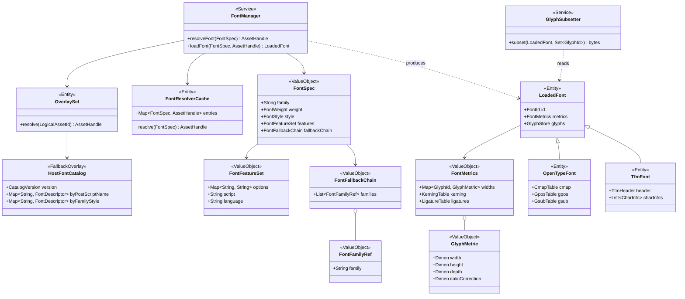

### 3.8 開発者ツール コンテキスト

`LspServer` は未保存変更を含む `OpenDocumentBuffer` を `OpenDocumentStore` に保持し、最新の成功した `CommitBarrier` 完了時点で確定した Stable Compile State と合成した `LiveAnalysisSnapshot` を全 LSP provider の共通入力にする。`DefinitionProvider` は暗黙の外部インデックスに依存せず、`LiveAnalysisSnapshot` から再構築した `SymbolIndex` を利用する。`CompletionProvider` は active なコマンド/環境レジストリと label / citation 状態を `CompletionIndex` へ投影し、package-aware な候補のみを返す。`HoverProvider` は `StableCompileState.packageDocs` が保持する active な class/package snapshot 由来の説明資産を `HoverDocCatalog` に正規化し、コマンド構文・要約・例を返す。LSP の read path は active compile/watch job の完了を待たず、常に最新の Stable Compile State を読む。watch 系の再コンパイル順序は `RecompileScheduler` が `PendingChangeQueue` を用いて制御し、各コンパイル完了後に最新 `DependencyGraph` から `FileWatcher` の監視対象集合を再同期する。preview 配信は `PreviewSessionService` が `PreviewTarget` ごとの session を発行・失効管理し、loopback 上の `POST /preview/session` bootstrap request と `ExecutionPolicy.previewPublication` に照らして許可された場合だけ `PreviewTransport` を通じて HTTP document endpoint と WebSocket events endpoint へ target 付き revision 通知を配信し、view-state 更新を受信する。session 失効・target 不一致・policy 拒否時は `SessionErrorResponse`（エラー種別・対象 sessionId・回復手順）を返す（`REQ-NF-010`）。compile / watch / LSP の入口は `CliAdapter` / `WatchAdapter` / `LspServer` として分離され、各入口のオプションを `RuntimeOptions` に正規化する。`WatchAdapter` は `RecompileScheduler` を起動し、`CliAdapter` と `RecompileScheduler` は共通の `CompileJobService` にコンパイルを委譲する。`ExecutionPolicyFactory` は `RuntimeOptions` と `WorkspaceContext` から共通の `ExecutionPolicy` を構築する。

```mermaid
classDiagram
    class LspServer {
        <<Entity>>
        +ServerCapabilities capabilities
        +handleRequest(LspRequest) LspResponse
    }
    class OpenDocumentStore {
        <<Entity>>
        +Map~String, OpenDocumentBuffer~ buffers
        +open(String, int, String) OpenDocumentBuffer
        +update(String, int, String) OpenDocumentBuffer
        +lookup(String) OpenDocumentBuffer
    }
    class OpenDocumentBuffer {
        <<Entity>>
        +String uri
        +int version
        +String text
    }
    class LiveAnalysisSnapshotFactory {
        <<Service>>
        +build(OpenDocumentBuffer, StableCompileState) LiveAnalysisSnapshot
    }
    class StableCompileState {
        <<ValueObject>>
        +CommandRegistry commands
        +EnvironmentRegistry environments
        +CrossReferenceTable references
        +BibliographyState bibliography
        +PackageDocSnapshotCatalog packageDocs
    }
    class PackageDocSnapshotCatalog {
        <<ValueObject>>
        +Map~String, PackageDocEntry~ entries
        +lookup(String) PackageDocEntry
    }
    class PackageDocEntry {
        <<ValueObject>>
        +String packageName
        +Map~String, CommandDoc~ commandDocs
    }
    class CommandDoc {
        <<ValueObject>>
        +String syntax
        +String summary
        +String example
    }
    class LiveAnalysisSnapshot {
        <<ValueObject>>
        +OpenDocumentBuffer buffer
        +StableCompileState stableState
    }
    class DiagnosticProvider {
        <<Service>>
        +diagnose(LiveAnalysisSnapshot) List~Diagnostic~
    }
    class CompletionProvider {
        <<Service>>
        +complete(LiveAnalysisSnapshot, Position) List~CompletionItem~
    }
    class CompletionIndex {
        <<Entity>>
        +rebuild(LiveAnalysisSnapshot) void
        +lookupCommands(String) List~CompletionCandidate~
        +lookupEnvironments(String) List~CompletionCandidate~
        +lookupLabels(String) List~CompletionCandidate~
        +lookupCitations(String) List~CompletionCandidate~
    }
    class CompletionCandidate {
        <<ValueObject>>
        +CompletionKind kind
        +String label
        +String insertText
        +String detail
        +String origin
    }
    class DefinitionProvider {
        <<Service>>
        +findDefinition(LiveAnalysisSnapshot, Position) Location
    }
    class SymbolIndex {
        <<Entity>>
        +Map~SymbolKey, DefinitionProvenance~ entries
        +rebuild(LiveAnalysisSnapshot) void
        +lookup(TextDocument, Position) DefinitionProvenance
    }
    class HoverProvider {
        <<Service>>
        +hover(LiveAnalysisSnapshot, Position) Hover
    }
    class HoverDocCatalog {
        <<Entity>>
        +rebuild(LiveAnalysisSnapshot) void
        +lookup(SymbolKey) HoverDoc
    }
    class HoverDoc {
        <<ValueObject>>
        +String syntax
        +String summary
        +String example
        +String origin
    }
    class CodeActionProvider {
        <<Service>>
        +suggest(LiveAnalysisSnapshot, Range, Diagnostic) List~CodeAction~
    }
    class FileWatcher {
        <<Entity>>
        +Set~FilePath~ watchedPaths
        +Duration debounce
        +replaceWatchedPaths(Set~FilePath~) void
        +start() void
        +stop() void
    }
    class FileChangeEvent {
        <<ValueObject>>
        +Set~FilePath~ paths
        +Instant observedAt
    }
    class PendingChangeQueue {
        <<Entity>>
        +enqueue(FileChangeEvent) void
        +drainCoalesced() FileChangeEvent
        +isEmpty() bool
    }
    class RecompileScheduler {
        <<Service>>
        +bool compileInFlight
        +enqueue(FileChangeEvent) void
        +syncWatchSet(DependencyGraph) void
        +onCompileFinished() void
    }
    class PreviewTarget {
        <<ValueObject>>
        +FilePath workspaceRoot
        +FilePath primaryInput
        +String jobname
    }
    class PreviewPublicationPolicy {
        <<ValueObject>>
        +bool loopbackOnly
        +bool latestActiveJobOnly
        +bool requireSessionTargetMatch
        +bool reissueOnTargetChange
        +bool reissueOnProcessRestart
    }
    class PreviewTransport {
        <<Service>>
        +publish(PreviewSession, PreviewRevision) void
        +receiveViewUpdate(String, PreviewViewState) void
        +respondError(String, SessionErrorResponse) void
    }
    class SessionErrorResponse {
        <<ValueObject>>
        +SessionErrorKind errorKind
        +String sessionId
        +String recoveryInstruction
    }
    class PreviewSessionService {
        <<Service>>
        +openSession(PreviewTarget, ExecutionPolicy) PreviewSession
        +publish(PreviewSession, PreviewRevision, ExecutionPolicy) void
    }
    class PreviewSession {
        <<Entity>>
        +String sessionId
        +PreviewTarget target
        +PreviewViewState viewState
        +bool active
        +updateView(PreviewViewState) void
        +restoreView(PreviewRevision) PreviewViewState
        +invalidate() void
    }
    class PreviewViewState {
        <<ValueObject>>
        +int pageNumber
        +float viewportOffsetY
        +float zoom
        +clampToPageCount(int) PreviewViewState
    }
    class PreviewRevision {
        <<ValueObject>>
        +PreviewTarget target
        +long revision
        +int pageCount
    }
    class RuntimeOptions {
        <<ValueObject>>
        +FilePath primaryInput
        +FilePath artifactRoot
        +String jobname
        +int parallelism
        +bool reuseCache
        +AssetBundleRef assetBundleRef
        +InteractionMode interactionMode
        +bool synctex
        +bool shellEscapeAllowed
    }
    class AssetBundleRef {
        <<ValueObject>>
        +BundleRefKind kind
        +String value
    }
    class WorkspaceContext {
        <<ValueObject>>
        +FilePath projectRoot
        +List~FilePath~ overlayRoots
        +FilePath cacheDir
        +List~FilePath~ bundleSearchRoots
        +Set~String~ builtinBundleIds
    }
    class CliAdapter {
        <<Service>>
        +compile(CompileOptions) ExitCode
    }
    class WatchAdapter {
        <<Service>>
        +watch(WatchOptions) void
    }
    class CompileJobService {
        <<Application Service>>
    }
    class ExecutionPolicyFactory {
        <<Service>>
        +build(RuntimeOptions, WorkspaceContext) ExecutionPolicy
    }
    class CompileOptions {
        <<ValueObject>>
        +FilePath input
        +FilePath outputDir
        +String jobname
        +int jobs
        +bool noCache
        +AssetBundleRef assetBundle
        +InteractionMode interaction
        +bool synctex
        +bool shellEscape
    }
    class WatchOptions {
        <<ValueObject>>
        +FilePath input
        +FilePath outputDir
        +String jobname
        +int jobs
        +bool noCache
        +AssetBundleRef assetBundle
        +InteractionMode interaction
        +bool synctex
        +bool shellEscape
        +Duration debounce
    }

    LspServer --> DiagnosticProvider
    LspServer --> CompletionProvider
    LspServer --> DefinitionProvider
    LspServer --> HoverProvider
    LspServer --> CodeActionProvider
    LspServer --> OpenDocumentStore
    LspServer --> LiveAnalysisSnapshotFactory
    LspServer --> ExecutionPolicyFactory
    LspServer --> RuntimeOptions : normalizes
    OpenDocumentStore o-- OpenDocumentBuffer
    LiveAnalysisSnapshotFactory --> OpenDocumentBuffer
    LiveAnalysisSnapshotFactory ..> StableCompileState : combines latest committed state
    LiveAnalysisSnapshotFactory --> LiveAnalysisSnapshot
    LiveAnalysisSnapshot --> OpenDocumentBuffer
    LiveAnalysisSnapshot --> StableCompileState
    StableCompileState --> PackageDocSnapshotCatalog
    PackageDocSnapshotCatalog o-- PackageDocEntry
    PackageDocEntry o-- CommandDoc
    CompletionProvider --> CompletionIndex
    DefinitionProvider --> SymbolIndex
    HoverProvider --> HoverDocCatalog
    DiagnosticProvider ..> LiveAnalysisSnapshot : analyzes
    CompletionProvider ..> LiveAnalysisSnapshot : reads
    DefinitionProvider ..> LiveAnalysisSnapshot : reads
    HoverProvider ..> LiveAnalysisSnapshot : reads
    CodeActionProvider ..> LiveAnalysisSnapshot : suggests on
    CompletionIndex --> CompletionCandidate
    CompletionIndex ..> LiveAnalysisSnapshot : projects buffer + registries
    HoverDocCatalog --> HoverDoc
    SymbolIndex ..> LiveAnalysisSnapshot : projects symbols
    HoverDocCatalog ..> LiveAnalysisSnapshot : projects active package/class docs
    FileWatcher ..> FileChangeEvent : emits
    FileWatcher --> RecompileScheduler : notifies
    RecompileScheduler --> FileWatcher : refreshes watch set
    RecompileScheduler ..> DependencyGraph : projects watched paths
    RecompileScheduler --> PendingChangeQueue
    RecompileScheduler ..> CompileJobService : triggers compile
    CompileJobService ..> PreviewSessionService : delegates preview publish
    PreviewSessionService ..> ExecutionPolicy : checks previewPublication
    PreviewSessionService --> PreviewTransport : publishes if allowed
    PreviewSessionService o-- PreviewSession : owns
    PreviewSessionService ..> SessionErrorResponse : returns on error
    PreviewTransport --> PreviewSession : exchanges view-state for
    PreviewTransport ..> PreviewRevision : publishes
    PreviewTransport ..> SessionErrorResponse : returns on session error
    PreviewSession --> PreviewViewState
    PreviewSession --> PreviewTarget
    PreviewRevision --> PreviewTarget
    CliAdapter --> CompileOptions
    CliAdapter --> RuntimeOptions : normalizes
    CliAdapter --> ExecutionPolicyFactory
    CliAdapter ..> CompileJobService : delegates
    WatchAdapter --> WatchOptions
    WatchAdapter --> RuntimeOptions : normalizes
    WatchAdapter --> ExecutionPolicyFactory
    WatchAdapter --> RecompileScheduler : starts
    ExecutionPolicyFactory --> RuntimeOptions
    ExecutionPolicyFactory --> WorkspaceContext
    RuntimeOptions --> AssetBundleRef
    CompileOptions --> AssetBundleRef
    ExecutionPolicy --> PreviewPublicationPolicy
    WatchOptions --> AssetBundleRef
```

## 4. 状態遷移図

### 4.1 コンパイルジョブ (CompilationJob)

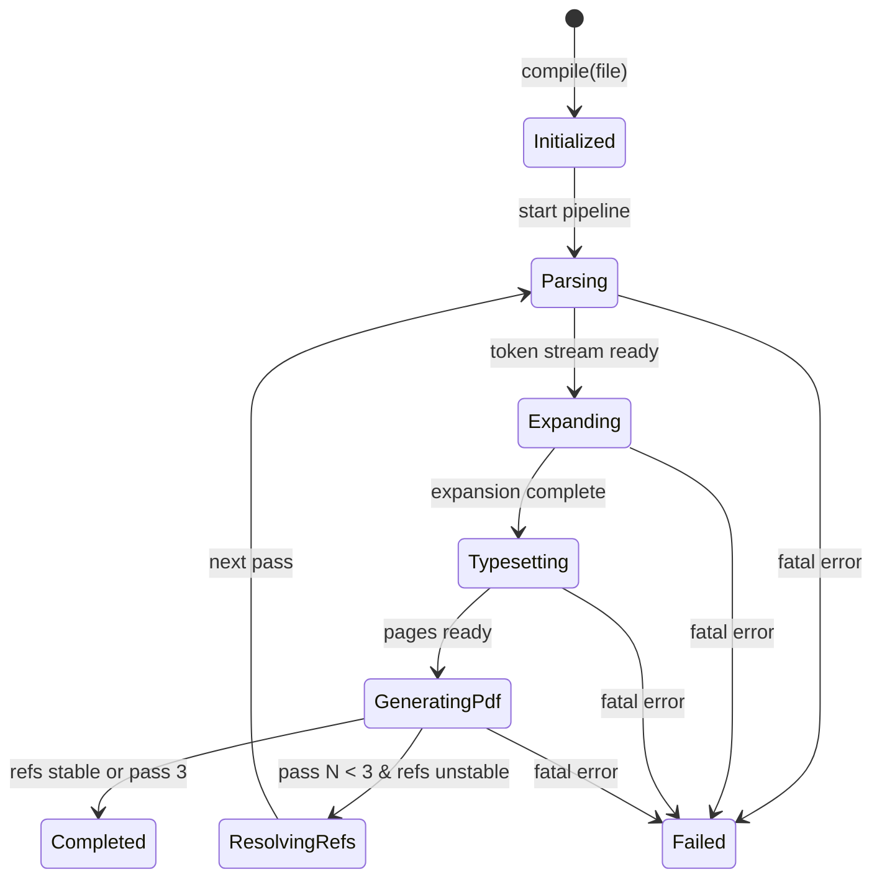

### 4.2 フロート配置

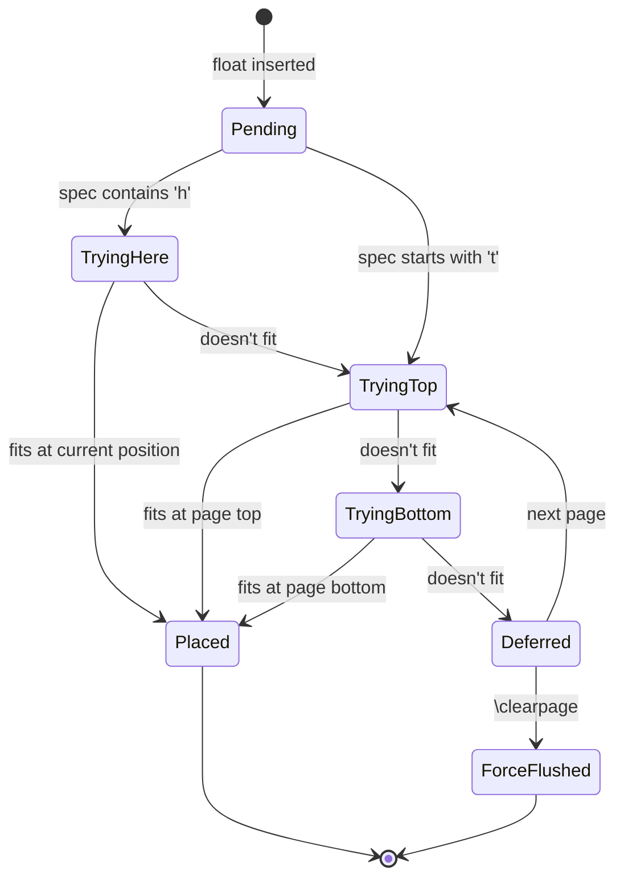

### 4.3 差分コンパイルキャッシュ

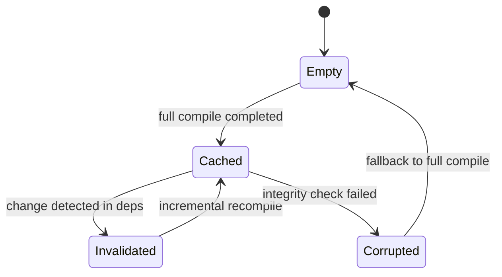

## 5. 用語集

### 5.1 パーサー/マクロエンジン コンテキスト

| 用語 | 定義 | 関連概念 |
|---|---|---|
| トークン (Token) | 字句解析が生成する処理の最小単位。コントロールシーケンストークンと文字トークンの 2 種 | カテゴリコード, Lexer |
| カテゴリコード (Catcode) | 各文字に割り当てる種別コード（0〜15）。字句解析の挙動を制御 | トークン, CatcodeTable |
| マクロ定義 (MacroDefinition) | `\def` 等で定義されたパターンと置換テキストの組。Definition Provenance を持ち、定義ジャンプの起点になる | マクロ展開, スコープ |
| スコープ (Scope) | `{}` や `\begingroup`/`\endgroup` で区切られたマクロ・レジスタ・catcode の有効範囲。`ScopeStack` は frame ごとの差分を保持し、終了時に入口値へ巻き戻す | ScopeStack |
| レジスタ (Register) | count, dimen, skip, toks, box 等の型付き記憶領域。e-TeX 拡張で 32768 個 (`REQ-FUNC-004`) | RegisterBank |
| コンパイルジョブ (CompilationJob) | 1 回の compile/watch/LSP 再コンパイル要求を表す集約。最大 3 パスまでの `CompilationSession` を束ね、`DocumentState` / active-job 限定の `OutputArtifactRegistry` / `ExecutionPolicy` を pass 間で保持する。job 完了時に registry を invalidate する | CompilationSession, DocumentState, OutputArtifactRegistry |
| コンパイルセッション (CompilationSession) | `CompilationJob` 内の 1 パスで共有される可変 TeX 状態。カテゴリコード、レジスタ、スコープ、条件分岐評価 (`REQ-FUNC-003`)、エラー回復 (`REQ-FUNC-006`)、コマンド/環境レジストリ、input stack、include 状態、current Job Context を保持する | CompilationJob, JobContext, InputStack, IncludeState |
| 入力スタック (InputStack) | 現在処理中の TeX 入力ファイル列を保持し、current-file 基準の解決コンテキストとネスト深度を供給するスタック | CompilationSession, InputSource, ResolutionContext |
| include 状態 (IncludeState) | `\include` のガード対象と分離された `.aux` 出力先を保持する pass-local 状態 | CompilationSession, JobContext |
| 解決コンテキスト (ResolutionContext) | current directory・ネスト深度・optional load 可否から成る資産解決用コンテキスト | InputStack, AssetResolver |
| コンパイルスナップショット (CompilationSnapshot) | 並列ステージ境界で共有する読み取り専用の状態スナップショット。`CompilationSession` / `DocumentState` の確定済み部分だけを参照可能にする | CompilationJob, CompilationSession, DocumentState |
| コミットバリア (CommitBarrier) | 並列ステージの結果を決定的順序で `CompilationJob` へ反映する同期点。マクロ・レジスタ・文書状態の破壊的更新はここでのみ許可される | CompilationJob, CompilationSnapshot |
| Stable Compile State | 最新の成功した `CommitBarrier` 完了時点で確定した `CompilationSession` / `DocumentState` の投影。worker-local な未 commit 状態や失敗 pass の部分結果を含まない | LiveAnalysisSnapshot, CompilationJob |
| ジョブコンテキスト (JobContext) | current jobname・主入力・現在パス番号を保持する値。`CompilationJob` 内の現在パスを識別し、same-job readback の一致判定キーである jobname / 主入力と、順序・診断用の現在パス番号を分離して扱う | CompilationSession, OutputArtifactRegistry |
| ファイルアクセスゲート (FileAccessGate) | `\input` / `\openin` / `\openout` / engine-temp / engine-readback などの I/O 要求を `ExecutionPolicy` と `OutputArtifactRegistry` に照らして許可/拒否する共通ゲート | FileAccessRequest, SandboxedFileHandle |
| 目次状態 (TableOfContentsState) | `.toc` / `.lof` / `.lot` 由来の目次・図表一覧エントリを保持する job-scope 状態 | DocumentState, TocEntry |
| 索引状態 (IndexState) | `\index` から収集した索引語・ソートキー・ページ番号を保持し、makeindex 互換整列へ渡す job-scope 状態 | DocumentState, IndexEntry |
| ナビゲーション状態 (NavigationState) | hyperref とセクショニングが生成する PDF metadata draft、しおり候補、named destination、既定リンク装飾を保持する job-scope 状態 | DocumentState, PdfMetadataDraft, OutlineDraftEntry |
| リンク装飾 (LinkStyle) | hyperref の `colorlinks` や枠線指定から正規化されたリンク描画規則。既定値として `NavigationState` に保持され、配置済みリンクへコピーされる | NavigationState, LinkAnnotationPlan |
| 定義 provenance (DefinitionProvenance) | マクロ・ラベル・参考文献エントリの定義元を示す SourceLocation と由来種別の組。`CitationInfo.traceProvenance` のような trace 用参照にも使う | MacroDefinition, LabelInfo, BibliographyEntry, CitationInfo(trace) |
| パスアクセスポリシー (PathAccessPolicy) | 読み書き可能な project root / overlay roots / bundle roots / cache dir / output roots / private temp root と、output root から再読込可能な補助ファイル拡張子 allowlist を保持する静的ポリシー。実際の readback 可否は OutputArtifactRegistry と組み合わせて判定する | ExecutionPolicy, OutputArtifactRegistry |
| 出力アーティファクトレジストリ (OutputArtifactRegistry) | Ferritex または Ferritex が制御した外部ツール実行で生成した readback 対象補助ファイルの provenance を保持し、current Compilation Job の `jobname` と主入力の双方に整合する trusted artifact のみを再読込可能にする active-job 限定 in-memory 台帳。`producedPass` は監査属性であり、same-job の一致条件には含めない。job 完了または process restart で無効化し、append-only manifest は監査専用とする | OutputArtifactRecord, JobContext, ExecutionPolicy |
| アーティファクト種別 (ArtifactKind) | Output Artifact Registry が記録する補助ファイル種別。`.aux`、`.toc`、`.lof`、`.lot`、`.bbl`、`.synctex` など trusted readback 対象の論理分類を表す | OutputArtifactRecord, OutputArtifactRegistry |
| アーティファクト生成者種別 (ArtifactProducerKind) | Output Artifact Registry が記録する生成主体種別。Ferritex 本体か、Ferritex が制御した外部ツールかを区別する | OutputArtifactRecord, ShellCommandGateway |
| プレビューターゲット (PreviewTarget) | preview session / revision が紐づく対象文書の識別子。workspace root、primaryInput、jobname の組 | PreviewSession, PreviewRevision |
| プレビュー公開ポリシー (PreviewPublicationPolicy) | `ExecutionPolicy` に内包される preview 配信専用の制約。loopback bind 限定、active job の最新 PDF のみ publish、session target 一致、target 変更または process restart 時の session 再発行規約を保持する | ExecutionPolicy, PreviewSessionService |
| 文書状態デルタ (DocumentStateDelta) | 1 つの文書パーティションまたは 1 つの commit barrier ステージが生成する `DocumentState` への変更セット。カウンタ差分、ラベル/citation/TOC/索引/ナビゲーション更新、aux 書き出しを含む。`CommitBarrier` が `(passNumber, stageOrder, partitionId)` の total order でデルタを適用する | CommitBarrier, DocumentState, DocumentPartitionPlan |
| グラフィックコマンドストリーム (GraphicsCommandStream) | パーサーが tikz/graphicx コマンドを処理した際に生成する描画指示列。描画ディレクティブと参照先資産を保持し、`GraphicsCompiler` が `GraphicsBox` へ変換する | GraphicsCompiler, GraphicsScene |
| 依存イベント列 (DependencyEvents) | パース中に発生するファイル読み込み・マクロ定義/使用・ラベル定義・参照使用などの依存追跡イベント列。`DependencyGraph` の構築・更新に使い、差分コンパイルの変更検知基盤を供給する | DependencyGraph, ChangeDetector |
| ソース位置 (SourceLocation) | ファイル名・行番号・列番号の組。エラー報告と SyncTeX で使用 | エラー回復 |
| プレビュー配信契約 (PreviewTransport) | loopback に bind し、`PreviewSessionService` が `POST /preview/session` bootstrap 応答と session ごとの HTTP document endpoint / WebSocket events endpoint を公開するための双方向 port。`PreviewTarget` 付き revision 通知を配信し、view-state 更新を受信する。session 失効時は `SessionErrorResponse` を返す | PreviewSession, PreviewRevision, SessionErrorResponse |

### 5.2 タイプセッティング コンテキスト

| 用語 | 定義 | 関連概念 |
|---|---|---|
| ボックス (Box) | 幅・高さ・深さを持つ組版の基本レイアウト単位 | HBox, VBox |
| グルー (Glue) | 自然長・伸び量・縮み量を持つ伸縮可能なスペース | 行分割 |
| ペナルティ (Penalty) | 行/ページ分割の位置を制御する整数値。高いほど分割されにくい | 行分割, ページ分割 |
| 行分割 (Line Breaking) | Knuth-Plass アルゴリズムにより段落の最適な改行位置を決定する処理 | Paragraph, LineBreakParams |
| フロート (Float) | テキストの流れから独立して配置されるオブジェクト。配置指定子で制御 | FloatQueue, PageBuilder |
| 配置指定子 (PlacementSpec) | `[htbp!]` を優先順位付き配置領域と force 指示へ正規化した値 | FloatItem, FloatQueue |
| フロート配置 (FloatPlacement) | 実際に選ばれた配置領域とページ内矩形を持つフロート配置結果 | PageBox, FloatQueue |
| 脚注キュー (FootnoteQueue) | ページ下部へ配置待ちの脚注を保持し、現在ページへ割り当てる脚注高さを予約するキュー | PageBuilder, FootnoteItem |
| 脚注項目 (FootnoteItem) | 脚注マーカー、本文、由来ソース範囲を持つ脚注 1 件 | FootnoteQueue, FootnotePlacement |
| ディスプレイ数式ブロック (DisplayMathBlock) | `align` / `gather` / `multline` / `split` など複数行 display math を表す集約。行揃え、`\intertext`、式番号付けを保持する | AmsmathLayoutEngine, MathAlignmentRow, EquationTag |
| 数式整列行 (MathAlignmentRow) | `&` で区切られたセル列と行単位の式タグを持つ display math の 1 行 | DisplayMathBlock, MathCell, EquationTag |
| 数式タグ (EquationTag) | 自動番号、`\tag`、`\notag` を正規化した式番号付け規則 | MathAlignmentRow, CounterStore |
| ドキュメント状態 (DocumentState) | カウンタ、ラベル、参考文献、目次、索引、ナビゲーション状態など、組版中に更新される文書単位の状態 | CounterStore, CrossReferenceTable, BibliographyState, TableOfContentsState, IndexState, NavigationState |
| 相互参照 (Cross Reference) | `\label`/`\ref`/`\pageref` による文書内の参照。最大 3 パスで解決 | CrossReferenceTable |
| 参考文献状態 (BibliographyState) | `.bbl` 由来の Citation Table と参考文献エントリを保持し、`\cite` 解決と参考文献リスト組版の入力を管理する状態 | CitationTable, BblSnapshot |
| Citation Table | citation key から `CitationInfo` を引く索引。`CitationInfo.label` は citation label、`CitationInfo.formattedText` は本文中の `\cite` 表示文字列を保持する | BibliographyState, CitationInfo |
| Bibliography Entry | 参考文献 1 件分の整形済みエントリ。`renderedBlock` は参考文献リストへ流し込むブロック表示を保持し、本文中の citation 表示とは分離する | BblSnapshot, BibliographyState |
| 目次エントリ (TocEntry) | 章節・図表一覧の項目名、番号、ページ番号、階層を保持する値 | TableOfContentsState |
| 索引エントリ (IndexEntry) | 索引語、ソートキー、対応ページ番号を保持する値 | IndexState |
| ソース範囲 (SourceSpan) | 組版結果 1 単位に対応付くソース開始/終了位置。SyncTeX と診断の由来追跡に使う | PlacedNode, SourceLocation |
| 配置済みノード (PlacedNode) | ページ上で確定した矩形と SourceSpan を伴うノード。PDF 射影と SyncTeX の共通入力 | PageBox, TextRun |
| テキストラン (TextRun) | 配置済みグリフ列と text style を持つノード。`colorlinks=true` 時は LinkStyle から text color を受け取る | TextStyle, LinkStyle |
| 配置済み destination (PlacedDestination) | named destination のページ内配置結果。内部リンク・しおり解決に使う | PageBox, NavigationState |
| ページボックス (PageBox) | 単一ページに配置済みのノード列、確定済みフロート配置、destination、リンク注釈計画を保持するページ単位の box tree | PageBuilder, PlacedNode, FloatPlacement, LinkAnnotationPlan |
| 目次組版器 (TocTypesetter) | `TableOfContentsState` を `\tableofcontents` / `\listoffigures` / `\listoftables` 用の box tree へ射影するサービス | TableOfContentsState, DocumentState |
| 索引組版器 (IndexTypesetter) | `IndexState` を `\printindex` 用の box tree へ射影するサービス | IndexState, DocumentState |
| 数式リスト (MathList) | 数式アトム（Ord, Op, Bin, Rel 等）の列。スタイルに応じて組版 | MathAtom |

### 5.3 グラフィック描画 コンテキスト

| 用語 | 定義 | 関連概念 |
|---|---|---|
| グラフィックコマンドストリーム (GraphicsCommandStream) | パーサー/マクロエンジンから供給される描画指示列。`GraphicsCompiler` の入力として消費される | GraphicsCompiler, GraphicsBox |
| グラフィックシーン (GraphicsScene) | `tikz` / `graphicx` の結果を PDF 非依存のベクター・PDF グラフィック・ラスタ・テキスト要素へ正規化した描画単位 | GraphicsBox, GraphicNode |
| GraphicsBox | 組版結果に埋め込める寸法付きの描画ボックス | GraphicsScene, PlacementContext |
| GraphicGroup | tikz/pgf の group/scope に対応する階層ノード。継承スタイルと clip path を子ノードへ適用する | GraphicsScene, GraphicStyle, ClipPath |
| GraphicStyle | グループ単位で継承される描画スタイル。線・塗り・テキスト色の既定値を保持する | GraphicGroup, PaintStyle |
| ClipPath | group/scope に対して適用されるクリッピング形状 | GraphicGroup, PathCommand |
| VectorPath | 線・矩形・曲線などのベクター描画要素 | PathCommand, PaintStyle |
| ArrowSpec | パスの始点/終点に付与される矢印指定 | VectorPath |
| ExternalGraphic | 外部ファイル由来のグラフィック要素。共通のクリッピング・変換情報を持つ | RasterImage, PdfGraphic |
| RasterImage | PNG/JPEG 画像などのラスタ要素 | GraphicAssetResolver, Transform |
| PdfGraphic | 埋め込み元 PDF のページをベクター性を保持したまま扱う外部グラフィック要素 | GraphicAssetResolver, Transform |

### 5.4 差分コンパイル コンテキスト

| 用語 | 定義 | 関連概念 |
|---|---|---|
| 依存イベント列 (DependencyEvents) | パーサー/マクロエンジンから供給される依存追跡イベント列。ファイル読み込み・マクロ定義/使用・ラベル/参照を記録し、`DependencyGraph` の構築に使う | DependencyGraph, ChangeDetector |
| 依存グラフ (DependencyGraph) | ファイル・マクロ・ラベル間の依存関係を表す有向グラフ。永続化は `DependencyGraphStore` port が担う | DepNode, 変更検知 |
| 依存ノード (DepNode) | 依存グラフの頂点。ファイル/マクロ/ラベルのいずれか | DependencyGraph |
| コンテンツハッシュ (ContentHash) | ファイル/ノード内容のハッシュ値。変更検知に使用 | ChangeDetector |
| 再コンパイル範囲 (RecompilationScope) | 変更検知 (`REQ-FUNC-028`) の影響伝播により再処理が必要なノードの集合。参照影響の有無を含む | ChangeDetector |
| コンパイルキャッシュ (CompilationCache) | 差分再利用の論理集約。永続化は `CacheMetadataStore` と `BlobCacheStore` に分離され、`IncrementalCompilationCoordinator` からは一貫した cache 契約として見える | CacheEntry, IncrementalCompilationCoordinator |
| コンパイルマージプラン (CompilationMergePlan) | 再構築ノードと再利用ノードの境界、および参照安定化の要否を表す計画 | IncrementalCompilationCoordinator |
| 差分コンパイルコーディネータ (IncrementalCompilationCoordinator) | 差分コンパイル時のプランニング、`CompilationJob` 単位の pass 反復、再処理、マージ、参照安定化を統括するサービス | RecompilationScope, CompilationCache, CompilationJob |
| 文書パーティション計画 (DocumentPartitionPlan) | 章またはセクション単位並列化で独立に処理できる work unit 群と、逐次ページ番号を保てるかの条件を表す計画 | DocumentPartitionPlanner, DocumentWorkUnit |
| 文書ワークユニット (DocumentWorkUnit) | 1 つの章またはセクションに対応する入力ファイル、`partitionId`、`PartitionLocator`、輸入/輸出する参照、独立組版可否を表す単位 | DocumentPartitionPlan, PaginationMergeCoordinator |
| パーティション種別 (PartitionKind) | 文書パーティションの種別。`chapter` / `section` など、`DocumentPartitionPlanner` が work unit を分類するための論理タグ | DocumentWorkUnit, DocumentPartitionPlan |
| パーティション識別子 (partitionId) | `DocumentPartitionPlanner` が各文書パーティションへ安定に発行する識別子。`CommitBarrier` の total order を決定するキーの 1 つ | DocumentWorkUnit, CommitBarrier |
| パーティション位置 (PartitionLocator) | 同一ファイル内でも章/セクション境界を一意に特定する論理位置。`entryFile`、見出しの `SourceSpan`、出現順 ordinal を組にして表す | DocumentWorkUnit, DocumentLayoutFragment |
| ページ統合調停役 (PaginationMergeCoordinator) | 各文書パーティションの組版結果を順序付きで統合し、ページオフセットと参照整合性を確定するサービス | DocumentLayoutFragment, PaginationMergeResult |
| キャッシュエントリ (CacheEntry) | コンパイル中間結果のシリアライズデータ。ソースハッシュで整合性を検証 | CompilationCache |

### 5.5 アセットランタイム コンテキスト

| 用語 | 定義 | 関連概念 |
|---|---|---|
| Ferritex Asset Bundle | 実行時に参照するクラス・パッケージ・フォント資産の不変スナップショット | AssetIndex, OverlaySet |
| Asset Index | 論理名から資産ハンドルを高速解決する索引構造 | AssetBundle |
| オーバーレイ (Overlay) | project-local 資産、設定済み read-only overlay roots、Ferritex Asset Bundle、host-local font catalog fallback を優先順位付きで束ねる解決レイヤー | OverlaySet, OverlayLayer |
| Host Font Catalog | platform font discovery API から収集したホストフォント索引。overlay の一種として解決面に参加する | PlatformFontScanner, FontSnapshot |

### 5.6 PDF 生成 コンテキスト

| 用語 | 定義 | 関連概念 |
|---|---|---|
| コンテンツストリーム (ContentStream) | PDF ページの描画命令列 | PdfOperator |
| ページレンダープラン (PageRenderPlan) | 単一ページ分の `PageBox` と `GraphicsScene` を束ねた PDF 射影入力。`PageBox` 内には配置済み `PlacedNode` / `PlacedDestination` / `LinkAnnotationPlan` が含まれる | PdfRenderer, PageBox, GraphicsScene |
| PDF レンダラ (PdfRenderer) | `PageRenderPlan` と `NavigationState` を PDF 演算子列・リンク Annotation・リソース辞書・メタデータ・しおりへ射影し、`PlacedDestination` と `LinkStyle` を内部 destination / text color / annotation border へ変換して `PdfDocument` を構築するサービス | GraphicResourceEncoder, PdfPage |
| リンク注釈計画 (LinkAnnotationPlan) | 配置済みリンク 1 件分の PDF 注釈化計画。リンク矩形、リンク先、装飾設定を保持し、`PdfRenderer` が `Annotation` へ変換する | PageBox, LinkTarget, LinkStyle |
| リンク先 (LinkTarget) | 内部 named destination または外部 URI を表すリンク解決先 | LinkAnnotationPlan, Annotation |
| アノテーション (Annotation) | PDF 上のリンク・しおり等のインタラクティブ要素 | hyperref |
| フォントサブセット計画 (FontSubsetPlan) | 1 フォントについて PDF に埋め込む使用グリフ集合と ToUnicode CMap 生成要否を保持する計画 | FontEmbeddingPlanner, EmbeddedFont |
| フォント埋め込み計画器 (FontEmbeddingPlanner) | `TextRun` 群から使用グリフを集約し、`FontManager` / `GlyphSubsetter` と協調して `EmbeddedFont` を構築するサービス | FontSubsetPlan, EmbeddedFont |
| PDF メタデータ草案 (PdfMetadataDraft) | hyperref が収集した `pdftitle` / `pdfauthor` などの中間状態。`PdfRenderer` が `PdfMetadata` へ変換する | NavigationState |
| アウトライン草案エントリ (OutlineDraftEntry) | セクショニングや hyperref から収集したしおり候補。`PdfRenderer` が PDF の `OutlineEntry` へ変換する | NavigationState |
| 埋め込みフォント (EmbeddedFont) | 使用グリフのみをサブセット化して PDF に埋め込んだフォントデータ | GlyphSubsetter |
| 埋め込み PDF グラフィック (EmbeddedPdfGraphic) | 外部 PDF ページを Form XObject 化して PDF 内へ再利用可能にした描画資産 | PdfGraphic |
| PDF 位置 (PdfPosition) | ページ番号とページ内座標の組。SyncTeX の逆引き入力になる | SyncTexData, PdfPoint |
| SyncTeX trace fragment | 1 つの SourceSpan と 1 つのページ内矩形を対応付ける SyncTeX の最小断片。1 つの SourceSpan に複数存在しうる | SyncTexData, SyncTraceFragment |
| SyncTeX ビルダ (SyncTexBuilder) | `PlacedNode` の SourceSpan と配置矩形から `SyncTexData` を導出するサービス | PageRenderPlan, SyncTexData |
| SyncTeX データ | fragment 群を forward / inverse search 用に索引化した双方向マッピング | SyncTraceFragment, SyncTexBuilder |

### 5.7 フォント管理 コンテキスト

| 用語 | 定義 | 関連概念 |
|---|---|---|
| フォントメトリクス (FontMetrics) | 文字幅・高さ・深さ・カーニング・リガチャ情報の集合 | GlyphMetric |
| フォント指定 (FontSpec) | `fontspec` と `TextStyle` から正規化されるフォント要求。family、weight/style、OpenType feature、fallback chain を 1 つの値にまとめる | FontFeatureSet, FontFallbackChain |
| フォント feature 集合 (FontFeatureSet) | `Ligatures`, `Numbers`, `Script`, `Language` などの OpenType feature 指定を正規化した値 | FontSpec |
| フォント fallback chain (FontFallbackChain) | 第 1 候補が解決できない場合に試す追加フォントファミリ列 | FontSpec, FontFamilyRef |
| OpenType フォント | OTF/TTF 形式のモダンフォント。GPOS/GSUB テーブルで高度な組版を制御 | fontspec |
| TFM フォント | TeX 固有のフォントメトリクスバイナリ形式 (`REQ-FUNC-018`) | Computer Modern |
| グリフサブセット化 | 使用グリフのみを抽出してフォントデータを縮小する処理 | PDF 埋め込み |

### 5.8 開発者ツール コンテキスト

| 用語 | 定義 | 関連概念 |
|---|---|---|
| シンボル索引 (SymbolIndex) | `DefinitionProvenance` を LSP 向けに投影した read model。カーソル位置からジャンプ先を解決する | DefinitionProvider, CompilationSession |
| 補完索引 (CompletionIndex) | `LiveAnalysisSnapshot` から active な command/environment registry、未保存 buffer、label/citation 状態を LSP 補完向けに射影した read model | CompletionProvider, CompletionCandidate |
| 補完候補 (CompletionCandidate) | コマンド、環境、ラベル、参考文献キーの補完項目。表示名、挿入文字列、由来情報を保持する | CompletionIndex |
| パッケージ説明スナップショット群 (PackageDocSnapshotCatalog) | active な class/package snapshot の説明資産を保持する `StableCompileState` 側の読み取りモデル | StableCompileState, HoverDocCatalog |
| hover 文書カタログ (HoverDocCatalog) | `LiveAnalysisSnapshot.stableState.packageDocs` から active な class/package snapshot の説明資産をコマンドごとに索引化した read model | HoverProvider, HoverDoc |
| hover 文書 (HoverDoc) | コマンドの構文、要約、使用例、由来パッケージを保持する説明データ | HoverDocCatalog |
| オープンドキュメントバッファ (OpenDocumentBuffer) | エディタ上の未保存変更を含む最新テキスト。LSP 機能は保存済みファイルよりこれを優先して参照する | OpenDocumentStore, LiveAnalysisSnapshot |
| オープンドキュメントストア (OpenDocumentStore) | 現在開かれているテキスト文書の buffer と version を保持する LSP セッション内ストア | LspServer, OpenDocumentBuffer |
| ライブ解析スナップショット (LiveAnalysisSnapshot) | `OpenDocumentBuffer` と Stable Compile State を合成した LSP 共通入力。diagnostic/completion/definition/hover が同じ解析基盤を共有する | LiveAnalysisSnapshotFactory, CompletionIndex, SymbolIndex, HoverDocCatalog |
| 再コンパイルスケジューラ (RecompileScheduler) | watch 実行中の変更イベントを受け、コンパイル中フラグと pending queue を管理しながら `CompileJobService` への再コンパイル要求を逐次実行する調停役。各コンパイル完了後は最新の `DependencyGraph` から `FileWatcher` の監視対象集合も再同期する | FileWatcher, PendingChangeQueue, DependencyGraph, CompileJobService |
| CLI アダプタ (CliAdapter) | CLI からのコンパイル要求を `RuntimeOptions` に正規化し、`CompileJobService` に委譲する entry adapter | CompileOptions, RuntimeOptions, CompileJobService |
| watch アダプタ (WatchAdapter) | watch モードの起動を `RuntimeOptions` に正規化し、`RecompileScheduler` を起動する entry adapter | WatchOptions, RuntimeOptions, RecompileScheduler |
| コンパイルジョブサービス (CompileJobService) | `CliAdapter` と `RecompileScheduler` から正規化済みの `RuntimeOptions` を受け取り、共通のコンパイル use case を統合する application service。compile 完了後の `PreviewSessionService` への publish 委譲も担う | RuntimeOptions, ExecutionPolicy, PreviewSessionService |
| セッションエラー応答 (SessionErrorResponse) | preview session の失効・target 不一致・policy 拒否時に返すエラー応答。エラー種別・対象 sessionId・回復手順（`POST /preview/session` による再取得）を含む（`REQ-NF-010`） | PreviewSessionService, PreviewTransport |
| 保留変更キュー (PendingChangeQueue) | コンパイル中に到着した追加変更を coalesce して保持し、完了後の再トリガーに渡す待ち行列 | RecompileScheduler, FileChangeEvent |
| プレビューセッション (PreviewSession) | sessionId ごとの preview 状態。`PreviewTarget` を owner として保持し、同一 target かつ同一 process の間だけ再利用される。`PreviewSessionService.openSession` から bootstrap され、閲覧位置を保持し、PDF 更新後の view restore に使う | PreviewTransport, PreviewViewState |
| プレビュー表示状態 (PreviewViewState) | 現在ページ、ページ内オフセット、ズーム倍率など、プレビュー更新後も維持すべき閲覧位置。新 PDF のページ数に対して最近傍の有効ページへ clamp できる | PreviewSession |
| RuntimeOptions | compile (`REQ-FUNC-042`) / watch (`REQ-FUNC-044`) / LSP (`REQ-FUNC-045`) の入口固有指定を `primaryInput`、`artifactRoot`、`jobname`、`parallelism`、`reuseCache`、`assetBundleRef`、`interactionMode`、`synctex`、`shellEscapeAllowed` へ正規化した共通実行オプション。`ExecutionPolicyFactory` の入力となる | ExecutionPolicyFactory, AssetBundleRef |
| AssetBundleRef | Asset Bundle の参照値。ファイルパスまたは組み込み識別子を区別して保持する | RuntimeOptions, CompileOptions, WatchOptions |
| WorkspaceContext | プロジェクトルート、overlay roots、キャッシュ位置、利用可能な bundle 探索範囲/組み込み識別子をまとめた実行文脈 | ExecutionPolicyFactory |

## 6. 判断記録

### 6.1 パイプライン並列化をインフラストラクチャ層に配置

- **日付**: 2026-03-11
- **関連コンテキスト**: 全コンテキスト横断
- **判断内容**: パイプライン並列化（ステージ間バッファリング・スレッドプール管理）はドメインモデルに含めず、インフラストラクチャ層の関心事とする。ただし `REQ-FUNC-031` の並列安全性を満たすため、各ステージは `CompilationSession` / `DocumentState` から導出した読み取り専用 `CompilationSnapshot` のみを観測し、可変状態の反映は `CompilationJob` 配下の `CommitBarrier` で逐次化する
- **根拠**:
  - 観測事実: BR-6 (REQ-FUNC-031)「並列処理の出力はシングルスレッド実行と同一」および REQ-FUNC-031「並列安全なレジスタ・マクロ状態管理」— ドメインロジックは実行モデルに依存しないが、状態可視性の契約は必要
  - 代替案: `PipelineOrchestrator` をドメインモデルに含める
  - 分離証人: 組版ステージと PDF 射影ステージが同じマクロ・レジスタ状態を参照するケース。snapshot/barrier 契約付きモデルでは両者が同一の確定済み状態を観測し、commit 順序も一意になるが、契約なしモデルでは途中更新の可視性が実装依存になり逐次実行との差分を説明できない
- **等価性への影響**: 理論等価（ドメインの振る舞いは変化しない）
- **語彙への影響**: 「CompilationSnapshot」「CommitBarrier」を導入

### 6.2 依存グラフとコンパイルキャッシュの独立永続化

- **日付**: 2026-03-11
- **関連コンテキスト**: 差分コンパイル
- **判断内容**: `DependencyGraph` は `CompilationCache` とは独立したストレージに永続化する
- **根拠**:
  - 観測事実: BR-9 (REQ-FUNC-029)「キャッシュ破損時はフルコンパイルにフォールバック」。依存グラフが失われると変更検知自体が不可能になり、フォールバックのコストが不必要に増大する
  - 代替案: `DependencyGraph` を `CompilationCache` の一部として同一ストレージに保存する
  - 分離証人: キャッシュ破損＋依存グラフ健全のケース。独立永続化モデルでは依存グラフから invalidation 範囲や watch-set refresh を再計算したうえで full compile へ移行できるが、同一ストレージモデルではグラフも失われるため復旧前に全ファイル再探索が必要になる
- **等価性への影響**: 観測的等価（正常時の出力は同一。異常時の復旧効率が異なる）
- **語彙への影響**: なし

### 6.3 RecompilationScope への参照影響フラグ追加

- **日付**: 2026-03-11
- **関連コンテキスト**: 差分コンパイル / タイプセッティング
- **判断内容**: `RecompilationScope` に `referencesAffected: bool` を追加し、差分コンパイル時の参照再計算要否を明示する
- **根拠**:
  - 観測事実: BR-5「差分コンパイルの出力はフルコンパイルと同一」。ページ番号がずれると目次・相互参照の再計算が必要
  - 代替案: 差分コンパイル時は常に参照を再計算する
  - 分離証人: 本文中のタイポ修正（ページ番号に影響しない変更）のケース。フラグありモデルでは `referencesAffected == false` で参照再計算をスキップし高速化。常時再計算モデルでは不要なパスが実行される
- **等価性への影響**: 理論等価（出力は同一。処理効率が異なる）
- **語彙への影響**: 「再コンパイル範囲」の定義に「参照影響の有無」を追加

### 6.4 パッケージ互換レイヤーを独立サブドメインとしない

- **日付**: 2026-03-11
- **関連コンテキスト**: 全コンテキスト横断
- **判断内容**: パッケージ互換を独立サブドメインとせず、各サブドメインの拡張ポイントとして実現する。`graphicx` / `tikz` はグラフィック描画コンテキストへ束ねる
- **根拠**:
  - 観測事実: 個別パッケージの振る舞いは異なるサブドメインに属する（amsmath → 数式組版、hyperref → PDF リンク、graphicx / tikz → グラフィック描画）
  - 代替案: 「パッケージ互換」を独立した境界づけられたコンテキストとする
  - 分離証人: 独立コンテキストモデルでは、amsmath の数式環境を処理するために「パッケージ互換コンテキスト」がタイプセッティングの内部（MathList, MathAtom）を知る必要があり、密結合が生じる。拡張ポイントモデルではこの問題が発生しない
- **等価性への影響**: 理論等価（機能は同一。モジュール構造が異なる）
- **語彙への影響**: なし

### 6.5 Ferritex Asset Bundle を実行時の唯一の共有資産源とする

- **日付**: 2026-03-11
- **関連コンテキスト**: アセットランタイム / パーサー/マクロエンジン / フォント管理
- **判断内容**: クラス・パッケージ・フォント資産は、project-local 資産、設定済み read-only overlay roots、Ferritex Asset Bundle、Host Font Catalog fallback の順で解決し、TeX Live / kpathsea は実行時依存にしない。Host Font Catalog は第三の資産源ではなく fallback overlay として扱い、前段に一致候補がない場合または明示的 host-local 解決時にのみ参照する。ただし host-local font を直接解決した出力は REQ-NF-008 のバイト同一保証対象外とする
- **根拠**:
  - 観測事実: 要件は pdfLaTeX 比 100 倍の高速化を求め、単一バイナリ + バンドルでの起動を要求する
  - 代替案: 実行時に `TEXMF` ツリーを走査し、kpathsea 互換の探索を行う
  - 分離証人: クリーンマシンでのコールドスタートコンパイル。Asset Bundle モデルでは memory-mapped index 1回 + ハッシュ探索でクラス/パッケージ/フォントを解決できるが、実行時探索モデルではディレクトリ走査・`ls-R` 解析・OS フォント探索が必要になる
- **等価性への影響**: 観測的非等価（展開・配備方式は変わるが、文書処理機能の目標は同一）
- **語彙への影響**: 「Ferritex Asset Bundle」「Asset Index」「Host Font Catalog」を導入

### 6.6 CompilationJob と CompilationSession を分離して pass 境界を表現する

- **日付**: 2026-03-11
- **関連コンテキスト**: パーサー/マクロエンジン / タイプセッティング
- **判断内容**: 最大 3 パスまでのコンパイル全体は `CompilationJob` が表現し、`DocumentState`・`OutputArtifactRegistry`・`ExecutionPolicy` を pass 間で保持する。各 pass は新しい `CompilationSession` として開始し、カテゴリコード、スコープ、レジスタ、コマンド/環境レジストリ、current Job Context など pass-local な可変状態だけを持つ。same-job readback の一致判定は `JobContext` の jobname と主入力で行い、現在パス番号は current job の順序・出力命名・診断に使う運用属性、`OutputArtifactRecord.producedPass` は artifact provenance の監査属性として保持する。タイプセッティングは `CompilationJob` が所有する同じ `DocumentState` を共有参照する
- **根拠**:
  - 観測事実: `\section` によるカウンタ更新、`\label` の登録、`\ref` の再解決、`.aux` / `.toc` の readback は pass をまたいで持ち越される一方、カテゴリコードやグループスコープは各 pass で再初期化される
  - 代替案: すべての状態を単一 `CompilationSession` に閉じ込める、または逆に pass 間共有状態を暗黙のグローバルへ逃がす
  - 分離証人: `\tableofcontents` を含む文書の 2 パスコンパイル。`CompilationJob` モデルでは前パス生成の `.toc` provenance と参照状態を維持したまま、新しい `CompilationSession` で catcode / scope を初期化できるが、単一セッションモデルでは pass 境界が曖昧になり、グローバル逃がしモデルでは所有者が消える
- **等価性への影響**: 理論等価（外部仕様は同一だが、pass 境界と所有境界の表現力が向上する）
- **語彙への影響**: 「CompilationJob」「CompilationSession」「DocumentState」「BibliographyState」を導入

### 6.7 実行制御を CLI フラグではなく ExecutionPolicy として表現する

- **日付**: 2026-03-11
- **関連コンテキスト**: パーサー/マクロエンジン / 開発者ツール
- **判断内容**: `--shell-escape` やパス制御は CLI の一時的な分岐ではなく、全エントリポイントで共通に使う `ExecutionPolicy` / `PathAccessPolicy` として表現する。設定済み read-only overlay roots は `overlayRoots` として allowlist 化し、`--output-dir` は明示的 `outputRoots` へ変換する。`ExecutionPolicy` はデフォルト上限として `commandTimeout = 30s`、`maxConcurrentProcesses = 1`、`maxCapturedOutputBytes = 4 MiB` を保持し、preview 配信については `previewPublication` に loopback 限定、active-job 限定、session target 一致、target 変更または process restart 時の session 再発行規約を保持する。private temp root は Ferritex が管理する専用ディレクトリに限定し、output root の readback は、まず current `JobContext` の `jobname` と主入力で same-job を確認し、次に `OutputArtifactRegistry` に記録された正規化パス・生成パス・生成者・コンテンツハッシュなどの artifact provenance で個別 artifact を trusted と確認した補助ファイルに限って許可する。`producedPass` は監査属性であり、same-job の一致条件には含めない。Ferritex が制御した外部ツールの生成物は `ShellCommandGateway` が trusted external artifact として同レジストリへ登録し、registry は active job 完了時に invalidate される
- **根拠**:
  - 観測事実: 同じコンパイル機能が CLI、watch、LSP、プレビュー再コンパイルから呼ばれ、REQ-FUNC-024 / REQ-FUNC-047 / REQ-FUNC-048 は Ferritex 制御外部ツール生成物の provenance 記録を要求する
  - 代替案: 各入口で個別に shell escape とファイルアクセス判定を実装する
  - 分離証人: `bibtex` を起動して `.bbl` を生成するケース。Policy + registry 連携モデルでは shell-escape 判定と trusted external artifact 登録を単一の gateway で完結できるが、入口ごとの分岐モデルでは許可判定と provenance 登録の所有者が分裂する
- **等価性への影響**: 理論等価（外部仕様は同一で、実装の一貫性が向上する）
- **語彙への影響**: 「ExecutionPolicy」「PathAccessPolicy」「OutputArtifactRegistry」を導入

### 6.8 引用解決を label 系相互参照から分離する

- **日付**: 2026-03-12
- **関連コンテキスト**: パーサー/マクロエンジン / タイプセッティング
- **判断内容**: `\label`/`\ref`/`\pageref` は `CrossReferenceTable` で扱い、`.bbl` 由来の `\cite` 解決と参考文献リスト組版は `BibliographyState` / `CitationTable` で扱う。`CitationInfo.label` は citation label、`CitationInfo.formattedText` は本文中の citation 表示、`CitationInfo.traceProvenance` はその表示の trace に使う補助情報、`BibliographyEntry.renderedBlock` は参考文献リスト表示を表す。`\cite` の定義ジャンプ authority は `BibliographyEntry.provenance` とし、両者は同じ `DocumentState` に属するが責務は分離する
- **根拠**:
  - 観測事実: ラベル参照は `.aux` ベースの文書内参照であり、引用解決は `.bbl` ベースの外部ツール連携を伴う
  - 代替案: すべての参照を単一の `CrossReferenceTable` に集約する
  - 分離証人: `\ref{sec:intro}` と `\cite{knuth1984}` が同居する文書。分離モデルでは `.aux` と `.bbl` の更新条件を独立に扱えるが、単一テーブルモデルでは未解決原因と更新契機が混線する
- **等価性への影響**: 理論等価（外部仕様は同一で、責務境界の明瞭さが向上する）
- **語彙への影響**: 「CitationTable」「BblSnapshot」を導入

### 6.9 定義ジャンプは SymbolIndex read model で実現する

- **日付**: 2026-03-12
- **関連コンテキスト**: パーサー/マクロエンジン / 開発者ツール
- **判断内容**: `DefinitionProvider` は暗黙の外部インデックスに依存せず、`MacroDefinition` / `LabelInfo` / `BibliographyEntry` が保持する authoritative な `DefinitionProvenance` を `SymbolIndex` へ投影して定義位置を解決する。`CitationInfo.traceProvenance` は本文側 citation 表示の trace に使う補助情報であり、`\cite` の定義ジャンプ authority にはしない
- **根拠**:
  - 観測事実: REQ-FUNC-036 は `\ref` / `\cite` / マクロ定義への定義ジャンプを要求している
  - 代替案: LSP 実装内部にのみ存在する非公開インデックスへ依存する
  - 分離証人: `\newcommand{\foo}` と `\foo` のケース。`DefinitionProvenance` + `SymbolIndex` モデルではコンパイル/解析結果から一意に定義位置を再構築できるが、非公開インデックス前提モデルではドメインモデルだけから必要データを導けない
- **等価性への影響**: 理論等価（外部仕様は同一で、LSP 機能の実装可能性が明確になる）
- **語彙への影響**: 「DefinitionProvenance」「SymbolIndex」を導入

### 6.10 差分コンパイルの統合と参照安定化はコアドメインに含める

- **日付**: 2026-03-12
- **関連コンテキスト**: 差分コンパイル
- **判断内容**: 変更範囲の検知だけでなく、再構築ノードと再利用ノードのマージ、および参照安定化までの反復を `IncrementalCompilationCoordinator` / `CompilationMergePlan` としてコアドメインへ明示する
- **根拠**:
  - 観測事実: REQ-FUNC-030 は差分コンパイル結果がフルコンパイルと同一であることを要求し、単なる変更検知だけでは満たせない
  - 代替案: 統合・安定化ロジックを別設計文書またはインフラストラクチャ層へ追い出す
  - 分離証人: ページ番号ずれにより `\ref` と目次が再計算されるケース。コアモデルに統合・安定化が含まれれば同一性要件を直接表現できるが、外部化モデルでは変更検知しか表現できず、最重要制約がモデル外に漏れる
- **等価性への影響**: 理論等価（外部仕様は同一で、コア制約の表現力が向上する）
- **語彙への影響**: 「IncrementalCompilationCoordinator」「CompilationMergePlan」を導入

### 6.11 PDF 射影責務を PdfRenderer / GraphicResourceEncoder として明示する

- **日付**: 2026-03-12
- **関連コンテキスト**: PDF 生成 / グラフィック描画
- **判断内容**: `PageRenderPlan` / `NavigationState` を `PdfDocument` へ落とす責務は `PdfRenderer` とし、配置済みリンクを `LinkAnnotationPlan` として受け取って `Annotation` へ変換する。外部ラスタ画像と外部 PDF の埋め込み形式決定は `GraphicResourceEncoder` に分離する
- **根拠**:
  - 観測事実: REQ-FUNC-013 / REQ-FUNC-015 / REQ-FUNC-016 / REQ-FUNC-022 / REQ-FUNC-023 は、通常のボックス組版、hyperref のメタデータ/しおり/リンク装飾、`graphicx` の画像埋め込み、tikz/pgf の描画結果が単一の PDF 出力面へ収束することを要求している
  - 代替案: `PdfDocument` 自身の `render()` にすべての射影責務を押し込む
  - 分離証人: `\href{https://example.com}{link}` と `\hypersetup{colorlinks=true,pdftitle=...}` を含む文書のケース。分離モデルでは `PdfRenderer` が `PageRenderPlan` の `LinkAnnotationPlan` と `NavigationState` のメタデータ/しおりを統合し、`GraphicResourceEncoder` が imported PDF Form XObject を扱えるが、自己完結型 `PdfDocument` モデルではリンク矩形・装飾・外部グラフィック変換の責務がデータ構造へ混入する
- **等価性への影響**: 理論等価（外部仕様は同一で、変換責務の境界が明確になる）
- **語彙への影響**: 「PageRenderPlan」「LinkAnnotationPlan」「LinkStyle」「PdfRenderer」「GraphicResourceEncoder」を導入

### 6.12 実行ポリシーは RuntimeOptions と WorkspaceContext から構築する

- **日付**: 2026-03-12
- **関連コンテキスト**: 開発者ツール / パーサー/マクロエンジン
- **判断内容**: CLI 固有の `CompileOptions` を直接 `ExecutionPolicyFactory` に渡さず、compile / watch / LSP から得た指定を `RuntimeOptions` へ正規化してから `WorkspaceContext` と合わせて `ExecutionPolicy` を構築する。`RuntimeOptions` は `primaryInput`、`artifactRoot`、`jobname`、`parallelism`、`reuseCache`、`assetBundleRef`、`interactionMode`、`synctex`、`shellEscapeAllowed` だけを保持し、debounce や transport など入口固有の制御情報は含めない。preview session ごとの owner や lifetime は `ExecutionPolicy.previewPublication` と `PreviewSessionService` が扱い、`RuntimeOptions` には混ぜない。Asset Bundle 指定は `AssetBundleRef` としてファイルパスと組み込み識別子の両方を表現する
- **根拠**:
  - 観測事実: 同じコンパイル機能が CLI、watch、LSP から呼ばれ、REQ-FUNC-046 は Asset Bundle をパスまたは組み込み識別子で受ける
  - 代替案: `CompileOptions` を共通入力として流用し、watch/LSP は暗黙変換で吸収する
  - 分離証人: ワークスペース既定の組み込み bundle を使う LSP 再コンパイルと、明示的な `--asset-bundle /path/to/bundle` を使う CLI コンパイルのケース。`RuntimeOptions` + `AssetBundleRef` モデルでは両者を同じ `ExecutionPolicyFactory` で扱えるが、`CompileOptions(FilePath)` 前提モデルでは LSP 側の表現が崩れる
- **等価性への影響**: 理論等価（外部仕様は同一で、入口非依存性と表現力が向上する）
- **語彙への影響**: 「RuntimeOptions」「AssetBundleRef」「WorkspaceContext」を導入

### 6.13 目次・索引・ナビゲーション状態を DocumentState に集約する

- **日付**: 2026-03-12
- **関連コンテキスト**: パーサー/マクロエンジン / タイプセッティング / PDF 生成
- **判断内容**: `\tableofcontents` / `\listoffigures` / `\listoftables` / `\makeindex` / hyperref が pass 間で共有する状態は `DocumentState` 内の `TableOfContentsState` / `IndexState` / `NavigationState` として保持する。`SectioningEngine` / `HyperrefExtension` がこれらを更新し、`TocTypesetter` / `IndexTypesetter` が box tree へ投影し、`PdfRenderer` が `NavigationState` と配置済みリンクを消費する
- **根拠**:
  - 観測事実: REQ-FUNC-012 / REQ-FUNC-015 / REQ-FUNC-022 は pass をまたぐ `.toc` / `.lof` / `.lot` / metadata / outline / link style の保持と、その後段の組版・PDF 射影を必要とする
  - 代替案: package 拡張内部または PDF 生成直前の一時構造として個別に保持する
  - 分離証人: `\tableofcontents` と `\printindex` と `\hypersetup{colorlinks=true}` を含む 2 パス文書。`DocumentState` 集約モデルでは前パス生成の目次/索引エントリと既定リンク装飾を同一所有者で保持し、後段で `TocTypesetter` / `IndexTypesetter` / `PdfRenderer` へ明示的に受け渡せるが、一時構造モデルでは pass 境界をまたいだ所有者が不明確になる
- **等価性への影響**: 理論等価（外部仕様は同一で、pass 跨ぎ状態の所有境界が明確になる）
- **語彙への影響**: 「TableOfContentsState」「IndexState」「NavigationState」「LinkStyle」「TocTypesetter」「IndexTypesetter」「PdfMetadataDraft」「OutlineDraftEntry」を導入

### 6.14 SyncTeX と internal destination の source-to-layout trace を PageBox に保持する

- **日付**: 2026-03-12
- **関連コンテキスト**: タイプセッティング / PDF 生成
- **判断内容**: `PageBox` は単なる node 列ではなく、配置済み `PlacedNode` と `PlacedDestination` を保持する。`PlacedNode` は `SourceSpan` と配置矩形を持ち、`SyncTexBuilder` がそこから `SyncTexData` を生成する。`PdfRenderer` は `PlacedDestination` を named destination 解決に用いる
- **根拠**:
  - 観測事実: REQ-FUNC-041 はソース位置と PDF 位置の双方向対応付けを要求し、REQ-FUNC-015 / REQ-FUNC-022 は internal destination をページ上の配置結果に解決する必要がある
  - 代替案: SyncTeX と destination 解決を非公開の外部インデックスまたは PDF 生成時の暗黙状態に依存させる
  - 分離証人: `\section{Intro}\label{sec:intro}` と `\ref{sec:intro}` を含む文書。`PlacedNode` / `PlacedDestination` モデルでは見出しの source span と destination 座標を同じ page-scope 構造から得られるが、暗黙状態モデルでは SyncTeX と internal link 解決の入力が分裂する
- **等価性への影響**: 理論等価（外部仕様は同一で、source-to-layout provenance の表現力が向上する）
- **語彙への影響**: 「SourceSpan」「PlacedNode」「PlacedDestination」「SyncTexBuilder」を導入

### 6.15 LinkStyle を text-side style と annotation border の両方へ射影する

- **日付**: 2026-03-12
- **関連コンテキスト**: タイプセッティング / PDF 生成
- **判断内容**: `LinkStyle` は annotation 用の境界線設定だけでなく、リンク文字列の `TextStyle.fillColor` へも射影される。`colorlinks=true` の場合、`PdfRenderer` は `TextRun` の text color として content stream に反映し、annotation には border 規則のみを残す
- **根拠**:
  - 観測事実: REQ-FUNC-022 は `colorlinks=true` で「色付きテキストとして出力」を要求しており、annotation だけでは満たせない
  - 代替案: `LinkStyle` を PDF annotation 側の情報に限定し、テキスト着色は暗黙実装に委ねる
  - 分離証人: `\hypersetup{colorlinks=true}\href{https://example.com}{link}` のケース。text-side 射影モデルでは `TextRun.style.fillColor` が content stream に現れるが、annotation-only モデルではクリック領域は表せてもリンク文字列の色は説明できない
- **等価性への影響**: 理論等価（外部仕様は同一で、色付きリンクの責務境界が明確になる）
- **語彙への影響**: 「TextRun」「TextStyle」を導入

### 6.16 すべてのファイル I/O は FileAccessGate を経由させる

- **日付**: 2026-03-12
- **関連コンテキスト**: パーサー/マクロエンジン / アセットランタイム / 開発者ツール
- **判断内容**: `\input` / `\include` / `\openin` / `\openout` / asset read / engine-temp / engine-readback を個別コンポーネントに散在させず、`FileAccessGate` が `ExecutionPolicy` / `OutputArtifactRegistry` / `JobContext` を受けて一元的に許可判定する
- **根拠**:
  - 観測事実: REQ-FUNC-048 は「コンパイル中のすべてのファイル読み書き」を同一ポリシーで制御することを要求し、外部コマンドだけでなく通常の TeX I/O も対象に含む
  - 代替案: `Lexer` / `AssetResolver` / CLI 各入口が個別にパス判定を実装する
  - 分離証人: `\input{chap1}` と `\openout\foo=../../outside.txt` が同じジョブ内にある文書。`FileAccessGate` モデルでは通常入力と危険書き込みの両方を同一の gate で判断できるが、呼び出し元分散モデルでは enforcement owner が複数に割れる
- **等価性への影響**: 理論等価（外部仕様は同一で、sandbox enforcement の所有者が明確になる）
- **語彙への影響**: 「FileAccessGate」「FileAccessRequest」「SandboxedFileHandle」を導入

### 6.17 SyncTeX は fragment ベースで保持する

- **日付**: 2026-03-12
- **関連コンテキスト**: タイプセッティング / PDF 生成
- **判断内容**: `SyncTexData` は `SourceLocation -> PdfPosition` の単純写像ではなく、`SyncTraceFragment` の集合として保持する。forward search は SourceLocation に交差する fragment 群を返し、inverse search は `PdfPosition` を含む fragment から `SourceSpan` を返す
- **根拠**:
  - 観測事実: REQ-FUNC-041 は placed node ごとの `SourceSpan` と配置矩形を保持し、複数行・複数ページに分割された結果も扱える必要がある
  - 代替案: `Map<SourceLocation, PdfPosition>` / `Map<PdfPosition, SourceLocation>` の点対点マップとして保持する
  - 分離証人: 長いリンクテキストや見出しが改行をまたいで複数断片に分割されるケース。fragment モデルでは複数矩形を 1 つの source span に対応付けられるが、点対点マップでは情報が欠落する
- **等価性への影響**: 理論等価（外部仕様は同一で、SyncTeX trace の表現力が向上する）
- **語彙への影響**: 「SyncTraceFragment」「PdfPosition」「PdfPoint」を導入

### 6.18 watch 再トリガーは RecompileScheduler が所有する

- **日付**: 2026-03-12
- **関連コンテキスト**: 開発者ツール / 差分コンパイル
- **判断内容**: watch 実行中の変更イベントは `FileWatcher` が発火し、`RecompileScheduler` が `PendingChangeQueue` を介して追加変更を coalesce しながら逐次的に差分コンパイルを起動する。コンパイル中の変更は即時実行せず、完了後に 1 回以上の再トリガーとして処理する。各コンパイル完了後は最新の `DependencyGraph` から watch 対象集合を再計算し、`FileWatcher` へ反映する
- **根拠**:
  - 観測事実: REQ-FUNC-039 はコンパイル中の追加変更をキューイングし、現在のコンパイル完了後に再コンパイルすることを Must として要求し、REQ-FUNC-038 は `\input` / `\include` 先の自動監視を Must として要求する
  - 代替案: `FileWatcher` または各 entry adapter が個別に再入制御を持つ
  - 分離証人: watch 中の再コンパイルで新たに `\input{appendix}` が解決された後に `appendix.tex` を編集するケース。`RecompileScheduler` が `DependencyGraph` から watch set を再同期するモデルでは変更を捕捉できるが、初期 watch set 固定モデルでは新規依存ファイルのイベントを取りこぼす
- **等価性への影響**: 理論等価（外部仕様は同一で、watch 再入制御の所有者が明確になる）
- **語彙への影響**: 「RecompileScheduler」「PendingChangeQueue」「FileChangeEvent」を導入

### 6.19 preview の閲覧位置と publish 制御は PreviewSession / PreviewSessionService が保持する

- **日付**: 2026-03-12
- **関連コンテキスト**: 開発者ツール
- **判断内容**: `PreviewTransport` は loopback 上の `POST /preview/session` bootstrap endpoint、HTTP document endpoint、WebSocket events endpoint を公開する双方向 port とし、view-state 更新の受信と許可済み revision 通知の publish を担う。`PreviewSessionService` は `PreviewTarget` ごとに session を発行し、同一 process かつ同一 target の間だけ再利用し、target 変更または process restart 時は再発行する。client からの bootstrap request には `PreviewSessionService` が応答し、publish 前には `ExecutionPolicy.previewPublication` に照らして active job の `PreviewTarget` と session owner の一致を判定し、`PreviewSession` が保持する閲覧位置を再適用してから `PreviewTransport` へ配信を委譲する。旧 session は `410 Gone` 相当で拒否し、client に bootstrap の再実行を要求する。`PreviewRevision` は target 付き revision と pageCount を持ち、保持ページが新 PDF に存在しない場合は最近傍の有効ページへ clamp する
- **根拠**:
  - 観測事実: REQ-FUNC-040 はホットリロード後も閲覧ページ位置が維持されること、および保持ページが消滅した場合は最近傍の有効ページへフォールバックすることを要求している
  - 代替案: preview クライアントが暗黙に位置復元すると仮定し、サーバー側モデルでは raw PDF 配信だけを表現する
  - 分離証人: 20 ページ目を閲覧中に再コンパイル後の PDF が 15 ページへ短縮されるケース。`PreviewSession` + `PreviewViewState.clampToPageCount` モデルでは 15 ページ目へ決定的にフォールバックできるが、raw 配信モデルでは fallback 先が実装依存になり位置維持要件を満たせない
- **等価性への影響**: 理論等価（外部仕様は同一で、preview view restore の責務境界が明確になる）
- **語彙への影響**: 「PreviewTarget」「PreviewPublicationPolicy」「PreviewSession」「PreviewViewState」「PreviewRevision」「PreviewTransport」「PreviewSessionService」を導入

### 6.20 フォント埋め込み計画は FontEmbeddingPlanner が所有する

- **日付**: 2026-03-12
- **関連コンテキスト**: PDF 生成 / フォント管理
- **判断内容**: PDF へ埋め込むフォントの使用グリフ収集、subset 化、ToUnicode CMap 生成は `FontEmbeddingPlanner` が所有し、`TextRun` 群から `FontSubsetPlan` を作成したうえで `FontManager` / `GlyphSubsetter` と協調して `EmbeddedFont` を構築する
- **根拠**:
  - 観測事実: REQ-FUNC-014 は使用グリフ収集、サブセット埋め込み、ToUnicode CMap 生成を Must として要求している
  - 代替案: `PdfRenderer` または `FontManager` が暗黙に subset を構築する
  - 分離証人: 同じ OpenType フォントが複数ページにまたがって部分的に使用されるケース。`FontEmbeddingPlanner` モデルでは全ページの `TextRun` を集約して 1 つの `FontSubsetPlan` に落とせるが、暗黙モデルでは subset 対象の集約境界が不明確になり、重複埋め込みや ToUnicode CMap 欠落を説明しにくい
- **等価性への影響**: 理論等価（外部仕様は同一で、フォント埋め込み責務の所有者が明確になる）
- **語彙への影響**: 「FontEmbeddingPlanner」「FontSubsetPlan」を導入

### 6.21 tikz/pgf の継承スタイルとクリッピングは GraphicGroup で保持する

- **日付**: 2026-03-12
- **関連コンテキスト**: グラフィック描画 / PDF 生成
- **判断内容**: `GraphicsScene` は flat なノード列ではなく `GraphicGroup` を含む階層構造とし、tikz/pgf の scope 単位で継承される style と clip path を `GraphicGroup` に保持する。path ごとの矢印指定は `VectorPath.arrows` で保持する
- **根拠**:
  - 観測事実: REQ-FUNC-023 は変換、スタイル継承、クリッピング、矢印指定を Must として要求している
  - 代替案: すべての描画要素を style 解決済みの flat `GraphicNode` へ潰し込む
  - 分離証人: `scope` 内で線色と clip を設定し、その内部で `\draw[->] ...` を行う tikzpicture。`GraphicGroup` モデルでは group 単位の継承規則と clip を後段へ保ったまま path ごとの矢印指定を追加できるが、flat モデルでは style 由来と clip 境界が失われやすい
- **等価性への影響**: 理論等価（外部仕様は同一で、tikz/pgf の中間表現力が向上する）
- **語彙への影響**: 「GraphicGroup」「GraphicStyle」「ClipPath」「ArrowSpec」を導入

### 6.22 脚注配置は FootnoteQueue が所有する

- **日付**: 2026-03-12
- **関連コンテキスト**: タイプセッティング
- **判断内容**: `PageBuilder` は `FootnoteQueue` を所有し、脚注本文の保留、現在ページ下部への予約、あふれた脚注の次ページ繰り延べを `FootnoteItem` / `FootnotePlacement` で表現する
- **根拠**:
  - 観測事実: REQ-FUNC-008 は脚注を含むページ分割を Must として要求している
  - 代替案: 脚注を `FloatQueue` と同一視する、または inline box の後処理として扱う
  - 分離証人: 本文末尾で複数の脚注が追加され、すべてを現在ページ下部へ収めると本文領域を侵食するケース。`FootnoteQueue` モデルでは脚注予約量と繰り延べを `PageBuilder` と同じ境界で決定できるが、float/後処理モデルでは本文と脚注のページ高調停が分裂する
- **等価性への影響**: 理論等価（外部仕様は同一で、脚注配置責務の所有者が明確になる）
- **語彙への影響**: 「FootnoteQueue」「FootnoteItem」「FootnotePlacement」を導入

### 6.23 amsmath の複数行 display math は DisplayMathBlock として表現する

- **日付**: 2026-03-12
- **関連コンテキスト**: タイプセッティング / パーサー/マクロエンジン
- **判断内容**: `align` / `gather` / `multline` / `alignat` / `split` などの複数行 display math は `DisplayMathBlock` を集約境界とし、各行の揃え位置は `MathAlignmentRow` / `MathCell`、`\intertext` は `IntertextBlock`、行ごとの自動番号・`\tag`・`\notag` は `EquationTag` で表現する。実際の組版と番号付け確定は `AmsmathLayoutEngine` が `DocumentState` / `CounterStore` を参照して行う
- **根拠**:
  - 観測事実: REQ-FUNC-009 / REQ-FUNC-021 は `align` 系の複数行数式、`\intertext`、`\tag` / `\notag` を Must として要求している
  - 代替案: `MathList` / `MathAtom` の単層モデルだけを維持し、display math の行揃えと番号付けは実装詳細に委ねる
  - 分離証人: 2 列揃えの `align` 環境の途中に `\intertext{...}` を挟み、末尾行だけ `\tag{A}` を付与するケース。`DisplayMathBlock` モデルでは行列構造とタグ方針を同じ aggregate 内で保持できるが、単層 `MathList` モデルでは行境界・整列列・番号付け規則が暗黙になり受け入れ基準を追跡しにくい
- **等価性への影響**: 理論等価（外部仕様は同一で、amsmath の複数行 display math の責務境界が明確になる）
- **語彙への影響**: 「DisplayMathBlock」「MathAlignmentRow」「MathCell」「IntertextBlock」「EquationTag」「AmsmathLayoutEngine」を導入

### 6.24 ファイル入力コンテキストは InputStack / IncludeState で保持する

- **日付**: 2026-03-12
- **関連コンテキスト**: パーサー/マクロエンジン
- **判断内容**: `\input` / `\include` / `\InputIfFileExists` の current-file 基準解決、ネスト深度管理、`\include` のガードと分離 `.aux` 出力先は `CompilationSession` 配下の `InputStack` / `ResolutionContext` / `IncludeState` が所有する。`AssetResolver` は `ResolutionContext.currentDirectory` と `allowMissing` を受けて資産解決を行う
- **根拠**:
  - 観測事実: REQ-FUNC-005 は current-file 基準の相対パス解決、`\include` のガード処理、ファイルネスト深度管理を Must として要求している
  - 代替案: 単一 `InputSource` と暗黙の current directory を仮定し、`\include` 状態は実装内部のローカル変数に留める
  - 分離証人: `main.tex` から `chapters/a.tex` を `\input` し、その内部で `sections/b.tex` をさらに `\input` しつつ別の `\include{appendix}` が独立 `.aux` を必要とするケース。`InputStack` + `IncludeState` モデルでは current-file 基準解決、深さ制限、include ごとの `.aux` 分離を同じ session 境界で説明できるが、単一 `InputSource` モデルでは責務が散逸する
- **等価性への影響**: 理論等価（外部仕様は同一で、ファイル入力処理の責務境界が明確になる）
- **語彙への影響**: 「InputStack」「IncludeState」「ResolutionContext」を導入

### 6.25 フロート配置の入出力は PlacementSpec / FloatPlacement として明示する

- **日付**: 2026-03-12
- **関連コンテキスト**: タイプセッティング
- **判断内容**: `[htbp!]` などのフロート指定子は `PlacementSpec.priorityOrder` と `force` へ正規化し、`FloatQueue` は選択した配置領域とページ内矩形を `FloatPlacement` として返す。`PageBox` は確定済みフロート配置を `floats` として保持する
- **根拠**:
  - 観測事実: REQ-FUNC-010 は指定子優先順位に従うフロート配置と「配置位置が確定したフロートボックス」を Must として要求している
  - 代替案: `FloatItem` の生 box を `PageBuilder` の内部実装だけで処理し、指定子解釈と配置結果は暗黙にする
  - 分離証人: `[tbp]` 指定の図が現ページ top に入らず、次善策として float page へ送られるケース。`PlacementSpec` / `FloatPlacement` モデルでは入力指定子の意味と選択結果を `PageBox` まで保持できるが、暗黙モデルでは top/bottom/page の判定根拠が図から追えない
- **等価性への影響**: 理論等価（外部仕様は同一で、フロート配置アルゴリズムの入出力境界が明確になる）
- **語彙への影響**: 「PlacementSpec」「FloatPlacement」を導入

### 6.26 LSP 補完と hover は専用 read model に投影する

- **日付**: 2026-03-12
- **関連コンテキスト**: パーサー/マクロエンジン / 開発者ツール
- **判断内容**: `CompletionProvider` / `HoverProvider` はその場で registry や package snapshot を走査せず、補完用の `CompletionIndex` と説明用の `HoverDocCatalog` を参照する。`CompletionIndex` は `LiveAnalysisSnapshot` から active な command/environment registry、未保存 buffer、label/citation 状態を再構築し、`HoverDocCatalog` は同じ `LiveAnalysisSnapshot` から active な class/package snapshot の説明資産をコマンド単位に正規化する
- **根拠**:
  - 観測事実: REQ-FUNC-035 は package-aware な command/environment 補完と label/cite 補完を Must とし、REQ-FUNC-037 はコマンドの構文と使用例を含む hover を要求している
  - 代替案: `CompletionProvider` / `HoverProvider` が毎回 `CommandRegistry` / `EnvironmentRegistry` / package snapshot を直接探索し、未保存 buffer は provider ごとに個別解決する
  - 分離証人: `amsmath` を読み込んだ文書で `\begin{al` を補完しつつ `\frac` の hover を引くケース。専用 read model なら active package 群に応じた候補と説明を同じ再コンパイル成果から安定して返せるが、都度探索モデルでは候補生成と説明検索の根拠が分散し差分更新時の整合性を説明しにくい
- **等価性への影響**: 理論等価（外部仕様は同一で、LSP の参照元が明確になる）
- **語彙への影響**: 「CompletionIndex」「CompletionCandidate」「HoverDocCatalog」「HoverDoc」を導入

### 6.27 fontspec 指定は FontSpec / FontFeatureSet / FontFallbackChain へ正規化する

- **日付**: 2026-03-12
- **関連コンテキスト**: パーサー/マクロエンジン / フォント管理
- **判断内容**: `fontspec` の `\setmainfont` / `\setsansfont` / `\setmonofont` と `TextStyle` のフォント要求は、生の文字列オプションのまま保持せず `FontSpec` へ正規化する。OpenType feature は `FontFeatureSet`、代替フォント列は `FontFallbackChain` で表現し、`FontManager` / `FontResolverCache` はこの canonical form をキーに解決する
- **根拠**:
  - 観測事実: REQ-FUNC-025 はフォント名解決、OpenType feature 適用、fallback chain を Should として要求し、REQ-FUNC-017 / REQ-FUNC-019 は OpenType 読み込みとフォント解決を要求している
  - 代替案: `fontspec` オプション文字列を各 call site で個別解釈し、キャッシュキーは family 名だけにする
  - 分離証人: `\setmainfont{Noto Serif}[Ligatures=TeX,Numbers=OldStyle]` と記号用 fallback font を併用するケース。`FontSpec` モデルなら feature と fallback の差が解決キーと描画責務に残るが、文字列ばらまきモデルでは feature 差分と fallback 順序がキャッシュ境界から失われやすい
- **等価性への影響**: 理論等価（外部仕様は同一で、fontspec の責務境界が明確になる）
- **語彙への影響**: 「FontSpec」「FontFeatureSet」「FontFallbackChain」「FontFamilyRef」を導入

### 6.28 文書パーティション単位並列化の独立性判定とページ統合は DocumentPartitionPlanner / PaginationMergeCoordinator が所有する

- **日付**: 2026-03-12
- **関連コンテキスト**: 差分コンパイル / タイプセッティング
- **判断内容**: REQ-FUNC-032 の章・セクション単位並列化は、実行スケジューリング自体ではなく、`DependencyGraph` / `DocumentState` を用いた独立パーティション判定を `DocumentPartitionPlanner` が、各パーティションの組版結果から逐次ページ番号と参照整合性を復元する処理を `PaginationMergeCoordinator` が所有する
- **根拠**:
  - 観測事実: REQ-FUNC-032 は章間だけでなく、chapter を持たない文書クラスでは section 単位の独立性判定、並列組版、結果マージとページ番号統合も要求している
  - 代替案: インフラストラクチャ層の scheduler が heuristic に章だけを分割し、統合も単純連結に任せる
  - 分離証人: `book` では章単位、`article` ではセクション単位で独立性が変わる文書群を同じ機構で扱うケース。`DocumentPartitionPlanner` モデルでは partition kind を見て安全な単位だけ並列化し、`PaginationMergeCoordinator` が最終ページオフセットを適用して sequential compile と同じページ番号へ戻せるが、chapter 固定モデルでは `article` 系文書の分割責務が表現できない
- **等価性への影響**: 理論等価（外部仕様は同一で、文書パーティション単位並列化の責務が明確になる）
- **語彙への影響**: 「DocumentPartitionPlanner」「DocumentPartitionPlan」「DocumentWorkUnit」「DocumentLayoutFragment」「PaginationMergeCoordinator」「PaginationMergeResult」を導入

### 6.29 LSP 機能は OpenDocumentBuffer と Stable Compile State から LiveAnalysisSnapshot を構築する

- **日付**: 2026-03-12
- **関連コンテキスト**: 開発者ツール / パーサー/マクロエンジン
- **判断内容**: `diagnostics` / `completion` / `definition` / `hover` / `codeAction` は、保存済みファイルを個別に再読込するのではなく、`OpenDocumentStore` が保持する `OpenDocumentBuffer` と最新の成功した `CommitBarrier` 完了時点で確定した Stable Compile State から `LiveAnalysisSnapshot` を構築し、それを共通入力として扱う。LSP の read path は active compile/watch job の完了を待たず、常に直近の Stable Compile State を読み取る
- **根拠**:
  - 観測事実: REQ-FUNC-034 / REQ-FUNC-035 / REQ-FUNC-036 / REQ-FUNC-037 は保存前の `didChange` 状態に対して一貫した診断・補完・定義ジャンプ・hover を返す必要がある
  - 代替案: provider ごとに保存済みファイルと最新コンパイル結果を別々に参照する
  - 分離証人: 未保存の `\label{fig:new}` 追加直後に `\ref{fig:` 補完と hover を引き、同時に diagnostics を更新するケース。`LiveAnalysisSnapshot` モデルでは全 provider が同じ buffer version を観測できるが、個別参照モデルでは completion だけ新しい label を見えて diagnostics/hover が古い状態を返しうる
- **等価性への影響**: 理論等価（外部仕様は同一で、LSP の一貫した入力境界が明確になる）
- **語彙への影響**: 「OpenDocumentStore」「OpenDocumentBuffer」「LiveAnalysisSnapshot」「LiveAnalysisSnapshotFactory」を導入

## 7. ビジネスルール一覧

要件定義書から抽出した主要なビジネスルール・不変条件の一覧。

| # | ルール | 出典 | 関連コンテキスト |
|---|---|---|---|
| BR-1 | カテゴリコードは `\catcode` により動的に変更可能。字句解析は現在のカテゴリコードテーブルを常に参照する | REQ-FUNC-001 | パーサー/マクロエンジン |
| BR-2 | マクロ展開の再帰深度は上限あり（デフォルト 1000）。超過時はエラー | REQ-FUNC-002 | パーサー/マクロエンジン |
| BR-3 | ラベル/ページ相互参照は同一 `CompilationJob` 内で最大 3 パスで解決する。未解決は `??` を出力し警告 | REQ-FUNC-011 | タイプセッティング |
| BR-4 | フロート配置は指定子（`[htbp!]`）の優先順位に従い、配置不可時はキューに繰り延べ | REQ-FUNC-010 | タイプセッティング |
| BR-5 | 差分コンパイルは再構築ノードと再利用ノードをマージした後もフルコンパイルと同一の出力でなければならず、参照不安定時は最大 3 パスまで反復する | REQ-FUNC-030 | 差分コンパイル |
| BR-6 | 並列処理の出力はシングルスレッド実行と同一でなければならず、並列ステージは読み取り専用 `CompilationSnapshot` のみを参照し、マクロ・レジスタ・文書状態への commit は `CommitBarrier` で逐次化される | REQ-FUNC-031 | インフラストラクチャ層 |
| BR-7 | `--shell-escape` なしでは外部コマンド実行経路がゼロ。compile / watch / LSP の各入口は指定を `RuntimeOptions(jobname を含む)` へ正規化したうえですべての実行要求を `ExecutionPolicy` へ通し、デフォルト上限は 30 秒、1 プロセス / `CompilationJob`、捕捉出力 4 MiB である。preview 配信制約は `ExecutionPolicy.previewPublication` に含まれる。Ferritex が制御した readback 対象補助ファイル生成物は `ShellCommandGateway` を通じて trusted external artifact として `OutputArtifactRegistry` に記録される | REQ-FUNC-043 / REQ-FUNC-047 / REQ-NF-005 | パーサー/マクロエンジン / 開発者ツール |
| BR-8 | ファイル読み書きはすべて `FileAccessGate` を経由し、読み取りではプロジェクトディレクトリ、設定済み read-only overlay roots、Asset Bundle、キャッシュディレクトリに制限される。明示的 output root は、same-job の一致条件を current `JobContext` の `jobname` と主入力で満たし、かつ active-job 限定の `OutputArtifactRegistry` に記録された artifact provenance から trusted と確認できた `.aux` / `.toc` / `.lof` / `.lot` / `.bbl` / `.synctex` などの補助ファイル readback に限って読み取り可能である。`producedPass` は監査属性であり、same-job 一致条件には含めない。書き込みはキャッシュディレクトリ、明示的 output root に制限され、private temp root は engine-temp 用にのみ使用する。registry は job 完了または process restart で invalidate される | REQ-FUNC-048 / REQ-NF-006 | パーサー/マクロエンジン |
| BR-9 | キャッシュ破損時はフルコンパイルにフォールバック | REQ-FUNC-029 | 差分コンパイル |
| BR-10 | 行分割は Knuth-Plass アルゴリズムにより総デメリット最小化 | REQ-FUNC-007 | タイプセッティング |
| BR-11 | クラス・パッケージ・フォント資産はプロジェクトオーバーレイ、設定済み read-only overlay roots、Ferritex Asset Bundle、host-local Font Catalog fallback の順で解決し、実行時の `TEXMF` 全走査や OS フォント全走査を行わない。host-local font を直接解決した出力は REQ-NF-008 のバイト同一保証対象外とする | REQ-FUNC-005 / REQ-FUNC-019 / REQ-FUNC-026 / REQ-FUNC-046 / REQ-NF-008 | アセットランタイム / パーサー/マクロエンジン / フォント管理 |
| BR-12 | カウンタ更新、ラベル登録、`.aux` 書き出しは同一 `CompilationJob` が所有する job-scope の `DocumentState` / `OutputArtifactRegistry` に対して行われ、各 pass の `CompilationSession` から参照される | REQ-FUNC-011 / REQ-FUNC-020 / REQ-FUNC-026 / REQ-FUNC-048 | パーサー/マクロエンジン / タイプセッティング |
| BR-13 | `\cite` の解決と参考文献リスト組版は `BibliographyState` / `CitationTable` が担い、label 系の `CrossReferenceTable` とは責務を分離する | REQ-FUNC-024 | パーサー/マクロエンジン / タイプセッティング |
| BR-14 | 定義ジャンプは `MacroDefinition` / `LabelInfo` / `BibliographyEntry` の authoritative な `DefinitionProvenance` を `SymbolIndex` に投影して解決する。`CitationInfo.traceProvenance` は本文側 citation 表示の trace に使う補助情報であり、`\cite` の authority にはしない | REQ-FUNC-036 | パーサー/マクロエンジン / 開発者ツール |
| BR-15 | 目次・図表一覧・索引のエントリは同一 `CompilationJob` が所有する `TableOfContentsState` / `IndexState` に蓄積され、pass をまたいで merge されたうえで `TocTypesetter` / `IndexTypesetter` により box tree へ再投影される | REQ-FUNC-012 | パーサー/マクロエンジン / タイプセッティング |
| BR-16 | hyperref が収集する PDF metadata draft、しおり候補、named destination、既定リンク装飾は `NavigationState` に集約され、配置済みリンクは `LinkAnnotationPlan` に、named destination は `PlacedDestination` に正規化される。`LinkStyle.textColor` は必要に応じて `TextRun.style.fillColor` へコピーされ、`PdfRenderer` はそれらを `PdfMetadata` / `PdfOutline` / text color / `Annotation` へ射影する | REQ-FUNC-015 / REQ-FUNC-022 | パーサー/マクロエンジン / タイプセッティング / PDF 生成 |
| BR-17 | SyncTeX は `PageBox` に含まれる `PlacedNode` の `SourceSpan` と配置矩形から `SyncTexBuilder` が `SyncTraceFragment` 群を生成し、forward search では SourceLocation に交差する fragment 群を、inverse search では `PdfPosition` を含む fragment に対応する `SourceSpan` を返す | REQ-FUNC-041 | タイプセッティング / PDF 生成 |
| BR-18 | watch 実行中の追加変更は `RecompileScheduler` が `PendingChangeQueue` へ集約し、コンパイル中に並列実行せず、現在のコンパイル完了後に coalesce 済み変更集合で再コンパイルする。各コンパイル完了後は最新 `DependencyGraph` から `FileWatcher.watchedPaths` を再同期する | REQ-FUNC-038 / REQ-FUNC-039 | 開発者ツール / 差分コンパイル |
| BR-19 | PDF プレビュー配信は `PreviewSessionService` が `PreviewTarget` ごとに session を発行・失効管理し、loopback `POST /preview/session` bootstrap request に応答して session を返す。`ExecutionPolicy.previewPublication` に照らして active job の target と session owner が一致する場合だけ publish 可否を判定する。`PreviewTransport` は session ごとの HTTP document endpoint と WebSocket events endpoint へ target 付き revision 通知を配信し、view-state 更新を受信する。`PreviewSession` は `PreviewViewState` を保持して PDF 更新時に保存済みの同じページ位置とズームを再適用し、保持ページが存在しない場合は `pageCount` に基づき最近傍の有効ページへフォールバックする。target 変更または process restart 時の旧 session は `410 Gone` 相当で拒否する | REQ-FUNC-040 | 開発者ツール |
| BR-20 | PDF フォント埋め込みは `FontEmbeddingPlanner` が `TextRun` 群から使用グリフ集合を `FontSubsetPlan` として集約し、`FontManager` / `GlyphSubsetter` と協調して subset font と ToUnicode CMap を生成する | REQ-FUNC-014 / REQ-FUNC-017 | PDF 生成 / フォント管理 |
| BR-21 | tikz/pgf の描画は `GraphicGroup` が継承スタイルと clip path を保持し、`VectorPath` が path ごとの矢印指定を保持したまま PDF 射影へ渡される | REQ-FUNC-023 | グラフィック描画 / PDF 生成 |
| BR-22 | 脚注は `FootnoteQueue` に蓄積され、`PageBuilder` が現在ページ下部へ予約できる脚注だけを `FootnotePlacement` として確定し、残りを次ページへ繰り延べる | REQ-FUNC-008 | タイプセッティング |
| BR-23 | amsmath の複数行 display math は `DisplayMathBlock` が保持し、各 `MathAlignmentRow` は `EquationTag` により自動番号/`\tag`/`\notag` を表現する。`AmsmathLayoutEngine` は `CounterStore` を参照して行揃えと番号付けを確定する | REQ-FUNC-009 / REQ-FUNC-021 | タイプセッティング / パーサー/マクロエンジン |
| BR-24 | `\input` / `\include` / `\InputIfFileExists` は `InputStack` を push/pop し、current-file 基準の `ResolutionContext.currentDirectory` で解決される。`\include` の重複抑止と分離 `.aux` 出力先は `IncludeState` が管理する | REQ-FUNC-005 | パーサー/マクロエンジン |
| BR-25 | フロート指定子は `PlacementSpec.priorityOrder` と `force` へ正規化され、`FloatQueue` は選択された配置領域とページ内矩形を `FloatPlacement` として返し `PageBox` に保持する | REQ-FUNC-010 | タイプセッティング |
| BR-26 | LSP 補完は `CompletionIndex` が `LiveAnalysisSnapshot` から active な command/environment registry、未保存 buffer、label/citation 状態を再構築し、package-aware な command/environment 候補と `\ref` / `\cite` 候補だけを返す | REQ-FUNC-035 | パーサー/マクロエンジン / 開発者ツール |
| BR-27 | LSP hover は `HoverDocCatalog` が `LiveAnalysisSnapshot.stableState.packageDocs` から active な class/package snapshot の説明資産をコマンド単位に索引化し、構文・要約・使用例を返す | REQ-FUNC-037 | パーサー/マクロエンジン / 開発者ツール |
| BR-28 | `fontspec` によるフォント指定は `FontSpec` へ正規化され、OpenType feature は `FontFeatureSet`、代替フォント列は `FontFallbackChain` で保持される。`FontManager` / `FontResolverCache` はこの canonical form を解決キーとして扱う | REQ-FUNC-025 / REQ-FUNC-017 / REQ-FUNC-019 | パーサー/マクロエンジン / フォント管理 |
| BR-29 | 章またはセクション単位並列化では `DocumentPartitionPlanner` が `DependencyGraph` / `DocumentState` から独立パーティションだけを `partitionId` と `PartitionLocator` 付き `DocumentWorkUnit` として抽出し、`PaginationMergeCoordinator` が同じ組を持つ `DocumentLayoutFragment` を順序付きに統合して sequential compile と同じページ番号へ復元する | REQ-FUNC-032 | 差分コンパイル / タイプセッティング |
| BR-30 | LSP の diagnostics/completion/definition/hover/codeAction は `OpenDocumentStore` 上の未保存 `OpenDocumentBuffer` を優先し、最新の成功した `CommitBarrier` 完了時点で確定した Stable Compile State と合成した `LiveAnalysisSnapshot` を共通入力として評価する。read path は active compile/watch job の完了を待たず、必要なら次回の background recompile だけを coalesce する | REQ-FUNC-034 / REQ-FUNC-035 / REQ-FUNC-036 / REQ-FUNC-037 | 開発者ツール / パーサー/マクロエンジン |

## 変更履歴

| バージョン | 日付         | 変更内容 | 変更者             |
| ----- | ---------- | ---- | --------------- |
| 0.1.21 | 2026-03-17 | DocumentStateDelta, GraphicsCommandStream, DependencyEvents の ValueObject 定義追加、Shared Entity ステレオタイプ補足、ErrorRecovery に REQ-FUNC-006 注記追加 | Claude Opus 4.6 |
| 0.1.20 | 2026-03-16 | preview bootstrap 契約、partition locator、cache fallback の復旧意味論、package doc snapshot、永続化 port の責務を明文化 | Codex |
| 0.1.19 | 2026-03-15 | `RuntimeOptions.jobname` と `PreviewPublicationPolicy` / `PreviewTarget` を導入し、preview session の owner/lifecycle、active-job 限定の Output Artifact Registry 寿命、LSP 非ブロッキング read path を反映 | Codex |
| 0.1.18 | 2026-03-15 | same-job readback の判定キーを jobname + 主入力へ固定し、LSP 入力境界を Stable Compile State 表現へ統一。メタ情報を最新版へ同期 | Codex |
| 0.1.17 | 2026-03-15 | ScopeStack の group 巻き戻し責務、Stable Compile State、PreviewTransport/PreviewRevision、entry-point 非依存の RuntimeOptions を反映 | Codex |
| 0.1.16 | 2026-03-12 | LSP の OpenDocumentBuffer/LiveAnalysisSnapshot を追加し、章固定の partition モデルを章/セクション両対応の document partition へ一般化 | Codex |
| 0.1.15 | 2026-03-12 | CompletionIndex/HoverDocCatalog、FontSpec/FontFeatureSet/FallbackChain、章単位並列化の partition/merge 責務を追加し REQ-FUNC-025 / REQ-FUNC-032 / REQ-FUNC-035 / REQ-FUNC-037 のトレーサビリティを補強 | Codex |
| 0.1.14 | 2026-03-12 | amsmath の複数行 display math、ファイル入力スタック/include 状態、フロート配置の入出力型を追加して REQ-FUNC-005 / REQ-FUNC-009 / REQ-FUNC-010 / REQ-FUNC-021 のトレーサビリティを補強 | Codex |
| 0.1.13 | 2026-03-12 | フォント埋め込み計画器、tikz/pgf の階層 scope/clip/arrow、脚注キュー、preview view restore の必須化を反映 | Codex |
| 0.1.12 | 2026-03-12 | 並列実行の snapshot/barrier 契約、watch set の依存グラフ同期、preview の最近傍ページ fallback を追加 | Codex |
| 0.1.11 | 2026-03-12 | SyncTeX の fragment-based trace、watch scheduler/queue、preview session/view state を追加 | Codex |
| 0.1.10 | 2026-03-12 | SourceSpan / PlacedNode / PlacedDestination / SyncTexBuilder、colorlinks の text-side style、FileAccessGate を追加 | Codex |
| 0.1.9 | 2026-03-12 | LinkAnnotationPlan / LinkStyle、TocTypesetter / IndexTypesetter、trusted external artifact 登録経路を追加 | Codex |
| 0.1.8 | 2026-03-12 | TableOfContentsState / IndexState / NavigationState と PageRenderPlan を追加し、hyperref と PDF 射影の受け渡しを明示 | Codex |
| 0.1.7 | 2026-03-12 | 差分コンパイル固定点反復の所有者、PDF 射影サービス、RuntimeOptions/AssetBundleRef/WorkspaceContext を反映 | Codex |
| 0.1.6 | 2026-03-12 | CompilationJob を導入し、主入力を含む same-job provenance と shell-escape のデフォルト実行上限を反映 | Codex |
| 0.1.5 | 2026-03-12 | DefinitionProvenance/SymbolIndex、差分コンパイル統合、same-job readback 用 JobContext を反映 | Codex |
| 0.1.4 | 2026-03-12 | readback provenance、font fallback 優先順位、BibliographyState/CitationTable を反映 | Codex |
| 0.1.3 | 2026-03-12 | output root の補助ファイル readback、host-local font の再現性境界、EmbeddedPdfGraphic、LSP codeAction/hover を反映 | Codex |
| 0.1.2 | 2026-03-12 | overlayRoots、PdfGraphic、FontManager→OverlaySet を追加し、資産解決とアクセス境界の整合性を修正 | Codex |
| 0.1.1 | 2026-03-12 | グラフィック描画コンテキスト、host-local overlay、共有 DocumentState、output roots/private temp root を反映 | Codex |
| 0.1.0 | 2026-03-11 | 初版作成 | Claude Opus 4.6 |
