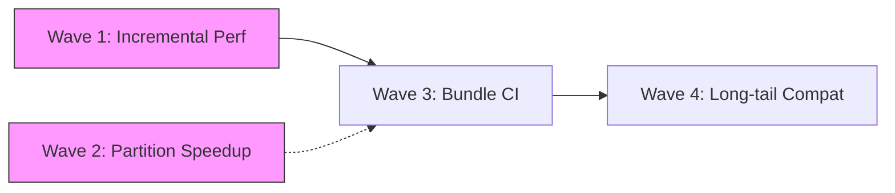

# Ferritex 完成計画レポート

## 1. 現状サマリー

### 実装済み領域

| 領域 | 実装レベル | 概要 |
|---|---|---|
| CLI / Runtime Options | 実用 | compile/watch/preview/lsp の 4 サブコマンド。`--jobs` / `--asset-bundle` / `--reproducible` / `--synctex` / `--trace-font-tasks` 等の共通 runtime option 正規化 |
| Parser / Macro | 中〜高 | `\def` / `\gdef` / `\edef`、`\expandafter`、`\noexpand`、`\csname`、`\newcommand`、`\newenvironment`、`\begingroup` / `\endgroup`、`\if` / `\ifx` / `\ifcat` / `\ifnum` / `\ifdim` / `\ifcase`、`\numexpr` / `\dimexpr`、32768 register family、recoverable parse diagnostics |
| File Input / Package Loading | 中 | `\input` / `\include` / `\InputIfFileExists`、current-file/project/overlay/bundle fallback、`.sty` 読み込み、`\RequirePackage` 再帰、class/package registry |
| Typesetting | 中〜高 | Knuth-Plass line breaking、hyphenation、hbox/vbox、page breaking、float queue、inline/display math、equation/align 系、TOC/LOF/LOT/index の multi-pass 解決。`TypesetterReusePlan` によるパーティション単位の rebuild/reuse 判定と `PaginationMergeCoordinator` によるフラグメント merge 済み |
| PDF / Graphics | 中 | PDF 1.4 出力、TrueType subset embedding + ToUnicode、hyperref link annotation / named destination / metadata、PNG/JPEG `\includegraphics` 埋め込み、outline-derived document partition planning、deterministic parallel page-render commit。math superscript/subscript の script positioning 修正済み（`contains_script_markers` で全 6 マーカーを検出） |
| Font | 中 | TFM / OpenType 読み込み、fontspec named-font resolution、project/overlay/bundle/host catalog fallback、asset index 経由の bundle font / TFM 解決、`--reproducible` で host fallback 無効化 |
| Incremental / Cache | 中 | `DependencyGraph` による依存グラフ構築・reverse-propagation・`affected_paths` 算出。persistent cache metadata（v4）による warm compile 再利用、cache metadata / cached PDF 破損時の full compile fallback。`CachedSourceSubtree` / `CachedTypesetFragment` によるサブツリー・フラグメント単位のキャッシュ再利用。`RecompilationScope` (FullDocument / LocalRegion) 判定。`TypesetterReusePlan` が変更パーティションのみ再 typeset し、未変更パーティションはキャッシュ済みフラグメントを再利用する部分再コンパイルパスが動作 |
| Bibliography | 中 | `.bbl` 読み込み、citation 解決、stale `.bbl` warning、reference list 組版 |
| Preview | 中〜高 | `PreviewSessionService` による session lifecycle 管理（create / invalidate / advance revision / check publish）。loopback transport で PDF publish / revision events / view state sync。session reuse・page fallback・active-job-only ポリシー |
| Watch | 中 | `PollingFileWatcher` による依存パス監視・`replace_paths` での再同期。`RecompileScheduler` による変更 coalesce と排他制御。`WorkspaceJobScheduler` によるワークスペース単位の直列化 |
| LSP | 中 | `LspCapabilityService` が diagnostics / completion / definition / hover / codeAction を提供。`LiveAnalysisSnapshot` が `StableCompileState` を基に最新の compile 結果を LSP に公開 |
| SyncTeX | 中 | `SyncTexData::build_line_based` による行ベース trace（column-precise fragment 分割・multi-file 対応）。`SyncTexData::build_from_placed_nodes` による `PlacedTextNode.sourceSpan` ベースのフラグメント精度 trace。forward / inverse search 両方向とも実装・テスト済み |
| Parallel Pipeline | 中 | `CommitBarrier` が 4 ステージ（MacroSession / DocumentReference / LayoutMerge / ArtifactCache）すべてをカバー。`AuthorityKey` 衝突検出と fallback。`DocumentPartitionPlanner` が document class と section outline から chapter / section 単位の stable `partitionId` を生成。partition-book / partition-article コーパスで `--jobs=1` と `--jobs=4` の出力等価性が確認済み |
| Asset Bundle Runtime | 中〜高 | `AssetBundleManifest` / `AssetBundleIndex` の読み込み・検証。`format_version` / `min_ferritex_version` のバージョン互換チェック。read-only mmap 読み込み。tex input / package / opentype font / default font / TFM font の 5 種の indexed lookup。path traversal 防止。project root 優先の package 解決 |
| Parity Evidence | 中〜高 | `bench_full_profile` テストから 5 カテゴリ（layout-core / navigation / bibliography / embedded-assets / tikz）の parity 計測が実行可能。全カテゴリ pass 確認済み。`math_equations` regression 修正済み（document_diff_rate: 0.286 → 0.000） |

### Parity Evidence 現状（REQ-NF-007）

`full_bench_parity_evidence` テストにより、以下の 5 カテゴリで parity を計測・確認済み。

| カテゴリ | 計測関数 | 判定基準 | 状態 |
|---|---|---|---|
| layout-core | `compute_parity_score` | document_diff_rate <= 0.05 | **pass** |
| navigation | `compute_navigation_parity_score` | annotations / destinations / outlines / metadata 一致 | **pass** |
| bibliography | `compute_bibliography_parity_score` | entry count / labels 一致 | **pass** |
| embedded-assets | `compute_embedded_assets_parity_score` | fonts / images / forms / pages 一致 | **pass** |
| tikz | `compute_tikz_parity_score` | match_ratio >= 0.80 | **pass** |

`math_equations` regression: `contains_footnote_markers` → `contains_script_markers` へのリネームにより全 6 マーカー（footnote + superscript + subscript）の検出を復元。document_diff_rate は 0.286 → 0.000 に改善。`math_equations_parity_regression` テストで regression baseline (0.286) 未満かつ threshold (0.10) 以内であることを assert。

### 主要な残ギャップ

| ID | 要件領域 | 深刻度 | 現状と残差分 |
|---|---|---|---|
| A | Incremental compilation (REQ-FUNC-027-030) | 中 | 依存グラフ・persistent cache・corruption fallback・reverse propagation・subtree cache 再利用・TypesetterReusePlan による部分再 typeset まで実装済み。**残差分**: 大規模文書での部分再コンパイルの性能適合度（`FTX-BENCH-001` 接続）と、ページ番号ずれを伴う変更での cross-reference 収束パスの end-to-end 検証 |
| B | Parallel pipeline (REQ-FUNC-031-033) | 低〜中 | CommitBarrier 4 ステージ・AuthorityKey 衝突検出・DocumentPartitionPlanner・PaginationMergeCoordinator・partition bench corpus まで実装済み。出力等価性（jobs=1 == jobs=4）確認済み、bounded no-regression evidence 確立済み。**残差分**: REQ-FUNC-032 の strict speedup 条件（`--jobs=4` median < `--jobs=1` median）は sub-1s compile の構造的限界により未達。multi-second compile corpus での speedup > 1.0 の実証が未着手 |
| C | tikz/pgf (REQ-FUNC-023) | 低 | graphics scene parsing 実装済み。tikz parity テストで match_ratio >= 0.80 を pass。**残差分**: long-tail な tikz パターンでの geometric parity 継続改善 |
| D | Asset bundle distribution (REQ-FUNC-046) | 低〜中 | bundle runtime（manifest / index / mmap / version check / 5 種 lookup）は完成。bundle-bootstrap / bundle-package テストで article / book / report / letter の compile が pass。**残差分**: 公式 `FTX-ASSET-BUNDLE-001` archive の配布契約・CI パイプラインへの接続 |
| E | Full LaTeX compatibility | 中 | long-tail package behavior、より厳密な layout parity は継続課題 |

## 2. 到達点の評価

Must 要件の大部分は動作しており、高難度領域（incremental / parallel / SyncTeX / asset bundle）もそれぞれ実装の核心部分を通過している。parity evidence 計測インフラ（layout-core / navigation / bibliography / embedded-assets / tikz の 5 カテゴリ）がテストに接続済みで、全カテゴリ pass が確認されている。`math_equations` regression も修正済み（0.286 → 0.000）。

残差分は「新機能の実装」ではなく「性能実証の拡充（incremental / parallel speedup）・配布インフラの整備（bundle archive CI）・long-tail 互換性の改善」に絞られている。

現在の到達点は「parity evidence が接続された working product」であり、REQ-NF-007 の主要な判定基準を満たすことが計測データで確認されている段階にある。

## 3. 残 Frontier と推奨 Wave

### 完了済み Wave

| Wave | 内容 | 状態 |
|---|---|---|
| Parity Evidence 接続 (REQ-NF-007) | `bench_full_profile` から 5 カテゴリ parity 計測をテスト実行可能にした | **完了** — layout-core / navigation / bibliography / embedded-assets / tikz 全 pass |
| math_equations Regression 修正 | `contains_script_markers` で全 6 マーカーを検出復元 | **完了** — document_diff_rate 0.286 → 0.000 |
| Partition Parallel Bounded Evidence | 出力等価性・overhead bounded の計測 | **完了** — evidence 確立済み（§5 参照） |

### Wave 1: Incremental Performance Evidence (REQ-FUNC-030)

| # | タスク | 受入基準 |
|---|---|---|
| 1 | 部分再コンパイルの end-to-end ベンチマーク | `FTX-BENCH-001` に warm incremental compile のケースを追加し、小変更時に full compile より高速であることを計測 |
| 2 | cross-reference 収束パスの検証 | ページ番号がずれる変更で、部分再コンパイル後に目次・相互参照が正しく更新されることをテストで確認 |

### Wave 2: Partition Parallel Speedup 実証 (REQ-FUNC-032)

| # | タスク | 受入基準 |
|---|---|---|
| 3 | multi-second compile corpus の追加 | `FTX-PARTITION-BENCH-001` に multi-second compile ケースを追加し、speedup > 1.0 を実証 |
| 4 | sub-1s compile の構造的限界を文書化 | partition overhead が sub-1s compile では支配的であることを計測データとともに ADR または docs に記録 |

### Wave 3: Bundle Distribution CI 接続 (REQ-FUNC-046)

| # | タスク | 受入基準 |
|---|---|---|
| 5 | `FTX-ASSET-BUNDLE-001` archive 作成と CI 接続 | 公式 bundle archive を CI で取得・展開し、bundle-bootstrap smoke テストが自動実行される |
| 6 | bundle-only corpus 実証 | host fallback を無効化（`--reproducible`）した状態で layout-core subset が compile できる |

### Wave 4: Long-tail 互換性改善

| # | タスク | 受入基準 |
|---|---|---|
| 7 | TikZ long-tail parity 改善 | `FTX-CORPUS-TIKZ-001` の拡張ケースで match_ratio を改善 |
| 8 | package compatibility 拡張 | long-tail package behavior の互換性向上 |

## 4. 実行戦略

- **Wave 1 を優先する**。incremental compile の性能実証は watch / LSP / benchmark すべてに波及する基盤であるため
- **Wave 2 は Wave 1 と並行可能**。multi-second corpus の追加と構造的限界の文書化は独立して進められる
- **Wave 3 は Wave 1 完了後に着手**。bundle-only corpus の parity 判定に既存の計測基盤を再利用するため
- **Wave 4 は単体で進められる**が、incremental / parallel の境界が固まってから入る方が安全

## 5. 妥当性判定

- **結果**: 性能実証・配布整備フェーズ
- **判断**: 実装の核心部分と parity evidence 接続が完了。REQ-NF-007 の 5 カテゴリ parity は全 pass。残りは incremental / parallel の性能実証、bundle 配布 CI 接続、long-tail 互換性改善に限定される
- **直近の推奨**: incremental compile の性能実証（Wave 1）を先に完了させ、watch / LSP / benchmark への波及効果を確認する

### Partition Parallel Benchmark 実績 (REQ-FUNC-031/032)

- **Status**: Bounded no-regression evidence established
- **確認済み**: partition-book / partition-article コーパス全ケースで出力等価性（jobs=1 == jobs=4）が成立。per-case parallel overhead は 10% 以内（speedup >= 0.90）、per-subset mean speedup >= 0.95
- **未達**: strict docs 要件（`--jobs=4` median が `--jobs=1` より高速 = speedup > 1.0）。sub-1s compile では parallel overhead（partition document construction / thread sync / fragment merge）が typesetting savings と拮抗するため
- **適用済み最適化**: balanced coalescing / worker-thread document construction / fragment move semantics / inline group execution / merge_owned
- **Corpus**: 600 iterations per chapter/section（初期の 100 から増加）
