# Ferritex 完成計画レポート

## 1. 現状サマリー

### 実装済み領域

| 領域 | 実装レベル | 概要 |
|---|---|---|
| CLI / Runtime Options | 実用 | compile/watch/preview/lsp の 4 サブコマンド。`--jobs` / `--asset-bundle` / `--reproducible` / `--synctex` / `--trace-font-tasks` 等の共通 runtime option 正規化 |
| Parser / Macro | 中〜高 | `\def` / `\gdef` / `\edef`、`\expandafter`、`\noexpand`、`\csname`、`\newcommand`、`\newenvironment`、`\begingroup` / `\endgroup`、`\if` / `\ifx` / `\ifcat` / `\ifnum` / `\ifdim` / `\ifcase`、`\numexpr` / `\dimexpr`、32768 register family、recoverable parse diagnostics |
| File Input / Package Loading | 中〜高 | `\input` / `\include` / `\InputIfFileExists`、current-file/project/overlay/bundle fallback、`.sty` 読み込み、`\NeedsTeXFormat`、`\ProvidesPackage`、`\makeatletter` / `\makeatother`、`\@namedef`、`\@ifundefined`、`\newif`、`\DeclareOption` / `\DeclareOption*` / `\ProcessOptions*`、`\RequirePackage` 再帰、`\@ifpackageloaded`、duplicate-load guard、class/package registry |
| Typesetting | 中〜高 | Knuth-Plass line breaking、hyphenation、hbox/vbox、page breaking、float queue、inline/display math、equation/align 系、TOC/LOF/LOT/index の multi-pass 解決。`TypesetterReusePlan` によるパーティション単位の rebuild/reuse 判定と `PaginationMergeCoordinator` によるフラグメント merge 済み |
| PDF / Graphics | 中 | PDF 1.4 出力、TrueType subset embedding + ToUnicode、hyperref link annotation / named destination / metadata、PNG/JPEG `\includegraphics` 埋め込み、outline-derived document partition planning、deterministic parallel page-render commit。math superscript/subscript の script positioning 修正済み（`contains_script_markers` で全 6 マーカーを検出）。TikZ: xcolor 標準 19 色、cm/pt/mm/in/ex/em 6 単位、circle/ellipse/arc path（位置引数 / key-value 構文対応）、`\draw`/`\fill`/`\filldraw`/`\path` command、7 種 line width preset、8 種 dash pattern、line cap（butt/round/rect）/ line join（miter/round/bevel）、stroke/fill opacity（ExtGState ベース） |
| Font | 中 | TFM / OpenType 読み込み、fontspec named-font resolution、project/overlay/bundle/host catalog fallback、asset index 経由の bundle font / TFM 解決、`--reproducible` で host fallback 無効化 |
| Incremental / Cache | 中 | `DependencyGraph` による依存グラフ構築・reverse-propagation・`affected_paths` 算出。persistent cache metadata による warm compile 再利用、cache metadata / cached PDF 破損時の full compile fallback。`CachedSourceSubtree` / `CachedTypesetFragment` によるサブツリー・フラグメント単位のキャッシュ再利用。`RecompilationScope` (FullDocument / LocalRegion / BlockLevel) 判定。`TypesetterReusePlan` が変更パーティションのみ再 typeset し、未変更パーティションはキャッシュ済みフラグメントを再利用する部分再コンパイルパスに加え、block checkpoint による変更 block 以降の suffix rebuild パスが動作。**Step 0 計装完了**: `StageTiming` により cache_load / source_tree_load / parse / typeset / pdf_render / cache_store の 6 stage を個別計測可能（parse と typeset は分離計測）。**Step 1 完了**: watcher/scheduler の `changed_paths` hint を `CompileJobService` 経由で `CompileCache::lookup(changed_paths_hint)` へ伝播し、`CompileCache` を v5 split cache 形式（`{cache_key}/index.json` + `partitions/*.json`）へ移行。v4 fallback 互換、partition 個別破損の graceful degrade、directory-based eviction を実装済み。**Step 2 完了**: partition 内 block 粒度 checkpoint と suffix rebuild パスを導入。変更 block 以降のみを再 typeset する。横断参照収束パスでは block reuse を無効化。fallback 条件を網羅的に実装。**Step 3 完了**: `PageRenderPayload.stream_hash` / `CachedPagePayload` / cache v7 を導入し、`Cached` / `BlockReuse` partition の pre-rendered payload を deterministic full rewrite に再注入する。fallback partition 文書と XObject-backed page は safety-first で reuse を無効化 |
| Bibliography | 中 | `.bbl` 読み込み、citation 解決、stale `.bbl` warning、reference list 組版 |
| Preview | 中〜高 | `PreviewSessionService` による session lifecycle 管理（create / invalidate / advance revision / check publish）。loopback transport で PDF publish / revision events / view state sync。session reuse・page fallback・active-job-only ポリシー |
| Watch | 中 | `FileWatcher` trait による監視 backend 抽象化、`PollingFileWatcher` による依存パス監視・`replace_paths` での再同期。path canonicalize 内包と debounce を実装済みで、`RecompileScheduler` による変更 coalesce / 排他制御、および inotify/kqueue backend 追加の受け皿が整っている。`WorkspaceJobScheduler` によるワークスペース単位の直列化 |
| LSP | 中 | `LspCapabilityService` が diagnostics / completion / definition / hover / codeAction を提供。`LiveAnalysisSnapshot` が `StableCompileState` を基に最新の compile 結果を LSP に公開 |
| SyncTeX | 中 | `SyncTexData::build_line_based` による行ベース trace（column-precise fragment 分割・multi-file 対応）。`SyncTexData::build_from_placed_nodes` による `PlacedTextNode.sourceSpan` ベースのフラグメント精度 trace。forward / inverse search 両方向とも実装・テスト済み |
| Parallel Pipeline | 中 | `CommitBarrier` が 4 ステージ（MacroSession / DocumentReference / LayoutMerge / ArtifactCache）すべてをカバー。`AuthorityKey` 衝突検出と fallback。`DocumentPartitionPlanner` が document class と section outline から chapter / section 単位の stable `partitionId` を生成。partition-book / partition-article コーパスで `--jobs=1` と `--jobs=4` の出力等価性が確認済み |
| Asset Bundle Runtime | 中〜高 | `AssetBundleManifest` / `AssetBundleIndex` の読み込み・検証。`format_version` / `min_ferritex_version` のバージョン互換チェック。read-only mmap 読み込み。tex input / package / opentype font / default font / TFM font の 5 種の indexed lookup。path traversal 防止。project root 優先の package 解決。Wave 3 で deterministic `FTX-ASSET-BUNDLE-001.tar.gz` 生成スクリプトと archive-based CI smoke proof を接続済み |
| Parity Evidence | 中〜高 | `bench_full_profile` テストから 5 カテゴリ（layout-core / navigation / bibliography / embedded-assets / tikz）の parity 計測が実行可能。全カテゴリ pass 確認済み。`math_equations` regression 修正済み（document_diff_rate: 0.286 → 0.000） |

### Parity Evidence 現状（REQ-NF-007）

`full_bench_parity_evidence` テストにより、以下の 5 カテゴリで parity を計測・確認済み。

| カテゴリ | 計測関数 | 判定基準 | 状態 |
|---|---|---|---|
| layout-core | `compute_parity_score` | document_diff_rate <= 0.05 | **pass** |
| navigation | `compute_navigation_parity_score` | annotations / destinations / outlines / metadata 一致 | **pass** |
| bibliography | `compute_bibliography_parity_score` | entry count / labels 一致 | **pass** |
| embedded-assets | `compute_embedded_assets_parity_score` | fonts / images / forms / pages 一致 | **pass** |
| tikz | `compute_tikz_parity_score` | match_ratio >= 0.80 | **pass** |

`math_equations` regression: `contains_footnote_markers` → `contains_script_markers` へのリネームにより全 6 マーカー（footnote + superscript + subscript）の検出を復元。document_diff_rate は 0.286 → 0.000 に改善。`math_equations_parity_regression` テストで regression baseline (0.286) 未満かつ threshold (0.10) 以内であることを assert。

### 主要な残ギャップ

| ID | 要件領域 | 深刻度 | 現状と残差分 |
|---|---|---|---|
| A | Incremental compilation (REQ-FUNC-027-030) | 低 | 依存グラフ・persistent cache・corruption fallback・reverse propagation・subtree cache 再利用・TypesetterReusePlan による部分再 typeset まで実装済み。**Wave 1 完了**: `full_bench_warm_incremental_evidence` で 1.84× speedup を point-in-time 計測（full --no-cache 28.614s vs incremental 15.550s、`FTX-BENCH-001` 1000-section staged input）。`incremental_xref_convergence_after_page_shift` でページ番号ずれ後の TOC/相互参照収束を byte-identical で確認。**Wave 1 残差分なし**。`REQ-NF-002` Step 0（stage timing 計装）完了: `StageTiming` で 6 stage を個別計測可能。**Step 1 完了**: watcher/scheduler から `changed_paths` fast path を `CompileJobService` / `CompileCache` まで接続し、`CompileCache` を v5 split cache 形式（`{cache_key}/index.json` + `partitions/*.json`）へ移行。v4 fallback 互換、partition 個別破損の graceful degrade、directory-based eviction、および `FileWatcher` trait + `PollingFileWatcher` canonicalize/debounce による watcher backend 抽象化まで完了。**Step 2 完了**: partition 内 block 粒度 checkpoint と suffix rebuild を導入し、変更 block 以降のみ再 typeset する。横断参照収束パスでは block reuse を無効化。**Step 3 完了**: per-page payload reuse を実装し、cache v7・pre-rendered payload 注入・XObject guard を追加。WU-5 再 profiling では `cached=999`, `suffix_rebuild=1`, `full_rebuild=0` を確認し、suffix rebuild 改善は完了。manual benchmark（5-run median 66,782ms、runs: 65.487s / 67.097s / 66.669s / 66.782s / 67.418s）により `REQ-NF-002` 100ms は大幅未達と確定した。残差分は benchmark path での stage 別律速分析と、その結果に基づく Step 4（incremental parse）または別 stage 最適化 |
| B | Parallel pipeline (REQ-FUNC-031-033) | 低 | CommitBarrier 4 ステージ・AuthorityKey 衝突検出・DocumentPartitionPlanner・PaginationMergeCoordinator・partition bench corpus まで実装済み。full-compile determinism 修正では HashMap→BTreeMap、named_destinations first-wins、page-lines y-sort normalization に加え、section-level パーティション向けの pipelined VList build + sequential pagination を適用して、article の連続フローを崩さずに strict proof 条件を維持する。**Wave 2 完了**: `partition_bench_multisecond_speedup_evidence` で book/article 両 heavy corpus について output identity = true かつ speedup > 1.0 を検証済み。残差分なし |
| C | Long-tail compatibility (Wave 4) | 中 | **Wave 4 bounded TikZ 改善 + package compatibility MVP 完了**: xcolor 標準 19 色（+14）、mm/in/ex/em 単位（+4、計 6）、ellipse path、`\path` command、dash patterns 8 種、line cap/join、opacity（ExtGState）、key-value arc 構文に加え、`\NeedsTeXFormat`、`\ProvidesPackage`、`\makeatletter` / `\makeatother`、`\@namedef`、`\@ifundefined`、`\newif`、`\DeclareOption`、`\DeclareOption*`、`\ProcessOptions*`、`\RequirePackage`、`\@ifpackageloaded`、duplicate-load guard、および compat primitives（`\unless`、`\pdfmdfivesum`、`\pdfescapestring`、`\pdfescapehex`、`\pdfpagewidth`、`\pdfcreationdate`）を実装。parity / compile test pass。long-tail の残 frontier は解消。**multicol MVP 完了**: `\begin{multicols}{N}` / `\end{multicols}` 環境パース、`\columnbreak` 指令、N カラムレイアウト組版（カラム幅自動計算、明示的/自動カラム分割）を実装 |

## 2. 到達点の評価

Must 要件の大部分は動作しており、高難度領域（incremental / parallel / SyncTeX / asset bundle）もそれぞれ実装の核心部分を通過している。parity evidence 計測インフラ（layout-core / navigation / bibliography / embedded-assets / tikz の 5 カテゴリ）がテストに接続済みで、全カテゴリ pass が確認されている。`math_equations` regression も修正済み（0.286 → 0.000）。Wave 3 では deterministic bundle archive 生成、artifact upload/download、archive-based smoke proof が CI に接続され、`REQ-FUNC-046` の配布面の残差分は解消された。

Wave 1（Incremental Performance Evidence）が完了し、warm incremental compile の機構が動作することを point-in-time 計測で確認した（1.84× speedup、`FTX-BENCH-001` 1000-section staged input）。Cross-reference 収束の byte-identical 検証も確立された。Wave 2（Partition Parallel Speedup Evidence）が完了し、book/article 両 heavy corpus で output identity = true かつ speedup > 1.0 の strict proof が確立された。Wave 3 も完了し、`FTX-ASSET-BUNDLE-001` の deterministic archive 生成と CI 上の archive-based smoke proof が定着した。`REQ-NF-002` は Step 0（stage timing 計装）に続き、**Step 1: Fixed-cost 削減**、**Step 2: Block checkpoint reuse**、**Step 3: Per-page payload reuse** が完了した。watcher/scheduler の `changed_paths` fast path 伝播、v5 split cache（`{cache_key}/index.json` + `partitions/*.json`）、`FileWatcher` trait 導入と `PollingFileWatcher` の canonicalize / debounce 改善、partition 内 block 粒度 checkpoint と変更 block 以降の suffix rebuild パスに加え、cache v7 の page payload 永続化と pre-rendered payload 注入経路が入り、supported path では unchanged partition の PDF render をスキップできる。WU-5 再 profiling では、1000-section staged input の 1 段落変更が `cached=999`, `suffix_rebuild=1`, `full_rebuild=0` で処理され、従来の `SuffixValidationFailed` fallback は再現しなかった。Wave 4 では bounded TikZ 改善に加えて package compatibility MVP も完了し、`\NeedsTeXFormat`、`\ProvidesPackage`、`\makeatletter` / `\makeatother`、`\@namedef`、`\@ifundefined`、`\newif`、`\DeclareOption`、`\DeclareOption*`、`\ProcessOptions*`、`\RequirePackage`、`\@ifpackageloaded`、duplicate-load guard、および compat primitives（`\unless`、`\pdfmdfivesum`、`\pdfescapestring`、`\pdfescapehex`、`\pdfpagewidth`、`\pdfcreationdate`）まで閉じられた。multicol MVP も完了し、Wave 4 の long-tail 残差分は解消された。ただし Wave 1 は incremental mechanism の初期実証であり、`REQ-NF-002`（差分コンパイル中央値 100ms 未満）の達成を意味するものではない。manual benchmark（5-run median 66,782ms）により `REQ-NF-002` 100ms は大幅未達と確定した。残差分は「benchmark path での支配 stage 特定」と「その結果に基づく Step 4（incremental parse）または別 stage 最適化」に整理される。

現在の到達点は「incremental compile 機構の初期実証、parallel pipeline の strict proof 確立、bundle archive 配布 CI 接続、parity 計測基盤が揃った working product」であり、REQ-NF-007 の parity 5 カテゴリ全 pass、REQ-FUNC-030 の収束要件、REQ-FUNC-032 の strict proof、REQ-FUNC-046 の bundle archive smoke proof が確認されている段階にある。加えて、`REQ-NF-002` は Step 0（stage timing 計装）、Step 1（watcher/scheduler から cache lookup までの `changed_paths` fast path 伝播、v5 split cache、watcher backend 抽象化）、Step 2（partition 内 block 粒度 checkpoint と suffix rebuild）、Step 3（cache v7 の per-page payload reuse）の 4 段階が完了した。Step 3 は `Cached` / `BlockReuse` partition の pre-rendered payload を deterministic full rewrite に再注入し、fallback partition 文書と XObject-backed page では safety-first で reuse を無効化する。WU-5 再 profiling では、staged `FTX-BENCH-001` が `cached=999 partition`, `suffix_rebuild=1 partition`, `full_rebuild=0 partition` で処理され、変更対象 partition は `reuse=SuffixRebuild, suffix=2/4, fallback=None` を記録した。Wave 4 では bounded TikZ long-tail 改善、package compatibility MVP、multicol MVP が全て完了し、long-tail frontier は解消された（multicol の既知制限: region のページ跨ぎ未対応）。manual benchmark（5-run median 66,782ms）により `REQ-NF-002` は大幅未達と確定した。残る Frontier は benchmark path での支配 stage 特定と、その結果に基づく Step 4 または別 stage 最適化である。

## 3. 残 Frontier と推奨 Wave

### 完了済み Wave

| Wave | 内容 | 状態 |
|---|---|---|
| Parity Evidence 接続 (REQ-NF-007) | `bench_full_profile` から 5 カテゴリ parity 計測をテスト実行可能にした | **完了** — layout-core / navigation / bibliography / embedded-assets / tikz 全 pass |
| math_equations Regression 修正 | `contains_script_markers` で全 6 マーカーを検出復元 | **完了** — document_diff_rate 0.286 → 0.000 |
| Partition Parallel Bounded Evidence | 出力等価性・overhead bounded の計測 | **完了** — evidence 確立済み（§5 参照） |
| Wave 1: Incremental Performance Evidence (REQ-FUNC-030) | warm incremental benchmark + cross-reference 収束検証 | **完了** — 1.84× speedup を point-in-time 計測（`FTX-BENCH-001` 固定構成）、xref convergence byte-identical 確認済み（§5 参照）。`REQ-NF-002` 達成とは別 |
| Wave 2: Partition Parallel Speedup Evidence (REQ-FUNC-032) | multi-second partition benchmark の strict proof | **完了** — `partition_bench_multisecond_speedup_evidence` で book/article 両 heavy corpus について output identity = true かつ speedup > 1.0 を検証済み |
| Wave 3: Bundle Distribution CI 接続 (REQ-FUNC-046) | deterministic archive 生成 + artifact upload/download + archive-based smoke proof | **完了** — `scripts/build_bundle_archive.sh` が `FTX-ASSET-BUNDLE-001.tar.gz` を再現可能に生成し、`bundle-ci.yml` が download した archive を `bundle_archive_smoke_proof` に渡して layout-core 4 クラスの `--reproducible` compile を検証 |
| REQ-NF-002 Step 0: Pipeline 計装 | `CompileJobService` に 6 stage の timing 計装を追加 | **完了** — `StageTiming` で cache_load / source_tree_load / parse / typeset / pdf_render / cache_store を個別計測。parse/typeset 分離計測。unit test 3 件 + CLI smoke 1 件 pass |
| REQ-NF-002 Step 1 Slice 1: changed_paths fast path | watcher/scheduler から `CompileCache` まで change hint を伝播 | **完了** — `CompileCache::lookup(changed_paths_hint)` / `CompileJobService::compile_with_changed_paths()` / watch runner plumbing を接続。unit test 3 件追加（`fast_path_detects_change_for_hinted_path`, `fast_path_with_empty_hint_falls_back_to_full_scan`, `fast_path_ignores_hint_paths_not_in_dependency_graph`） |
| REQ-NF-002 Step 1: Fixed-cost 削減 | changed_paths fast path・v5 split cache・watcher abstraction upgrade | **完了** — `CompileCache` を v5 split cache 形式（`{cache_key}/index.json` + `partitions/*.json`）へ移行し、v4 fallback 互換、partition 個別破損の graceful degrade、directory-based eviction を実装。`FileWatcher` trait と `PollingFileWatcher` の canonicalize / debounce により inotify/kqueue backend 追加準備も完了 |
| REQ-NF-002 Step 2: Block checkpoint reuse | partition 内 block 粒度 checkpoint による suffix rebuild | **完了** — RecompilationScope::BlockLevel、BlockCheckpointData、suffix rebuild パス、fallback 条件、e2e parity test 実装済み。設計文書: [design-step2-block-checkpoint-reuse.md](design-step2-block-checkpoint-reuse.md) |
| REQ-NF-002 Step 3: Per-page payload reuse | cached page payload を deterministic full rewrite に再注入 | **完了** — `PageRenderPayload.stream_hash`、`CachedPagePayload`、cache v7、pre-rendered payload 注入経路、Guard 1 + Guard 2 を実装。partitioned report fixture で `reused_pages=39` / `rendered_pages=1` と full compile byte-identical を確認 |
| Wave 4: TikZ + package compatibility + multicol MVP | long-tail 互換性の拡張 | **完了** — TikZ 側は xcolor 標準 19 色（+14）、mm/in/ex/em 単位（+4、計 6）、ellipse path、`\path` command、dash patterns 8 種、line cap/join、opacity（ExtGState）、key-value arc 構文、`\foreach` ループ（simple list / numeric range / step inference / nested）を追加。package 側は `\NeedsTeXFormat`、`\ProvidesPackage`、`\makeatletter` / `\makeatother`、`\@namedef`、`\@ifundefined`、`\newif`、`\DeclareOption` / `\DeclareOption*` / `\ProcessOptions*`、`\RequirePackage`、`\@ifpackageloaded`、duplicate-load guard、compat primitives を実装。multicol MVP: `\begin{multicols}{N}` / `\end{multicols}` 環境パース、`\columnbreak` 指令、N カラムレイアウト組版（カラム幅自動計算、10pt columnsep、明示的/自動バランス分割）。残 frontier なし |

### Wave 1: Incremental Performance Evidence (REQ-FUNC-030) — 完了

| # | タスク | 結果 |
|---|---|---|
| 1 | 部分再コンパイルの end-to-end ベンチマーク | `full_bench_warm_incremental_evidence` で 1000 `\section` 入力に対し warm incremental compile 15.550s vs full `--no-cache` 28.614s（1.84× speedup）を実測。`bench_full_profile.rs` に組み込み済み |
| 2 | cross-reference 収束パスの検証 | `incremental_xref_convergence_after_page_shift` で 3 章 report（TOC + `\ref` + `\pageref`）に `\newpage` 挿入後の incremental compile PDF が fresh full compile と byte-identical であることを確認。`e2e_compile.rs` に組み込み済み |

### Wave 2: Partition Parallel Speedup Evidence (REQ-FUNC-032) — 完了

| # | タスク | 結果 |
|---|---|---|
| 3 | full-compile determinism 修正 | HashMap→BTreeMap、named_destinations first-wins、page-lines y-sort normalization、section-level pipelined VList build + sequential pagination を適用。book/article 共通の strict proof 条件を維持 |
| 4 | multi-second strict proof 検証 | `partition_bench_multisecond_speedup_evidence` で `heavy_chapters_independent.tex` / `heavy_sections_independent.tex` を対象に `--no-cache` + `--reproducible`、1 warmup + 5 measured runs で `--jobs=1` vs `--jobs=4` を比較。両 corpus で output identity = true かつ speedup > 1.0 を確認 |

### Wave 3: Bundle Distribution CI 接続 (REQ-FUNC-046) — 完了

| # | タスク | 結果 |
|---|---|---|
| 5 | `FTX-ASSET-BUNDLE-001` archive 作成と CI 接続 | `scripts/build_bundle_archive.sh` を追加し、`manifest.json` / `asset-index.json` / `texmf/` のみを含む deterministic archive を生成。`bundle-ci.yml` が build artifact を upload/download し、smoke test に渡す |
| 6 | bundle-only corpus 実証 | `bundle_archive_smoke_proof` が downloaded archive を tempdir に展開し、展開済み bundle root を `--asset-bundle` + `--reproducible` で使って layout-core 4 クラスを compile。全件 non-empty PDF を確認 |

### REQ-NF-002 Step 0: Pipeline 計装 — 完了

| # | タスク | 結果 |
|---|---|---|
| - | `CompileJobService` に stage timing 計装を追加 | `StageTiming` 構造体で 6 stage（cache_load / source_tree_load / parse / typeset / pdf_render / cache_store）を個別計測可能にした。parse と typeset は typeset callback 内の累積計測により分離。unit test 3 件 + CLI smoke 1 件 pass |

- **成果**: 以降の最適化（Step 1〜3）の優先順位を stage 別コスト分布に基づいて定量的に判断できる状態になった
- **計測出力**: `tracing::info` ログにマイクロ秒単位で出力。`CompileResult.stage_timing` からプログラマティックにアクセス可能
- **既知の制約**: 初回 typeset callback で font selection 時間が `typeset` に含まれる（Step 0 として許容。Step 1 以降で分離が望ましい）
- **設計文書**: [design-incremental-100ms-optimization.md](design-incremental-100ms-optimization.md)

### REQ-NF-002 Step 1: Fixed-cost 削減 — 完了

| # | タスク | 結果 |
|---|---|---|
| 1 | watcher/scheduler の `changed_paths` を cache lookup まで伝播 | `CompileCache::lookup(changed_paths_hint)`、`CompileJobService::compile_with_changed_paths()`、watch runner plumbing を接続し、scheduler が既に知っている変更ファイルを `CompileCache::detect_changes()` に渡す fast path を導入 |
| 2 | compile cache を split 形式へ移行 | `CompileCache` を v5 split cache 形式（`{cache_key}/index.json` + `partitions/*.json`）へ移行し、v4 fallback 互換、partition 個別破損の graceful degrade、directory-based eviction を実装 |
| 3 | watcher backend を trait 抽象化 | `FileWatcher` trait を導入し、`PollingFileWatcher` に path canonicalize 内包と debounce を実装。inotify/kqueue backend が同じ trait を実装できる構造へ整理 |

- **完了内容**: `changed_paths` fast path を watcher/scheduler から `CompileJobService` を経由して `CompileCache` まで伝播し、`CompileCache` の v5 split cache 化と watcher backend 抽象化まで完了
- **テスト**: `fast_path_detects_change_for_hinted_path`、`fast_path_with_empty_hint_falls_back_to_full_scan`、`fast_path_ignores_hint_paths_not_in_dependency_graph`、`lookup_reads_legacy_v4_cache_record_as_fallback`、`corrupted_partition_blob_only_drops_that_partition`、`evicts_oldest_owned_cache_records_and_keeps_newer_entries`、`eviction_continues_after_individual_delete_failure`、`suppresses_repeated_changes_within_debounce_window`、`supports_trait_objects_for_polling`、`normalizes_symlink_paths_to_canonical_targets`
- **Step 1 の残差分**: なし
- **後続 Frontier**: Step 3 は完了済み。manual benchmark（5-run median 66,782ms）により 100ms 未達が確定した。残るのは benchmark path での支配 stage 特定と、その結果に基づく Step 4（incremental parse）または別 stage 最適化
- **設計文書**: [design-incremental-100ms-optimization.md](design-incremental-100ms-optimization.md)

### REQ-NF-002 Step 2: Block checkpoint reuse — 完了

| # | タスク | 結果 |
|---|---|---|
| 1 | `RecompilationScope::BlockLevel` 拡張 | `FullDocument \| LocalRegion` の 2 値 enum を `BlockLevel { affected_partitions, references_affected, pagination_affected }` で拡張。`Copy` を削除し `Clone` に統一 |
| 2 | Block checkpoint データ構造 | `BlockCheckpoint`, `BlockLayoutState`, `PendingFloat`, `BlockCheckpointData` を `compile_cache.rs` に追加。`CachedTypesetFragment` に `block_checkpoints: Option<BlockCheckpointData>` を `#[serde(default)]` 付きで追加（Step 1 cache 後方互換維持） |
| 3 | Checkpoint 生成パス | `document_nodes_to_vlist_with_state()` に `checkpoint_collector` パラメータを追加。ParBreak / Heading / Float / DisplayMath / EquationEnv / IncludeGraphics の block 境界で `RawBlockCheckpoint` を収集 |
| 4 | Suffix rebuild パス | `find_affected_block_index()` で変更 block を特定、`suffix_rebuild()` で prefix pages を cache から切り出し suffix のみ rebuild。`paginate_vlist_continuing_with_state()` で初期 float queue を外部注入 |
| 5 | Fallback 条件 | preamble 変更 / pageref / typeset_callback_count > 1 / checkpoint なし / block 構造変化 / float・footnote 不整合 で partition または full document fallback。`affected_block_index == 0` は suffix rebuild 経路で処理し、ページ数変化も許容 |
| 6 | テスト | `block_checkpoint_single_paragraph_edit_parity`, `block_checkpoint_heading_addition_fallback`, suffix rebuild with footnotes/floats, find_affected_block unit tests 等 20+ 件追加 |

- **完了内容**: partition 内 block 粒度の checkpoint 生成と、変更 block 以降の suffix rebuild パスを導入。横断参照収束パスでは block reuse を無効化するガードを実装
- **Step 2 の残差分**: なし
- **後続 Frontier**: Step 3 は完了済み。manual benchmark（5-run median 66,782ms）により 100ms 未達が確定した。残るのは benchmark path での支配 stage 特定と、その結果に基づく Step 4（incremental parse）または別 stage 最適化
- **設計文書**: [design-step2-block-checkpoint-reuse.md](design-step2-block-checkpoint-reuse.md)、[design-incremental-100ms-optimization.md](design-incremental-100ms-optimization.md)

### REQ-NF-002 Step 3: Per-page payload reuse — 完了

| # | タスク | 結果 |
|---|---|---|
| 1 | page payload hash + cache v7 | `PageRenderPayload.stream_hash`、`CachedPagePayload`、`CompileCache.cached_page_payloads` を追加し、split cache の version を 6 → 7 に更新 |
| 2 | pre-rendered payload 注入 | `reusable_page_payloads_for_render()` が `PartitionTypesetDetail` の `Cached` / `BlockReuse` partition だけを選び、cached payload を `PdfRenderer::render_with_partition_plan()` に渡す |
| 3 | Guard 1 + Guard 2 | Guard 1: `compile_job_service.rs` が fallback partition 文書、先頭 multi-page partition、reindexed XObject page を reuse 対象から除外。Guard 2: `pdf/api.rs` が XObject resource を持つページと invalid hash payload を必ず再 render |
| 4 | テスト | core 3 件 + application 3 件 + 回帰 2 件 pass。`per_page_payload_reuse_matches_full_and_reduces_pdf_render_stage` で `reused_pages=39` / `rendered_pages=1`、`incremental_recompile_with_toc_matches_full` で TOC 文書の回帰を確認 |

- **完了内容**: supported path では unchanged partition の page payload を再利用し、PDF 自体は毎回 deterministic に full rewrite する実装が入った
- **制限 / 未完境界**: reuse 対象は `Cached` / `BlockReuse` partition のページに限定され、`SuffixRebuild` / `FullRebuild` partition は全ページ再 render する。fallback partition 文書と XObject-backed page は safety-first で対象外。manual benchmark（5-run median 66,782ms）により `REQ-NF-002` 100ms は大幅未達と確定。次は支配 stage の特定が必要
- **設計文書**: [design-incremental-100ms-optimization.md](design-incremental-100ms-optimization.md)

### Wave 4: TikZ + package compatibility + multicol MVP — 完了

| # | タスク | 状態 | 結果 |
|---|---|---|---|
| 7 | TikZ long-tail parity 改善 | **完了** | xcolor 標準 19 色（+14）、mm/in/ex/em 単位（+4、計 6）、ellipse path（Bézier 近似）、`\path` command、dash patterns 8 種、line cap/join、opacity（ExtGState）、key-value arc 構文、`\foreach` ループ（simple list / numeric range / step inference / nested）を追加。TikZ 関連テスト 42+ 件 pass |
| 8 | package compatibility MVP | **完了** | `\NeedsTeXFormat`、`\ProvidesPackage`、`\makeatletter` / `\makeatother`、`\@namedef`、`\@ifundefined`、`\newif`、`\DeclareOption`、`\DeclareOption*`、`\ProcessOptions*`、`\RequirePackage`、`\@ifpackageloaded`、duplicate-load guard、compat primitives（`\unless`、`\pdfmdfivesum`、`\pdfescapestring`、`\pdfescapehex`、`\pdfpagewidth`、`\pdfcreationdate`）を実装。bundle package/compat fixture compile test 追加済み |

- **閉じた gap**: named colors（5→19、xcolor 標準準拠）、length units（2→6、mm/in/ex/em 追加）、ellipse path operation、`\path` command routing、dash patterns 8 種、line cap/join、opacity（stroke/fill、ExtGState）、key-value arc 構文、`\foreach` ループ（simple list / numeric range with `...` / step inference / nested / depth limit）、package loading/interpreter surface（`\NeedsTeXFormat`、`\ProvidesPackage`、`\makeatletter` / `\makeatother`、`\@namedef`、`\@ifundefined`、`\newif`、`\DeclareOption` / `\DeclareOption*` / `\ProcessOptions*`、`\RequirePackage`、`\@ifpackageloaded`、duplicate-load guard）、compat primitives（`\unless`、`\pdfmdfivesum`、`\pdfescapestring`、`\pdfescapehex`、`\pdfpagewidth`、`\pdfcreationdate`）、multicol MVP（`\begin{multicols}{N}` / `\end{multicols}` / `\columnbreak`、N カラムレイアウト、`VListItem::MulticolRegion` による side-by-side 配置）
- **multicol 既知制限**: region のページ跨ぎ未対応（`MulticolRegion` は単一 `VListItem` として pagination されるため、内容がページ高を超えても分割されない）

## 4. 実行戦略

- **Wave 1 完了**。incremental compile 機構の初期実証（point-in-time 計測で 1.84× speedup）と cross-reference 収束検証が確立された
- **Wave 2 完了**。pipelined VList build + sequential pagination を section-level path に適用し、book/article 両 heavy corpus で output identity と speedup > 1.0 の strict proof を確立
- **Wave 3 完了**。bundle archive 生成、artifact upload/download、archive-based smoke proof まで CI に接続された
- **REQ-NF-002 Step 0 完了**。`StageTiming` により 6 stage の個別計測が可能になり、Step 1 以降の最適化優先順位を定量的に判断できる状態になった
- **REQ-NF-002 Step 1 完了**。watcher/scheduler 由来の canonical `changed_paths` を `CompileJobService` / `CompileCache` へ伝播し、`CompileCache` の v5 split cache 化、`FileWatcher` trait 導入、`PollingFileWatcher` の canonicalize / debounce まで実装した
- **REQ-NF-002 Step 2: Block checkpoint reuse 完了**。`RecompilationScope::BlockLevel`、`BlockCheckpointData`、checkpoint 生成、suffix rebuild、fallback 条件、e2e parity test まで実装し、変更 block 以降のみ再 typeset できるようになった
- **REQ-NF-002 Step 3: Per-page payload reuse 完了**。`PageRenderPayload.stream_hash`、`CachedPagePayload`、cache v7、pre-rendered payload 注入、Guard 1 + Guard 2 を実装し、supported path では unchanged partition の page payload を full rewrite に再利用できるようになった
- **Wave 4: TikZ + package compatibility + multicol MVP 完了**。xcolor 標準 19 色、mm/in/ex/em 6 単位、ellipse path、`\path` command、dash patterns 8 種、line cap/join、opacity、key-value arcに加え、package surface（`\NeedsTeXFormat`、`\ProvidesPackage`、`\makeatletter` / `\makeatother`、`\@namedef`、`\@ifundefined`、`\newif`、`\DeclareOption` / `\DeclareOption*` / `\ProcessOptions*`、`\RequirePackage`、`\@ifpackageloaded`、duplicate-load guard）と compat primitives（`\unless`、`\pdfmdfivesum`、`\pdfescapestring`、`\pdfescapehex`、`\pdfpagewidth`、`\pdfcreationdate`）を追加。parity / compile test pass
- **残 Frontier**: `REQ-NF-002` は manual benchmark（5-run median 66,782ms）により 100ms 大幅未達が確定した。残件は benchmark path での支配 stage 特定と、その結果に基づく Step 4（incremental parse）または別 stage 最適化（設計文書: [design-incremental-100ms-optimization.md](design-incremental-100ms-optimization.md)）。Wave 4 long-tail は multicol MVP 完了により解消（既知制限: region のページ跨ぎ未対応）
- **profiling 現況**: WU-5 で `cargo test -p ferritex-application typeset_dominance_diagnostic -- --ignored --nocapture` を再実行し、`StageTiming.typeset_partition_details` の診断出力を確認した。1000-section staged input の 1 段落変更では `cached=999 partition`, `block_reuse=0`, `suffix_rebuild=1`, `full_rebuild=0` で、変更対象 partition は `reuse=SuffixRebuild, suffix=2/4, fallback=None` を記録した。`SuffixValidationFailed` は再現せず、suffix rebuild 改善は完了している
- **manual benchmark 実測（2026-04-05）**: staged `FTX-BENCH-001` 1000-section input で cache / 依存グラフ構築後、cycle 900 の 1 段落を 5 回連続変更して incremental compile を計測。runs: 65.487s / 67.097s / 66.669s / 66.782s / 67.418s、**median 66,782ms**。100ms 目標に対し約 668× の乖離
- **stage breakdown 実測（2026-04-05）**: `incremental_stage_timing_5run_median` test で各 stage の 5-run median を計測。cache_load 139ms / source_tree_load 22ms / parse 17ms / typeset 56ms / pdf_render 9ms / cache_store 250ms / total 496ms。dominant stage は cache_store (50.5%)。StageTiming 合計 496ms vs wall-clock 66,782ms の 134× gap が判明し、instrumented stages 外のオーケストレーション（cross-reference convergence loop 等）が真の律速であることが示唆された
- **直近の推奨**: (1) StageTiming 合計 496ms vs wall-clock 66,782ms の gap を調査し、cross-reference convergence loop の反復回数・各パス所要時間を計測する。(2) convergence loop が支配的と確認できれば、single-pass convergence（`\pageref` 不在時の multi-pass スキップ）を優先する。(3) cache_store 250ms (50.5%) は instrumented stages 内の最大コストであり、convergence 改善後に split cache write の非同期化を検討する

```mermaid
graph LR
    W1[Wave 1: Incremental Perf ✓] --> W2[Wave 2: Partition Speedup ✓]
    W2 --> W3[Wave 3: Bundle CI ✓]
    W3 --> S0[Step 0: Pipeline 計装 ✓]
    S0 --> S1A[Step 1 Slice 1: changed_paths ✓]
    W3 --> W4[Wave 4: TikZ + pkg compat + multicol ✓]
    S1A --> S1R[Step 1 完了: cache split / watcher ✓]
    S1R --> S2[Step 2: Block checkpoint ✓]
    S2 --> S2A[WU-5 reprofiling: suffix rebuild 正常化 ✓]
    S2A --> S3[Step 3: page payload reuse ✓]
    S3 --> BM[Benchmark: median 66,782ms ✓]
    BM --> SX[Next: 支配 stage 特定]
    SX --> S4[Step 4: incremental parse ?]
    W4 --> W4R[Wave 4: long-tail 解消 ✓]
    style W1 fill:#9f9,stroke:#333
    style W2 fill:#9f9,stroke:#333
    style W3 fill:#9f9,stroke:#333
    style S0 fill:#9f9,stroke:#333
    style S1A fill:#9f9,stroke:#333
    style S1R fill:#9f9,stroke:#333
    style S2 fill:#9f9,stroke:#333
    style S2A fill:#9f9,stroke:#333
    style S3 fill:#9f9,stroke:#333
    style W4 fill:#9f9,stroke:#333
    style W4R fill:#9f9,stroke:#333
    style BM fill:#f99,stroke:#333
    style SX fill:#ff9,stroke:#333
```

## 5. 妥当性判定

- **結果**: incremental 機構実証済み・parallel speedup evidence 取得済み・bundle archive CI 接続完了・Step 0 計装完了・Step 1 完了・Step 2 完了・Step 3 完了・Wave 4: TikZ + package compatibility + multicol MVP 完了
- **判断**: 実装の核心部分と parity evidence 接続が完了。REQ-NF-007 の 5 カテゴリ parity は全 pass。Wave 1〜3 に加え、REQ-NF-002 は Step 0 の計装、Step 1 の fixed-cost 削減（`changed_paths` fast path、v5 split cache、watcher backend 抽象化）、Step 2 の block checkpoint reuse（`RecompilationScope::BlockLevel`、checkpoint 生成、suffix rebuild、fallback 条件）、Step 3 の per-page payload reuse（`PageRenderPayload.stream_hash`、`CachedPagePayload`、cache v7、pre-rendered payload 注入、Guard 1 + Guard 2）まで完了した。Step 3 は partitioned report fixture で `reused_pages=39` / `rendered_pages=1` と full compile byte-identical を確認している一方、fallback partition 文書と XObject-backed page では fail-closed で無効化している。WU-5 再 profiling では `cached=999 partition`, `suffix_rebuild=1 partition`, `full_rebuild=0 partition`, `reuse=SuffixRebuild, suffix=2/4, fallback=None` が記録され、従来の `SuffixValidationFailed` fallback は解消された。Wave 4 では bounded TikZ 改善、package compatibility MVP、multicol MVP が全て完了し、long-tail frontier は解消された（multicol の既知制限: region のページ跨ぎ未対応）。manual benchmark（5-run median 66,782ms）により 100ms 大幅未達が確定した。残りは benchmark path での支配 stage 特定と、その結果に基づく Step 4（incremental parse）または別 stage 最適化
- **直近の推奨**: manual benchmark（5-run median 66,782ms）により 100ms 大幅未達が確定した。加えて stage breakdown 実測では `StageTiming` 合計 496ms、dominant instrumented stage は cache_store 250ms (50.5%) であり、wall-clock との 134× gap から cross-reference convergence loop を含む orchestration overhead が真の律速候補と分かった。次は gap の内訳を計測し、convergence loop が支配的なら single-pass convergence（`\pageref` 不在時の multi-pass スキップ）を優先し、その後に split cache write の非同期化を検討する

### Warm Incremental Benchmark 実績 (REQ-FUNC-030) — Wave 1 完了

- **Status**: Wave 1 evidence established（incremental 機構の有効性を実証。`REQ-NF-002` の定量基準は未達）
- **テスト**: `full_bench_warm_incremental_evidence`（`bench_full_profile.rs`）
- **構成**: 1000 `\section` 入力を `FTX-BENCH-001` に staged 変換し、cycle 900 で 1 段落変更を incremental compile
- **計測結果**（point-in-time、計測環境固有の値）: full `--no-cache` 28.614s / warm-cache 29.403s / incremental 15.550s（**1.84× speedup**）
- **注記**: 上記タイミングは特定マシン・特定入力での単一計測であり、環境によって異なる。speedup 比率が機構の有効性を示す主要指標であり、絶対値は参考値として扱うこと
- **収束検証**: `incremental_xref_convergence_after_page_shift`（`e2e_compile.rs`）で 3 章 report（TOC + `\ref` + `\pageref`）に `\newpage` 挿入後の incremental compile PDF が fresh full compile と **byte-identical** であることを確認
- **設計判断**: 単一 monolithic `.tex` 直接編集では speedup が出ず、partition entry file 単位への staged 変換が必要だった
- **REQ-NF-002 との関係**: Wave 1 は incremental compile 機構が full rebuild に対し有意な speedup を生むことの初期実証である。`REQ-NF-002`（差分コンパイル中央値 100ms 未満）の達成には、キャッシュ粒度の細分化・再 typeset スコープの縮小等の追加最適化が必要

### Partition Parallel Benchmark 実績 (REQ-FUNC-031/032)

- **Status**: Bounded no-regression evidence established
- **確認済み**: partition-book / partition-article コーパス全ケースで出力等価性（jobs=1 == jobs=4）が成立。per-case parallel overhead は 10% 以内（speedup >= 0.90）、per-subset mean speedup >= 0.95
- **strict proof 対応**: article の section-level path では VList 構築のみを並列化し、pagination は content offset を引き継いで逐次実行する pipelined path を採用した。これにより section 境界での artificial page break を入れずに、book/article 共通の strict proof 条件を維持している（Wave 2 で検証完了）
- **適用済み最適化**: balanced coalescing / worker-thread document construction / fragment move semantics / inline group execution / merge_owned
- **Corpus**: 600 iterations per chapter/section（初期の 100 から増加）
- **sub-1s structural limitation**: heavier fixture でも cache-warm compile は book/article とも 1s 未満に収束し、parallel overhead が typesetting savings を打ち消す。したがって canonical cache-enabled protocol では「speedup が出ない」問題が残り、これは full-compile determinism blocker とは独立に存在する

### Multi-second Partition Benchmark 実績 (REQ-FUNC-032) — Wave 2 完了

- **Status**: Wave 2 strict proof established（book/article 両 heavy corpus で output identity = true かつ speedup > 1.0 を検証済み）
- **テスト**: `partition_bench_multisecond_speedup_evidence`（`bench_bundle_bootstrap.rs`）
- **構成**: `heavy_chapters_independent.tex` / `heavy_sections_independent.tex` を対象に、`--no-cache` + `--reproducible`、1 warmup + 5 measured runs、`--jobs=1` と `--jobs=4` を比較
- **fixture 方針**: heavy fixture は既存 independent corpus の `\@for` リストを 2x に増やした additive corpus。cache-enabled protocol では warm compile が依然 sub-1s だったため、supplementary no-cache evidence として評価した
- **設計更新**: chapter-level では既存の full parallel typeset を維持し、section-level では partition ごとに VList を並列構築した後、pagination だけを content offset 付きで順次実行する
- **cache-enabled probe**: same-input warm compile では book 0.92s / 0.92s、article 0.77s / 0.77s（jobs=1 / jobs=4）で差が出ず、sub-1s overhead domination を再確認
- **補足**: cache-enabled の bounded protocol では `partition_bench_output_identity_across_jobs_1_and_jobs_4` と `partition_bench_docs_protocol_median_and_timing_proof` が引き続き pass。multi-second no-cache evidence は strict proof の canonical benchmark として維持する
