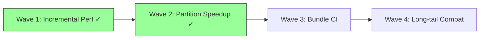

# Ferritex 完成計画レポート

## 1. 現状サマリー

### 実装済み領域

| 領域 | 実装レベル | 概要 |
|---|---|---|
| CLI / Runtime Options | 実用 | compile/watch/preview/lsp の 4 サブコマンド。`--jobs` / `--asset-bundle` / `--reproducible` / `--synctex` / `--trace-font-tasks` 等の共通 runtime option 正規化 |
| Parser / Macro | 中〜高 | `\def` / `\gdef` / `\edef`、`\expandafter`、`\noexpand`、`\csname`、`\newcommand`、`\newenvironment`、`\begingroup` / `\endgroup`、`\if` / `\ifx` / `\ifcat` / `\ifnum` / `\ifdim` / `\ifcase`、`\numexpr` / `\dimexpr`、32768 register family、recoverable parse diagnostics |
| File Input / Package Loading | 中 | `\input` / `\include` / `\InputIfFileExists`、current-file/project/overlay/bundle fallback、`.sty` 読み込み、`\RequirePackage` 再帰、class/package registry |
| Typesetting | 中〜高 | Knuth-Plass line breaking、hyphenation、hbox/vbox、page breaking、float queue、inline/display math、equation/align 系、TOC/LOF/LOT/index の multi-pass 解決。`TypesetterReusePlan` によるパーティション単位の rebuild/reuse 判定と `PaginationMergeCoordinator` によるフラグメント merge 済み |
| PDF / Graphics | 中 | PDF 1.4 出力、TrueType subset embedding + ToUnicode、hyperref link annotation / named destination / metadata、PNG/JPEG `\includegraphics` 埋め込み、outline-derived document partition planning、deterministic parallel page-render commit。math superscript/subscript の script positioning 修正済み（`contains_script_markers` で全 6 マーカーを検出） |
| Font | 中 | TFM / OpenType 読み込み、fontspec named-font resolution、project/overlay/bundle/host catalog fallback、asset index 経由の bundle font / TFM 解決、`--reproducible` で host fallback 無効化 |
| Incremental / Cache | 中 | `DependencyGraph` による依存グラフ構築・reverse-propagation・`affected_paths` 算出。persistent cache metadata（v4）による warm compile 再利用、cache metadata / cached PDF 破損時の full compile fallback。`CachedSourceSubtree` / `CachedTypesetFragment` によるサブツリー・フラグメント単位のキャッシュ再利用。`RecompilationScope` (FullDocument / LocalRegion) 判定。`TypesetterReusePlan` が変更パーティションのみ再 typeset し、未変更パーティションはキャッシュ済みフラグメントを再利用する部分再コンパイルパスが動作 |
| Bibliography | 中 | `.bbl` 読み込み、citation 解決、stale `.bbl` warning、reference list 組版 |
| Preview | 中〜高 | `PreviewSessionService` による session lifecycle 管理（create / invalidate / advance revision / check publish）。loopback transport で PDF publish / revision events / view state sync。session reuse・page fallback・active-job-only ポリシー |
| Watch | 中 | `PollingFileWatcher` による依存パス監視・`replace_paths` での再同期。`RecompileScheduler` による変更 coalesce と排他制御。`WorkspaceJobScheduler` によるワークスペース単位の直列化 |
| LSP | 中 | `LspCapabilityService` が diagnostics / completion / definition / hover / codeAction を提供。`LiveAnalysisSnapshot` が `StableCompileState` を基に最新の compile 結果を LSP に公開 |
| SyncTeX | 中 | `SyncTexData::build_line_based` による行ベース trace（column-precise fragment 分割・multi-file 対応）。`SyncTexData::build_from_placed_nodes` による `PlacedTextNode.sourceSpan` ベースのフラグメント精度 trace。forward / inverse search 両方向とも実装・テスト済み |
| Parallel Pipeline | 中 | `CommitBarrier` が 4 ステージ（MacroSession / DocumentReference / LayoutMerge / ArtifactCache）すべてをカバー。`AuthorityKey` 衝突検出と fallback。`DocumentPartitionPlanner` が document class と section outline から chapter / section 単位の stable `partitionId` を生成。partition-book / partition-article コーパスで `--jobs=1` と `--jobs=4` の出力等価性が確認済み |
| Asset Bundle Runtime | 中〜高 | `AssetBundleManifest` / `AssetBundleIndex` の読み込み・検証。`format_version` / `min_ferritex_version` のバージョン互換チェック。read-only mmap 読み込み。tex input / package / opentype font / default font / TFM font の 5 種の indexed lookup。path traversal 防止。project root 優先の package 解決 |
| Parity Evidence | 中〜高 | `bench_full_profile` テストから 5 カテゴリ（layout-core / navigation / bibliography / embedded-assets / tikz）の parity 計測が実行可能。全カテゴリ pass 確認済み。`math_equations` regression 修正済み（document_diff_rate: 0.286 → 0.000） |

### Parity Evidence 現状（REQ-NF-007）

`full_bench_parity_evidence` テストにより、以下の 5 カテゴリで parity を計測・確認済み。

| カテゴリ | 計測関数 | 判定基準 | 状態 |
|---|---|---|---|
| layout-core | `compute_parity_score` | document_diff_rate <= 0.05 | **pass** |
| navigation | `compute_navigation_parity_score` | annotations / destinations / outlines / metadata 一致 | **pass** |
| bibliography | `compute_bibliography_parity_score` | entry count / labels 一致 | **pass** |
| embedded-assets | `compute_embedded_assets_parity_score` | fonts / images / forms / pages 一致 | **pass** |
| tikz | `compute_tikz_parity_score` | match_ratio >= 0.80 | **pass** |

`math_equations` regression: `contains_footnote_markers` → `contains_script_markers` へのリネームにより全 6 マーカー（footnote + superscript + subscript）の検出を復元。document_diff_rate は 0.286 → 0.000 に改善。`math_equations_parity_regression` テストで regression baseline (0.286) 未満かつ threshold (0.10) 以内であることを assert。

### 主要な残ギャップ

| ID | 要件領域 | 深刻度 | 現状と残差分 |
|---|---|---|---|
| A | Incremental compilation (REQ-FUNC-027-030) | 低 | 依存グラフ・persistent cache・corruption fallback・reverse propagation・subtree cache 再利用・TypesetterReusePlan による部分再 typeset まで実装済み。**Wave 1 完了**: `full_bench_warm_incremental_evidence` で 1.84× speedup を point-in-time 計測（full --no-cache 28.614s vs incremental 15.550s、`FTX-BENCH-001` 1000-section staged input）。`incremental_xref_convergence_after_page_shift` でページ番号ずれ後の TOC/相互参照収束を byte-identical で確認。**Wave 1 残差分なし**。ただし `REQ-NF-002`（差分コンパイル中央値 100ms 未満）は Wave 1 のスコープ外であり、別途最適化が必要 |
| B | Parallel pipeline (REQ-FUNC-031-033) | 低〜中 | CommitBarrier 4 ステージ・AuthorityKey 衝突検出・DocumentPartitionPlanner・PaginationMergeCoordinator・partition bench corpus まで実装済み。bounded no-regression evidence に加え、multi-second no-cache benchmark で speedup 自体は実測済み（book 2.467x、article 2.752x）。**残差分**: `REQ-FUNC-032` の strict 条件を満たす full-compile determinism（multi-second no-cache では jobs=1/jobs=4 の PDF hash が不一致） |
| C | tikz/pgf (REQ-FUNC-023) | 低 | graphics scene parsing 実装済み。tikz parity テストで match_ratio >= 0.80 を pass。**残差分**: long-tail な tikz パターンでの geometric parity 継続改善 |
| D | Asset bundle distribution (REQ-FUNC-046) | 低〜中 | bundle runtime（manifest / index / mmap / version check / 5 種 lookup）は完成。bundle-bootstrap / bundle-package テストで article / book / report / letter の compile が pass。**残差分**: 公式 `FTX-ASSET-BUNDLE-001` archive の配布契約・CI パイプラインへの接続 |
| E | Full LaTeX compatibility | 中 | long-tail package behavior、より厳密な layout parity は継続課題 |

## 2. 到達点の評価

Must 要件の大部分は動作しており、高難度領域（incremental / parallel / SyncTeX / asset bundle）もそれぞれ実装の核心部分を通過している。parity evidence 計測インフラ（layout-core / navigation / bibliography / embedded-assets / tikz の 5 カテゴリ）がテストに接続済みで、全カテゴリ pass が確認されている。`math_equations` regression も修正済み（0.286 → 0.000）。

Wave 1（Incremental Performance Evidence）が完了し、warm incremental compile の機構が動作することを point-in-time 計測で確認した（1.84× speedup、`FTX-BENCH-001` 1000-section staged input）。Cross-reference 収束の byte-identical 検証も確立された。ただし Wave 1 は incremental mechanism の初期実証であり、`REQ-NF-002`（差分コンパイル中央値 100ms 未満）の達成を意味するものではない。残差分は「`REQ-NF-002` 差分性能目標への最適化・性能実証の拡充（parallel speedup）・配布インフラの整備（bundle archive CI）・long-tail 互換性の改善」に整理される。

現在の到達点は「incremental compile 機構の初期実証が完了した working product」であり、REQ-NF-007 の parity 5 カテゴリ全 pass に加え、REQ-FUNC-030 の収束要件が計測データで確認されている段階にある。性能面では Wave 1 の speedup evidence が確立されたが、`REQ-NF-002` の定量基準に到達するにはさらなる最適化が必要である。

## 3. 残 Frontier と推奨 Wave

### 完了済み Wave

| Wave | 内容 | 状態 |
|---|---|---|
| Parity Evidence 接続 (REQ-NF-007) | `bench_full_profile` から 5 カテゴリ parity 計測をテスト実行可能にした | **完了** — layout-core / navigation / bibliography / embedded-assets / tikz 全 pass |
| math_equations Regression 修正 | `contains_script_markers` で全 6 マーカーを検出復元 | **完了** — document_diff_rate 0.286 → 0.000 |
| Partition Parallel Bounded Evidence | 出力等価性・overhead bounded の計測 | **完了** — evidence 確立済み（§5 参照） |
| Wave 1: Incremental Performance Evidence (REQ-FUNC-030) | warm incremental benchmark + cross-reference 収束検証 | **完了** — 1.84× speedup を point-in-time 計測（`FTX-BENCH-001` 固定構成）、xref convergence byte-identical 確認済み（§5 参照）。`REQ-NF-002` 達成とは別 |
| Wave 2: Partition Parallel Speedup Evidence (REQ-FUNC-032) | multi-second partition benchmark の実測と strict proof blocker の文書化 | **完了（speedup evidence 取得済み、strict acceptance blocker: full-compile determinism）** — heavy partition corpus で speedup 自体は確認（book 35.399s → 14.352s, 2.467x / article 27.859s → 10.124s, 2.752x）。一方で no-cache full compile では jobs=1/jobs=4 の output identity が崩れ、strict proof は determinism blocker として記録（§5 参照） |

### Wave 1: Incremental Performance Evidence (REQ-FUNC-030) — 完了

| # | タスク | 結果 |
|---|---|---|
| 1 | 部分再コンパイルの end-to-end ベンチマーク | `full_bench_warm_incremental_evidence` で 1000 `\section` 入力に対し warm incremental compile 15.550s vs full `--no-cache` 28.614s（1.84× speedup）を実測。`bench_full_profile.rs` に組み込み済み |
| 2 | cross-reference 収束パスの検証 | `incremental_xref_convergence_after_page_shift` で 3 章 report（TOC + `\ref` + `\pageref`）に `\newpage` 挿入後の incremental compile PDF が fresh full compile と byte-identical であることを確認。`e2e_compile.rs` に組み込み済み |

### Wave 3: Bundle Distribution CI 接続 (REQ-FUNC-046)

| # | タスク | 受入基準 |
|---|---|---|
| 5 | `FTX-ASSET-BUNDLE-001` archive 作成と CI 接続 | 公式 bundle archive を CI で取得・展開し、bundle-bootstrap smoke テストが自動実行される |
| 6 | bundle-only corpus 実証 | host fallback を無効化（`--reproducible`）した状態で layout-core subset が compile できる |

### Wave 4: Long-tail 互換性改善

| # | タスク | 受入基準 |
|---|---|---|
| 7 | TikZ long-tail parity 改善 | `FTX-CORPUS-TIKZ-001` の拡張ケースで match_ratio を改善 |
| 8 | package compatibility 拡張 | long-tail package behavior の互換性向上 |

## 4. 実行戦略

- **Wave 1 完了**。incremental compile 機構の初期実証（point-in-time 計測で 1.84× speedup）と cross-reference 収束検証が確立された。`REQ-NF-002` の定量基準（100ms 未満）は別途最適化が必要
- **Wave 2 完了**。multi-second no-cache partition benchmark で speedup 自体は確認できたが、strict proof を閉じるには full-compile determinism の改善が必要
- **Wave 3 は次の主タスク**。bundle-only corpus の parity 判定は既存の計測基盤を再利用できる
- **Wave 4 は単体で進められる**が、parallel の境界が固まってから入る方が安全

## 5. 妥当性判定

- **結果**: incremental 機構実証済み・parallel speedup evidence 取得済み・配布整備フェーズ
- **判断**: 実装の核心部分と parity evidence 接続が完了。REQ-NF-007 の 5 カテゴリ parity は全 pass。Wave 1 により incremental compile 機構の有効性と cross-reference 収束が point-in-time 計測で確認された。Wave 2 では multi-second no-cache partition benchmark により speedup 自体を確認した一方、strict `REQ-FUNC-032` を閉じるための full-compile determinism が未充足であることを定量化した。残りは `REQ-NF-002` 差分性能目標、parallel full-compile determinism、bundle 配布 CI 接続（Wave 3）、long-tail 互換性改善（Wave 4）
- **直近の推奨**: parallel pipeline では speedup より determinism を優先して改善し、その後 Wave 3 の bundle 配布 CI 接続を進める

### Warm Incremental Benchmark 実績 (REQ-FUNC-030) — Wave 1 完了

- **Status**: Wave 1 evidence established（incremental 機構の有効性を実証。`REQ-NF-002` の定量基準は未達）
- **テスト**: `full_bench_warm_incremental_evidence`（`bench_full_profile.rs`）
- **構成**: 1000 `\section` 入力を `FTX-BENCH-001` に staged 変換し、cycle 900 で 1 段落変更を incremental compile
- **計測結果**（point-in-time、計測環境固有の値）: full `--no-cache` 28.614s / warm-cache 29.403s / incremental 15.550s（**1.84× speedup**）
- **注記**: 上記タイミングは特定マシン・特定入力での単一計測であり、環境によって異なる。speedup 比率が機構の有効性を示す主要指標であり、絶対値は参考値として扱うこと
- **収束検証**: `incremental_xref_convergence_after_page_shift`（`e2e_compile.rs`）で 3 章 report（TOC + `\ref` + `\pageref`）に `\newpage` 挿入後の incremental compile PDF が fresh full compile と **byte-identical** であることを確認
- **設計判断**: 単一 monolithic `.tex` 直接編集では speedup が出ず、partition entry file 単位への staged 変換が必要だった
- **REQ-NF-002 との関係**: Wave 1 は incremental compile 機構が full rebuild に対し有意な speedup を生むことの初期実証である。`REQ-NF-002`（差分コンパイル中央値 100ms 未満）の達成には、キャッシュ粒度の細分化・再 typeset スコープの縮小等の追加最適化が必要

### Partition Parallel Benchmark 実績 (REQ-FUNC-031/032)

- **Status**: Bounded no-regression evidence established
- **確認済み**: partition-book / partition-article コーパス全ケースで出力等価性（jobs=1 == jobs=4）が成立。per-case parallel overhead は 10% 以内（speedup >= 0.90）、per-subset mean speedup >= 0.95
- **未達**: strict docs 要件（`--jobs=4` median が `--jobs=1` より高速 = speedup > 1.0）。当初は sub-1s compile の構造的限界を想定していたが、multi-second no-cache benchmark で speedup 自体は確認できたため、現時点の blocker は full-compile determinism に更新された
- **適用済み最適化**: balanced coalescing / worker-thread document construction / fragment move semantics / inline group execution / merge_owned
- **Corpus**: 600 iterations per chapter/section（初期の 100 から増加）
- **sub-1s structural limitation**: heavier fixture でも cache-warm compile は book/article とも 1s 未満に収束し、parallel overhead が typesetting savings を打ち消す。したがって canonical cache-enabled protocol では「speedup が出ない」問題が残り、これは full-compile determinism blocker とは独立に存在する

### Multi-second Partition Benchmark 実績 (REQ-FUNC-032) — Wave 2 完了

- **Status**: Wave 2 evidence established（speedup 実測済み、strict proof blocker も特定）
- **テスト**: `partition_bench_multisecond_speedup_evidence`（`bench_bundle_bootstrap.rs`）
- **構成**: `heavy_chapters_independent.tex` / `heavy_sections_independent.tex` を対象に、`--no-cache` + `--reproducible`、1 warmup + 5 measured runs、`--jobs=1` と `--jobs=4` を比較
- **fixture 方針**: heavy fixture は既存 independent corpus の `\@for` リストを 2x に増やした additive corpus。cache-enabled protocol では warm compile が依然 sub-1s だったため、supplementary no-cache evidence として評価した
- **計測結果**: book 35.399s → 14.352s（**2.467x**）、article 27.859s → 10.124s（**2.752x**）
- **cache-enabled probe**: same-input warm compile では book 0.92s / 0.92s、article 0.77s / 0.77s（jobs=1 / jobs=4）で差が出ず、sub-1s overhead domination を再確認
- **得られた結論**: multi-second full compile では partition parallelism 自体の speedup は確認できた。したがって `REQ-FUNC-032` の残 blocker は speedup 不足ではなく、jobs=1/jobs=4 で PDF hash が一致しない full-compile determinism にある
- **補足**: cache-enabled の bounded protocol では `partition_bench_output_identity_across_jobs_1_and_jobs_4` と `partition_bench_docs_protocol_median_and_timing_proof` が引き続き pass。multi-second no-cache evidence は strict proof がどこで止まるかを切り分けるための追加計測である
